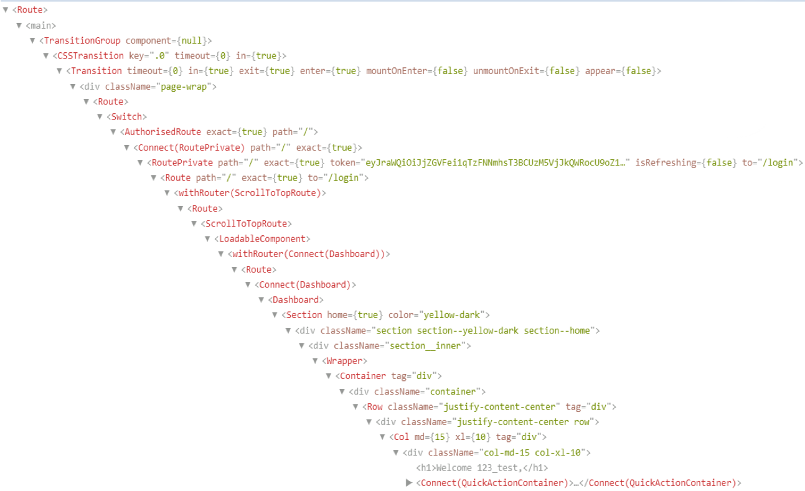

# 10.1 Hook 소개

## Written By Sangheon Kim(ksj8367@gmail.com)

## Hook의 개요

- 사용자 정의 컴포넌트를 정의하는 방법에는 세가지 방법이 있었다. 클래스 컴포넌트 안에서 Pure Component, Component 그리고 함수 컴포넌트가 있다.
- Hook이 나오기 전에는 클래스 컴포넌트 말고 함수 컴포넌트는 정말 단순히 UI를 받아서 표시해주는 그런 정도의 역할에 불과하였고, props를 전달받을 수는 있었으나, 컴포넌트 자체로 State를 가질 수 없었지만, Hook이 나오고 class 컴포넌트를 작성하지 않고도, React의 기능을 사용할 수 있다.

```jsx
import React, from "react";

function Example() {
  const [count, setCount] = React.useState(0);

  return (
    <div>
      <p>You clicked {count} times</p>
      <button onClick={() => setCount(count + 1)}>
        Click me
      </button>
    </div>
  )

}
```

> 클래스 컴포넌트를 배울 당시에 우리가 가장 먼저 접했던 setState처럼 Hooks역시도 컴포넌트 자체적으로 상태를 갖고 상태를 제어할 수 있는 useState를 배워봅시다.

## 레거시 코드의 변화는 필요없다.

- 100% 아존 버전과 호환성을 보장 한다.
- 그리고 Hook은 React v16.8부터 사용 가능하다.
  > 위에서 말한 특징 땜에 우리는 함수 컴포넌트, 클래스 컴포너트 여러개를 섞어서 한 프로젝트안에서 골고루 사용할 수 있다.
- class를 제거할 계획이 없다고 하니, 굳이 레거시 코드를 훅으로 변경할 필요는 없을 것 같다. 개인의 취향에 맡기면될 것 같다.

<a href="https://ko.reactjs.org/docs/hooks-intro.html#gradual-adoption-strategy">Hook 점진적 적용 전략</a>

- 위 링크가 있으니, 혹시라도 migration을 원한다면 위링크로 가서 한번 읽어보자.

## 만들어지게된 동기

- Facebook에서 5년동안 수만개가 넘는 컴포넌트를 유지하고 작성하면서 직면했던 많은 문제들을 해결했다고 한다... 그래서 만들었다고 한다..

## 컴포넌트 사이에서 상태와 관련된 로직을 재사용하기 힘들다.

- 무엇인가 재사용 가능한 행동들을 붙이는 방법을 이전에는 제공하지 않았다. 제공했다고 하더라도 HoC(Higher-Order Components)를 사용하여야 했다.
- 여기서 고차 컴포넌트라고 하는데 고차 함수는 뭐고 고차 컴포넌트는 뭘까?
- 2차 3차 방정식이있다.. 여기서 말하는 차수와 비슷하지 않을까? 필자는 그렇게 생각했다.
- 고차 함수의 의미는 우선 매개변수로 콜백함수를 전달받아서, 받은 콜백함수에 실행 시점을 고차함수가 제어할 수 있다. 쉽게 말해 매개변수로 콜백함수를 `전달받은` 함수다. 그리고 `함수를 반환` 해주는 함수이기도 하다.
- 이것이 가능할라면 일단 높은 계층에 있어야하지 않을까? 왜냐면 포함관계에서 안고있어야하지 않는가? 매개변수로 전달받은 함수도 품고 있고, 또는 반환할 함수도 갖고 있어야하니 그래서 High-Order가 붙은게 아닐까 조심스럽게 추측해본다.
- 이렇게 생각하고 그러면 함수를 컴포넌트로 바꿔보면 고차 컴포넌트이다. 매개변수로 컴포넌트를 전달받을 수 있다면 그것이 고차 컴포넌트가 아닐까? 추측해본다. 우리는 Hooks 시간이니, 너무 자세히는 말고 이정도로 간단한게만 알아보자. 다음에 클래스를 다룰 때 설명하겠다.
- 위에서 설명한대로 고차 컴포넌트를 사용해야 했다. 하지만 고차 컴포넌트를 사용하다보면, 나중에 코드를 추적하기 어려워진다. 그리고, 래퍼 지옥을 볼 수 있다... Wrapper Hell이 뭔지 이미지를 보여주겠다.
  
- 이미지 한장으로 설명이 되지 않을까? 생각해본다. 컴포넌트를 전달받을 수 있고, 그걸 가지고 계속해서 의존성을 갖기 시작하면, 끝도 없어질 것이고, 이것은 디버깅도 힘들어지고, 코드 추적도 힘들어지게 된다.
- 로직을 분리하고, 위에서 확인한 것처럼 Wrapper Hell을 피하면서, 컴포넌트의 라이프사이클에서도 자유롭게 코딩하는 방법으로 Hooks가 찾아온것이다.

#### 위에서 설명한 재사용 가능하면서 Wrapper지옥에서도 벗어나면서, 상태관련 로직을 재사용할 수 있게 도와주는 Custom Hook에 대해서는 Hook의 후반부에서 알아보자.

## 복잡한 컴포넌트들은 이해하기 어렵다.

- 클래스 컴포넌트는 다른 상태 관리 라이브러리에 의해 결합하면 할수록 컴포넌트 재사용을 더욱 어렵게 만든다.
- Hook을 통해 로직에 기반을 둔 작은 함수로 컴포넌트를 나눌 수 있다. (구독 설정 및 데이터를 불러오는 로직)

## class는 사람과 기계를 혼동시킨다.

- 자바스크립트에서 `this`는 일반적으로 다른 언어들과 다르게 경우에 따라 다르고, 클래스 컴포넌트는 this가 어떻게 작동하는지 알아야하고, Class는 잘 축소되지 않고, 핫 리로드를 깨지기 쉽고 신뢰할 수 없게 만든다. 함수 컴포넌트의 경우에는 Prepack을 활용한 Component Folding이 가능하다.

**Hook은 Class없이 React 기능들을 사용하는 방법을 알려준다.**
