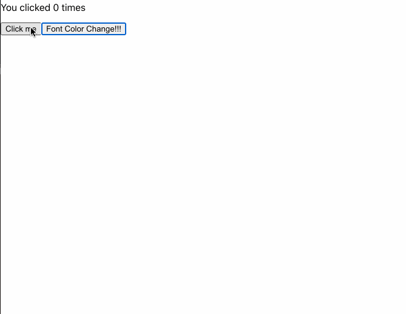

# 10.2 Hook 개요, State Hook

## React.useState(State Hook)

```tsx
import React from "react";

const StateHook: React.FC = () => {
  // 튜플 타입 명시
  // React 모듈에서 useState를 가져와서 사용하여, 0으로 초기화 해주고, 이 count를 갱신할 수 있는 action을 setCount라는 이름으로 배열 비구조화 할당으로 꺼내준다.
  const [count, setCount]: [number, React.Dispatch<React.SetStateAction<number>>] = React.useState(0);

  return (
    <div className="StateHook">
      <p>You clicked {count} times</p>
      {/* 버튼 클릭 이벤트를 받으면 state 변수를 갱신해주는데 현재는 1을 증가 시켜주고, state가 바뀜에 따라 리렌더링이 이루어진다.*/}
      <button onClick={() => setCount(count + 1)}>Click me</button>
    </div>
  );
};

export default StateHook;
```

> 버튼을 클릭하면, 카운트가 하나씩 증가하는 예제

- `useState`는 현재의 state 값과 이 값을 업데이트 하는 함수를 쌍으로 제공한다. 우리는 해당 함수를 이벤트 핸들러나 다른 곳에서도 호출할 수 있다. class컴포넌트의 `this.setState`와 유사하지만 다른 스테이트들과 합쳐지지 않고, 독립적으로 관리 가능하다.
- class 컴포넌트와 다른점은 Hook의 state는 객체일 필요가 없다. 원할경우 객체가 가능하지만, 초기 값은 초기 렌더링에만 한번 사용된다.

## `여러 state 변수 선언하기`

- 하나의 컴포넌트에서 State Hook을 여러개도 사용 가능하다.

```tsx
import React from "react";

const StateHook: React.FC = () => {
  // 튜플 타입 명시
  const [count, setCount]: [number, React.Dispatch<React.SetStateAction<number>>] = React.useState(0);
  const [isVisible, setVisible]: [boolean, React.Dispatch<React.SetStateAction<boolean>>] = React.useState(false as boolean);

  return (
    <div className="StateHook">
      <p style={{ color: isVisible ? "red" : "black" }}>You clicked {count} times</p>
      <button onClick={() => setCount(count + 1)}>Click me</button>
      <button onClick={() => setVisible(!isVisible)} style={{ cursor: "pointer" }}>
        Font Color Change!!!
      </button>
    </div>
  );
};

export default StateHook;
```

> 여러개의 스테이트를 가지고 있을 수도 있다. State Hook을 여러개 사용할 수 있다.
> `배열 구조 분해`문법은 state 변수를 다른 변수 명으로 받을 수 있다.

```js
const [one, two, three] = [1, 2, 3];

console.log(one, two, three); // 1 2 3
```

> 공식문서에는 나중에 살펴본다는데 나는 지금 설명하겠다. console.log(one,two, three) 1을 one으로 2를 two로 꺼냈다. 이런식으로 배열안에 값을 내가 원하는 변수명으로 꺼내서 쓸 수 있다.

`위에 Hook방식이 아닌 클래스 컴포넌트로 할 경우 코드`

```tsx
import * as React from "react";

interface IState {
  count: number;
  isVisible: boolean;
}
interface IProps {}

class ClassState extends React.Component<IProps> {
  state: IState;
  constructor(props: IProps) {
    super(props);

    this.state = {
      count: 0,
      isVisible: false,
    };
  }

  render() {
    const { count, isVisible } = this.state;
    return (
      <div className="StateHook">
        <p style={{ color: isVisible ? "red" : "black" }}>You clicked {count} times</p>
        <button onClick={() => this.setState({ count: count + 1 })}>Click me</button>
        <button onClick={() => this.setState({ isVisible: !isVisible })} style={{ cursor: "pointer" }}>
          Font Color Change!!!
        </button>
      </div>
    );
  }
}

export default ClassState;
```

> 

- 위에서 예제로 버튼을 누르면 바뀌는것과 카운터가 변경되는 에제를 보여주고 있다.

## Hook과 함수 컴포넌트

```tsx
// 화살표함수를 이용한 함수 컴포넌트
const Example: React.FC = (props) => {
  // 여기서 Hook을 사용할 수 있습니다!
  return <div />;
};

// 함수 선언문 형식의 함수 컴포넌트
function Example(props): React.FC {
  // 여기서 Hook을 사용할 수 있습니다!
  return <div />;
}
```

## State Hook이란 ?

- 예전에는 함수 컴포넌트 정의시에 state 사용하고 싶을때에는 클래스 컴포넌트로 바꿔야했지만, 이제는 함수 컴포넌트 안에서도 사용할 수 있게 해준 것이다.

## state 변수 선언하기

`클래스 컴포넌트`

```tsx
import * as React from "react";

class ClassState extends React.Component<IProps> {
  state: IState;
  constructor(props: IProps) {
    super(props);

    this.state = {
      count: 0,
      isVisible: false,
    };
  }
  // ...
}
```

`함수 컴포넌트`

```tsx
import * as React from "react";
const StateHook: React.FC = () => {
  // 튜플 타입 명시
  const [count, setCount]: [number, React.Dispatch<React.SetStateAction<number>>] = React.useState(0);
  // ...
};
```

- 함수 컴포넌트는 strict모드에서 this가 undefined로 읽힙니다. 그래서 this를 사용할 수 없고, useState Hook을 사용해서 state를 정의 할 수 있는 것이다.

`useStat를 호출하는 것은 무엇인가`

- 객체 비구조화 할당 이기에 내가 원하는 변수명을 넣어도된다. sangheon이렇게 넣어도되지만, 항상 개발에서 중요한 것이 명명이기에 자신이 사용할 상태에 대한 정확한 이름을 넣어주는 것이 좋다. 일반적으로 함수 선언시에 변수는 함수가 끝날 때에는 사라지지만, state변수는 react에 의해서 사라지지 않는다.

`useState의 인자로 무엇을 넘겨주어야 할까?`

- useState() Hook의 인수로 전달하는 것은 state의 초기값이다. 현재 위에서는 보는것처럼 count에 0으로 초기화 해준 것이다.

`useState는 무엇을 반환할까?`

- state 변수와, 해당 변수를 갱신할 수 있는 함수 두가지를 변환한다.
- 초기값을 반환해주고, 그것을 변화시킬수 있는 SetStateAction을 반환해준다.

```ts
function useState<S>(initialState: S | (() => S)): [S, Dispatch<SetStateAction<S>>];
```

- Create가 아닌 use를 사용한 이유는 컴포넌트 렌더링 시에 한번만 생성되어, create보다 use를 사용했다고 한다.. Hook의 이름이 use로 시작하는 이유에 대해서는 한번 나중에 알아보자.

## state 가져오기

- 클래스 컴포넌트에서는 `this.state.count`를 사용한다.
- 함수 컴포넌트에서는 직접 `count`를 사용할 수 있다.

## state 갱신하기

- 클래스 컴포넌트는 count를 갱신하기 위해서는 this.setState를 사용하고 있다.

```tsx
//  ...
<button onClick={() => this.setState({ count: count + 1 })}>Click me</button>
// ...
```

- 함수 컴포넌트는 setCount와 count 변수를 가지고 있어 this를 굳이 호출하지 않아도 된다.

```tsx
// ...
<button onClick={() => setCount(count + 1)}>Click me</button>
// ...
```

## `요약`

```tsx
import React from "react";

const StateHook: React.FC = () => {
  // React 모듈에서 useState를 가져와서 사용하여, 0으로 초기화 해주고, 이 count를 갱신할 수 있는 action을 setCount라는 이름으로 배열 비구조화 할당으로 꺼내준다.
  // 튜플 타입 명시
  const [count, setCount]: [number, React.Dispatch<React.SetStateAction<number>>] = React.useState(0);

  return (
    <div className="StateHook">
      <p>You clicked {count} times</p>
      {/* 버튼 클릭 이벤트를 받으면 state 변수를 갱신해주는데 현재는 1을 증가 시켜주고, state가 바뀜에 따라 리렌더링이 이루어진다.*/}
      <button onClick={() => setCount(count + 1)}>Click me</button>
    </div>
  );
};

export default StateHook;
```

`근데 Hook이 뭔가요?`

- React State와 라이프사이클 기능을 연동할 수 있게 해주는 함수다. class컴포넌트 없이도 리액트를 사용할 수 있게 해준 것이다.

- State Hook을 제외하고도 많은 내장 훅들이 있다.

- 다음시간에는 useEffect에 대해서 알아보자.
