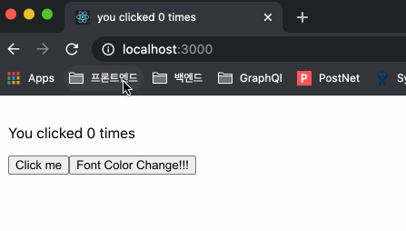
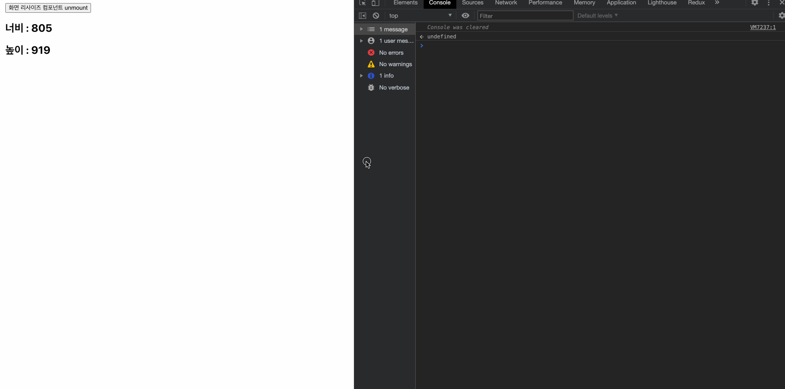

# Effect Hooks

## Written By Sangheon Kim(ksj8367@gmail.com)

- 함수 컴포넌트에서 side Effect를 수행할 수 있다.

```tsx
import React from "react";

const EffectHook: React.FC = () => {
  // 튜플 타입 명시
  const [count, setCount]: [number, React.Dispatch<React.SetStateAction<number>>] = React.useState(
    0
  );
  const [isVisible, setVisible]: [
    boolean,
    React.Dispatch<React.SetStateAction<boolean>>
  ] = React.useState(false as boolean);

  React.useEffect(() => {
    // 리렌더링이 이루어질때마다 갱신
    document.title = `you clicked ${count} times`;
  });

  return (
    <div className="EffectHook">
      <p style={{ color: isVisible ? "red" : "black" }}>You clicked {count} times</p>
      <button onClick={() => setCount(count + 1)}>Click me</button>
      <button onClick={() => setVisible(!isVisible)} style={{ cursor: "pointer" }}>
        Font Color Change!!!
      </button>
    </div>
  );
};

export default EffectHook;
```



> 이전에 State 훅을 사용할때 사용하던 예시에서 `useEffect를 사용했다. useEffect는 컴포넌트 안에서 sideEffect를 사용할 수 있어 useEffect라고 명명한것 같다.

`side Effect`

- 데이터 가져오기, Subscription 설정하기, 수동으로 리액트 컴포넌트의 DOM을 수정하는 것 모두가 side Effect라고 부른다.

<span style="color: red;">팁</span>

- 리액트의 class 생명주기 메서드에 친숙하다면, useEffec를 `componentDidMount`와 `componentDidUpdate`, `componentWillUnmount`가 합쳐진 것으로 생각하면 좋다.

- 리액트 컴포넌트에서 사이드이펙트는 정리가 필요한 것과 그렇지 않은 것 두가지로 나뉘는데 이 두가지를 구분하는 것을 알아보자.

### 정리를 이용하지 않는 Effects

- 리액트가 DOM을 업데이트한 뒤 추가로 코드를 실행해야 하는 경우가 있다. 예를 들어 네트워크 요청(서버에 데이터 요청 등), DOM 조작, 로그 기록 등은 정리가 필요가 엇다.
- 그렇다면 class와 Hook이 서로 이런 이펙트를 어떻게 다르게 구현하는지 보자

`클래스 컴포넌트`

- `componentDidMount` - 마운트가 일어난 시점
- `componentDidUpdate` - State나 Props에 변화가 일어났을때 발생한다.

```tsx
import * as React from "react";

interface IState {
  count: number;
  isVisible: boolean;
}
interface IProps {}

class ClassEffect extends React.Component<IProps> {
  state: IState;
  constructor(props: IProps) {
    super(props);

    this.state = {
      count: 0,
      isVisible: false,
    };
  }

  componentDidMount() {
    // 컴포넌트가 마운트된 시점에 발생
    document.title = `You Clicked ${this.state.count} times`;
  }
  componentDidUpdate() {
    // 컴포넌트가 업데이트될때에 발생한다.
    document.title = `You Clicked ${this.state.count} times`;
  }

  render() {
    const { count, isVisible } = this.state;
    return (
      <div className="StateHook">
        <p style={{ color: isVisible ? "red" : "black" }}>You clicked {count} times</p>
        <button onClick={() => this.setState({ count: count + 1 })}>Click me</button>
        <button
          onClick={() => this.setState({ isVisible: !isVisible })}
          style={{ cursor: "pointer" }}
        >
          Font Color Change!!!
        </button>
      </div>
    );
  }
}

export default ClassEffect;
```

> 중복코드가 일어난다.

- componentDidMount, componentDidUpdate 서로 역할도 다르지만, 클래스 컴포넌트에서는 두가지 개념을 포함하고 있는 그런 기능을 제공하지는 않는다. 현재 예시에서는 마운트된 시점에도, 그리고 상태가 업데이트될때 마다 title갱신을 해줘야하지만, 아쉬운 부분이긴하다.

### Hook을 이용한 예시

```tsx
import React from "react";

const EffectHook: React.FC = () => {
  // 튜플 타입 명시
  const [count, setCount]: [number, React.Dispatch<React.SetStateAction<number>>] = React.useState(
    0
  );
  const [isVisible, setVisible]: [
    boolean,
    React.Dispatch<React.SetStateAction<boolean>>
  ] = React.useState(false as boolean);

  React.useEffect(() => {
    // 리렌더링 때마다 이전과 다른 effect로 교체하여 전달한다. 각 effect는 특정한 렌더링에 속한다.
    document.title = `you clicked ${count} times`;
  });

  return (
    <div className="EffectHook">
      <p style={{ color: isVisible ? "red" : "black" }}>You clicked {count} times</p>
      <button onClick={() => setCount(count + 1)}>Click me</button>
      <button onClick={() => setVisible(!isVisible)} style={{ cursor: "pointer" }}>
        Font Color Change!!!
      </button>
    </div>
  );
};

export default EffectHook;
```

- 위에서 사용한 코드이지만, 한번 더 보자.
- `useEffect가 하는 일은 어떤것일까?`
  - 우리가 넘긴 함수를 기억했다가 DOM 업데이트를 수행한 이후 불러낸다. 이외에도 데이터를 가져오는 명령형 API를 불러내는 일도 가능하다.
- `useEffect를 컴포넌트 안에서 불러내는 이유는 어떤 것일까?`
  - useEffect를 컴포넌트 안에 둬야 컴포넌트 내부에서 state에 접근할 수 있게된다.
- `useEffect는 렌더링 이후에 매번 수행되는 것인가?`
  - 첫번째 렌더링과 이후의 모든 업데이트에서 수행 한다. 별도의 dependency를 지정하지 않는 경우다.

`ComponentDidMount`나 `componentDidUpdate`와 달리, 브라우저가 화면을 업데이트하는 것을 차단하지 않는다. 그래서 애플리케이션의 반응성을 향상시켜준다. 동기적으로 실행하지 않고, 만약 동기적으로 실행해야 하는 경우 `useLayoutEffect`라는 별도의 Hook이 존재한다.

## 정리를 이용하는 Effects

- 정리가 필요한 Effect라는 것은 무엇일까?

### Class를 사용하는 예시

- `componenetDidMount`에 구독을 설정한 뒤 `componentWillUnmount`에서 이를 정리(clean-up)한다. 쉽게 예를 들어보자 우리가 특정 페이지에서 리사이즈 이벤트에 따라 반응해야하는 페이지 컴포넌트 설정을 위해 addEventListener를 이용해서 리사이즈 이벤트 핸들러를 등록 했을 경우 해당 페이지가 아닌 경우에는 removeEventListenr를 통해서 이벤트핸들러를 제거해줘야 Memory 누수 현상을 막을 수 있다.


> removeEventListenr를 해주지 않으면 이렇게 컴포넌트가 언마운트되어있어서 업데이트 수행이 불가능한데 왜 핸들러를 제거 안해줬냐는 에러가 뜨는 것을 볼 수 있다.

`에러 유발 코드`

```tsx
import React, { Component } from "react";

class CleanUpCaseClass extends Component {
  state: {
    width: number;
    height: number;
  };
  constructor(props: any) {
    super(props);

    this.state = {
      width: 0,
      height: 0,
    };

    this._eventCallback = this._eventCallback.bind(this);
  }

  _eventCallback(e: any) {
    console.log("resize 이벤트 감지중");
    this.setState({
      width: e.target.innerWidth,
      height: e.target.innerHeight,
    });
  }

  componentDidMount() {
    this.setState({
      width: window.innerWidth,
      height: window.innerHeight,
    });
    window.addEventListener("resize", this._eventCallback);
  }

  render() {
    const { width, height } = this.state;
    return (
      <div>
        <h2>너비 : {width}</h2>
        <h2>높이 : {height}</h2>
      </div>
    );
  }
}

export default CleanUpCaseClass;
```

> 클린업을 하지 않은 코드다.

- 이제 에러가 난것을 확인 했으니 componentWillUnmount 라이프사이클 메서드에서 removeEventListener를 해줘보자.



> 결과 화면을 먼저 보자. 컴포넌트를 언마운트 하자 위의 코드의 결과와는 다르게 더이상 이벤트 핸들러가 동작하지 않고 있다. 그리고 에러 또한 사라진 것을 볼 수 있다. 메모리 상에서 등록된 이벤트 핸들러를 제거해준 것이다.

`클래스형 컴포넌트 Clean Up`

```tsx
import React, { Component } from "react";

class CleanUpCaseClass extends Component {
  state: {
    width: number;
    height: number;
  };
  constructor(props: any) {
    super(props);

    this.state = {
      width: 0,
      height: 0,
    };

    this._eventCallback = this._eventCallback.bind(this);
  }

  _eventCallback(e: any) {
    console.log("resize 이벤트 감지중");
    this.setState({
      width: e.target.innerWidth,
      height: e.target.innerHeight,
    });
  }

  componentDidMount() {
    this.setState({
      width: window.innerWidth,
      height: window.innerHeight,
    });
    window.addEventListener("resize", this._eventCallback);
  }

  componentWillUnmount() {
    window.removeEventListener("resize", this._eventCallback);
  }

  render() {
    const { width, height } = this.state;
    return (
      <div>
        <h2>너비 : {width}</h2>
        <h2>높이 : {height}</h2>
      </div>
    );
  }
}

export default CleanUpCaseClass;
```

- 이제 위 처럼 cleanUp 해줘야 하는 경우를 Effect Hook을 이용해서 짜보자.

`Clean-Up Example Hook`

```tsx
import React from "react";

const clienUpCaseHook = () => {
  const [displaySize, setDisplaySize] = React.useState({
    width: 0,
    height: 0,
  });

  const _eventCallback = (e: any) => {
    console.log("resize 이벤트 감지중");
    setDisplaySize({
      ...displaySize,
      width: e.target.innerWidth,
      height: e.target.innerHeight,
    });
  };

  React.useEffect(() => {
    // componentDidMount 같은 역할 (subscribe하고 있는 것이 없을 경우)
    setDisplaySize({
      ...displaySize,
      width: window.innerWidth,
      height: window.innerHeight,
    });
    window.addEventListener("resize", _eventCallback);

    return () => {
      // componentWillUnmount 같은 역할
      window.removeEventListener("resize", _eventCallback);
    };
  }, []);

  const { width, height } = displaySize;
  return (
    <div>
      <h2>너비 : {width}</h2>
      <h2>높이 : {height}</h2>
    </div>
  );
};

export default clienUpCaseHook;
```

> 클래스 컴포넌트와 다르게 useEffect안에서 return에 callback을 넣어 정리해주는 것을 볼 수 있다.

- effect에서 함수를 반환하는 이유는? 모든 effect는 정리를 위한 함수를 반환할 수 있다. 보통 구독을 하거나 구독 취소등의 로직을 가까이에 묶어 놓는다.
- 정리는 보통 마운트가 해제되는 시점에 정리를 실행한다.

## 요약

- `useEffect`가 컴포넌트의 렌더링 이후에 다양한 side effects를 표현할 수 있다.
- 정리가 필요 없는 경우에는 Effect Hook에서 어떤것도 반환하지 않아도 된다.
- Effect Hook은 정리가 필요한 경우와 정리가 필요하지 않은 경우를 Effect Hook하나로통합한다.

## Effect를 이용하는 팁

- 관심사를 구분하려고 한다면 Multiple Effect를 사용한다.
- 클래스 컴포넌트의 경우에는 만약 서로 동작이 다른 함수가 여러개가 있는 경우에도 라이프사이클에 맞춰서 구분지어야 했으나, Hook에서는 여러개의 useEffect를 사용하여, 동작마다 별도의 Effect를 둘 수 있다.

`클래스 컴포넌트`

```tsx
class FriendStatusWithCounter extends React.Component {
  constructor(props) {
    super(props);
    this.state = { count: 0, isOnline: null };
    this.handleStatusChange = this.handleStatusChange.bind(this);
  }

  componentDidMount() {
    document.title = `You clicked ${this.state.count} times`;
    ChatAPI.subscribeToFriendStatus(this.props.friend.id, this.handleStatusChange);
  }

  componentDidUpdate() {
    document.title = `You clicked ${this.state.count} times`;
  }

  componentWillUnmount() {
    ChatAPI.unsubscribeFromFriendStatus(this.props.friend.id, this.handleStatusChange);
  }

  handleStatusChange(status) {
    this.setState({
      isOnline: status.isOnline,
    });
  }
  // ...
}
```

> 카운트가 상태가 바뀜에 따라 document의 title을 변경해주는 함수와 친구의 상태를 구독하거나 취소하는건 전혀 다른 동작이지만, 라이프싸이클 메서드에 맞춰서 구분 지어야 한다.

- Effect Hook 사용시에는 동작에 따라 여러개의 Effect를 두어 처리할 수 있다.

```tsx
function FriendStatusWithCounter(props) {
  const [count, setCount] = useState(0);
  useEffect(() => {
    document.title = `You clicked ${count} times`;
  });

  const [isOnline, setIsOnline] = useState(null);
  useEffect(() => {
    function handleStatusChange(status) {
      setIsOnline(status.isOnline);
    }

    ChatAPI.subscribeToFriendStatus(props.friend.id, handleStatusChange);
    return () => {
      ChatAPI.unsubscribeFromFriendStatus(props.friend.id, handleStatusChange);
    };
  });
  // ...
}
```

> Hook을 사용하면, 라이프싸이클 메서드에 따라서가 아닌, 코드의 역할에 따라 나눌 수 있다.

### effect가 업데이트 시마다 실행되는 이유

- class 컴포넌트는 componentDidMount와 componentWillUnmount메서드를 사용하면 처음 마운트될 때와 언마운트되는 시점에 한번씩만 실행이 되는데 useEffect는 왜 업데이트마다 실행되는걸까?

- 클래스 컴포넌트의 경우에 만약 `componentDidMount()` 메서드와 `componentWillUnmount()` 메서드만 존재한다면, 프롭스나 스테이트가 변경되었을 때 최신 상태를 반영해줄 방법이 없을 것이다. 하지만 이런 경우를 다루기 위해서 `componentDidUpdate` 메서드가 존재한다.

```tsx
  componentDidMount() {
   ChatAPI.subscribeToFriendStatus(
     this.props.friend.id,
     this.handleStatusChange
   );
 }

 componentDidUpdate(prevProps) {
   // 이전 friend.id에서 구독을 해지합니다.
   ChatAPI.unsubscribeFromFriendStatus(
     prevProps.friend.id,
     this.handleStatusChange
   );
   // 다음 friend.id를 구독합니다.
   ChatAPI.subscribeToFriendStatus(
     this.props.friend.id,
     this.handleStatusChange
   );
 }

 componentWillUnmount() {
   ChatAPI.unsubscribeFromFriendStatus(
     this.props.friend.id,
     this.handleStatusChange
   );
 }
```

> 별도의 조건을 걸지 않은 componentDidUpdate이다. 결국 props값이 변경될때마다 계속 탈것이다. 여기서 직접 조건을 지정해준다면, 디테일한 제어도 가능하다.

- useEffect Hook의 경우에는 기본적으로 업데이트도 다루기 때문에 위처럼 별도의 코드가 필요가 없게 된다.

```tsx
function FriendStatus(props) {
  // ...
  useEffect(() => {
    // ...
    ChatAPI.subscribeToFriendStatus(props.friend.id, handleStatusChange);
    return () => {
      ChatAPI.unsubscribeFromFriendStatus(props.friend.id, handleStatusChange);
    };
  });
}
```

> 이렇게 지정해주게 된것을 코드로 풀어보아 동작하는 과정을 한번 살펴보자

```tsx
// { friend: { id: 100 } } state을 사용하여 마운트합니다.
ChatAPI.subscribeToFriendStatus(100, handleStatusChange); // 첫번째 effect가 작동합니다.

// { friend: { id: 200 } } state로 업데이트합니다.
ChatAPI.unsubscribeFromFriendStatus(100, handleStatusChange); // 이전의 effect를 정리(clean-up)합니다.
ChatAPI.subscribeToFriendStatus(200, handleStatusChange); // 다음 effect가 작동합니다.

// { friend: { id: 300 } } state로 업데이트합니다.
ChatAPI.unsubscribeFromFriendStatus(200, handleStatusChange); // 이전의 effect를 정리(clean-up)합니다.
ChatAPI.subscribeToFriendStatus(300, handleStatusChange); // 다음 effect가 작동합니다.

// 마운트를 해제합니다.
ChatAPI.unsubscribeFromFriendStatus(300, handleStatusChange); // 마지막 effect를 정리(clean-up)합니다.
```

> 고작 코드 4줄가지고 저렇게 수행을 해준다니 이건 참 멋진 것 같다. `componentDidMount`와, `componentWillUnmount`와 `componentDidUpdate` 메서드를 모두 갖고 있다니... 이건 정말 코드가 간결해지는걸로는 최고인것 같다.

## Effect를 건너뛰어 성능 최적화하기

- 지금 우리는 위의 코드에서는 별도의 처리를 하지 않고

```tsx
React.useEffect(() => {
  // ...
})

componentDidUpdate() {
  // ...
}
```

> 위 형식처럼 별도의 조건을 두지 않았기에, props나 state 변경이 있을때마다 처리가 이루어진다. 만약 위코드에서 friend의 id가 변경되지않고, 카운터가 변경될때마다도 탄다면 불필요한 성능 낭비가 되지않을까? 이런 경우를 막으려면 어떻게 할 수 있을까?

`클래스 컴포넌트`

```tsx
componentDidUpdate(prevProps, prevState) {
  if (prevState.count !== this.state.count) {
    // 이전 상태의 카운트와 현재 카운트가 변경되었을때 아래 동작을 수행한다.
    document.title = `You clicked ${this.state.count} times`;
  }
}
```

`함수 컴포넌트`

```tsx
useEffect(() => {
  document.title = `You clicked ${count} times`;
}, [count]); // count가 바뀔 때만 effect를 재실행합니다.
```

> [] 안에 구독할 항목을 넣어주면 된다. 그러면 해당 Effect는 []안에 구독항목이 변경시에만 동작하는 Effect Hook이 된다.

```tsx
useEffect(() => {
  function handleStatusChange(status) {
    setIsOnline(status.isOnline);
  }

  ChatAPI.subscribeToFriendStatus(props.friend.id, handleStatusChange);
  return () => {
    ChatAPI.unsubscribeFromFriendStatus(props.friend.id, handleStatusChange);
  };
}, [props.friend.id]); // props.friend.id가 바뀔 때만 재구독합니다.
```

Effect Hook은 이정도로 정리하겠습니다^^
