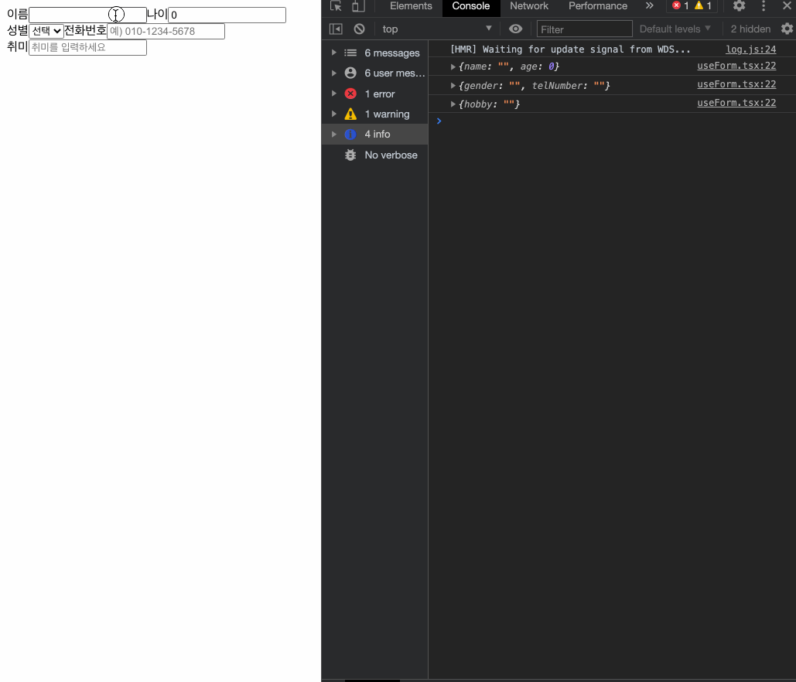

# 자신만의 Hook 만들기

## Written By Sangheon Kim(ksj8367@gmail.com)

- 자신만의 Hook을 만들면 컴포넌트 로직을 함수로 뽑아 내어 재사용 가능.
- <span style="color:red;">공식문서 예제에서는 사용자에 온라인 오프라인을 확인하는 예시를 들었지만 저는 그래도 실무에서 가장 많이 사용할법한 커스텀 훅을 만들어 보았습니다. </span>

- 아무래도 프로그램이 커질수록 사용자의 이벤트를 핸들링해서 결과를 반환하는 경우가 많은 것으로 판단하였습니다. 그중에서도 input Element에서 onChange 이벤트를 받는 경우를 많이 보곤 하는데요.
- 매번 state정의하고, onChange이벤트를 만들어 정의하는 것이 귀찮으실 때 사용하면 좋을 것 같습니다.
- ❗️ 실무 예제와 비슷하게 하려면 UI 컴포넌트를 상세적으로 분리해서 회원가입 폼에서 한번에 useForm 정의 하시고, 객체 비구조화 할당으로 값을 빼서 UI 컴포넌트에 props로 전달해주면 될 것 같습니다.
- 저는 커스텀 훅의 간편성을 설명하기 위해 설명한것이라 컴포넌트 분리기반보다 만약 페이지가 여러개로 있었을 경우로 가정하고 만들어 보았습니다.

### 우선 CustomHook을 사용하기 전의 코드를 한번 보시죠

`Before1.tsx`

```tsx
import React from "react";

const Before1 = () => {
  const [form, setForm] = React.useState({
    name: "",
    age: 0,
  });

  const { name, age } = form;

  const onChange = (e: any) => {
    const { name, value } = e.target;

    setForm({
      ...form,
      [name]: value,
    });
  };

  React.useEffect(() => {
    console.log(form);
  }, [form]);

  return (
    <div className="Before1">
      <label>이름</label>
      <input type="text" name="name" value={name} onChange={onChange} />
      <label>나이</label>
      <input type="number" name="age" value={age} onChange={onChange} />
    </div>
  );
};

export default Before1;
```

`Before2.tsx`

```tsx
import React from "react";

const Before2 = () => {
  const [form, setForm] = React.useState({
    gender: "",
    telNumber: "",
  });

  const telValidation = (telNumber: string) => {
    const reg = /([0-1]{3})-([0-9]{3,4})-([0-9]{4})/gm;
    const faultReg = /([0-1]{3})([0-9]{4})([0-9]{4})/gm;

    if (reg.test(telNumber)) {
      return telNumber;
    } else {
      const result = telNumber.replace(faultReg, `$1-$2-$3`);

      return result;
    }
  };

  const { gender, telNumber } = form;

  const onChange = (e: any) => {
    let { name, value } = e.target;

    value = name === "telNumber" ? telValidation(value) : value;
    setForm({
      ...form,
      [name]: value,
    });
  };

  React.useEffect(() => {
    console.log(form);
  }, [form]);

  const selectOptions: Array<{ value: string; title: string }> = [
    {
      value: "",
      title: "선택",
    },
    {
      value: "M",
      title: "남",
    },
    {
      value: "W",
      title: "여",
    },
    {
      value: "etc",
      title: "기타",
    },
  ];

  return (
    <div className="Before2">
      <label>성별</label>
      <select onChange={onChange} value={gender} name="gender">
        {selectOptions.map((item) => {
          return (
            <option value={item.value} selected={gender === item.value}>
              {item.title}
            </option>
          );
        })}
      </select>
      <label>전화번호</label>
      <input
        type="text"
        name="telNumber"
        value={telNumber}
        onChange={onChange}
        placeholder="예) 010-1234-5678"
      />
    </div>
  );
};

export default Before2;
```

`Before3.tsx`

```tsx
import React from "react";

const Before3 = () => {
  const [hobby, setHobby] = React.useState("");

  const onChange = (e: any) => {
    const { value } = e.target;
    setHobby(value);
  };

  React.useEffect(() => {
    console.log(hobby);
  }, [hobby]);

  return (
    <div>
      <label>취미</label>
      <input
        type="text"
        name="hobby"
        value={hobby}
        onChange={onChange}
        placeholder="취미를 입력하세요"
      />
    </div>
  );
};

export default Before3;
```

> 현재 Before1.tsx, Before2.tsx, Before3.tsx에는 Effect Hook을 이용해서 console을 확인하는 함수가 중복되고 onChange 함수가 중복되는 것을 볼 수 있습니다. 여기서 저는 생각 했습니다. 매번 정의 해주기 귀찮다... 점점 프로그램이 확장되고, 매번 input의 onChange이벤트를 받아서 해줄 것을 상상 했더니 끔찍했습니다.

## 사용자 정의 Hook 추출하기

- 사용자 정의 Hook은 이름이 use로 시작하는 자바스크립트 함수입니다. 사용자 Hook은 다른 Hook을 호출할 수 있습니다. 이 말은 제가 정의한 Hook에서 state Hook과 Effect Hook을 사용할 수 있습니다.
- 저는 이제 위에 3개의 컴포넌트들의 조건을 모두 충족시키는 커스텀 훅을 만들기 위해서 사용하던 것들을 하나씩 빼서 커스텀 Hook을 만들어 보겠습니다. 위의 컴포넌트들에서 로직들을 복사해서 붙혀놓기 시작했습니다.

`useForm.tsx`

- onChange 이벤트를 받아서 처리해줄 onChange 함수를 리턴해주고 해당 name에 맞게 스테이트를 변경해주고, 초기값으로 지정한 양식에 맞게 state를 리턴해주는 Hook 입니다.

```tsx
import React from "react";

/**
 *
 * @description onChange 이벤트를 받아서 처리해줄 onChange 함수를 리턴해주고 해당 name에 맞게 스테이트를 변경해주고,
 *              초기값으로 지정한 양식에 맞게 state를 리턴해주는 Hook 입니다.
 * @export
 * @param {*} initialValue
 * @param {string} [key]
 * @returns
 */
export function useForm(initialValue: any, key?: string) {
  // 만약 object 형식으로 들어오지 않는 경우에는
  // 두번째 매개변수를 통해 바인딩된 값을 프로퍼티 키값으로 두고
  // initialValue의 바인딩된 값을 그 프로퍼티의 값으로 만든 객체로 initialValue를 변경해줍니다.
  if (!!key) initialValue = { [key]: initialValue };
  // 위에서 들어온 초기값을 기반으로 state Hook을 사용하여 초기화 해줍니다.
  const [form, setForm] = React.useState(initialValue);

  // 현재 세 컴포넌트 모두 Effect Hook에서 form을 찍어놓아서 가지고 왔습니다.
  React.useEffect(() => {
    console.log(form);
  }, [form]);

  // before2.tsx에서 사용한 전화번호 유효성 검증을 통해서 자동으로 양식에 맞게 변경해주는 함수
  const telValidation = (telNumber: string) => {
    const reg = /([0-1]{3})-([0-9]{3,4})-([0-9]{4})/gm;
    const faultReg = /([0-1]{3})([0-9]{4})([0-9]{4})/gm;

    if (reg.test(telNumber)) {
      return telNumber;
    } else {
      const result = telNumber.replace(faultReg, `$1-$2-$3`);

      return result;
    }
  };

  // 공통으로 사용할 onChange함수 정의
  const onChange = (e: any) => {
    let { name, value } = e.target;

    // target의 name이 telNumber인 경우 validation체크 후 양식에 맞게 변경해준 후 value에 오버라이딩 해줍니다.
    value = name === "telNumber" ? telValidation(value) : value;
    // 현재 change이벤트가 발생하고 있는 Element의 name을 e.target 오브젝트의 name을 통해서 확인 후 해당 state 변경
    // value로는 해당 change이벤트가 발생하는 엘리먼트의 value값으로 변경해줍니다.
    setForm({
      ...form,
      [name]: value,
    });
  };

  // onChange는 공통으로 리턴해줄 것이기에 넣어놓습니다.
  const obj: any = {
    onChange,
  };

  // 키가 없다면 form이라는 프로퍼티를 이용하여 obj에 state Hook을 이용한 커스텀 Hook에 state인 form을 넣어줍니다.
  if (!key) obj["form"] = form;
  // 키가 있을 경우에는, 굳이 사용자가 value값만 추출하면 되니... form state에서 key를 이용하여 값만 추출하여 값을 리턴 해줍니다.
  // 키값으로는 사용자가 정의한 키값 그대로 내보내주면 좋겠죠?
  else obj[key] = form[key];

  return obj;
}
```

> 열심히 커스텀 Hook을 만들었으니, 이제 위에 Before 컴포넌트들이 어떻게 바뀌는지 한번 볼까요?

`customHooks1.tsx`

```tsx
import React from "react";
import { useForm } from "../../Hooks/useForm";

const CustomHooks1 = () => {
  const { onChange, form } = useForm({
    name: "",
    age: 0,
  });

  const { name, age } = form;

  return (
    <div className="CustomHooks1">
      <label>이름</label>
      <input type="text" name="name" value={name} onChange={onChange} />
      <label>나이</label>
      <input type="number" name="age" value={age} onChange={onChange} />
    </div>
  );
};

export default CustomHooks1;
```

`customHooks2.tsx`

```tsx
import React from "react";
import { useForm } from "../../Hooks/useForm";

const CustomHooks2 = () => {
  const { onChange, form } = useForm({
    gender: "",
    telNumber: "",
  });

  const { gender, telNumber } = form;

  const selectOptions: Array<{ value: string; title: string }> = [
    {
      value: "",
      title: "선택",
    },
    {
      value: "M",
      title: "남",
    },
    {
      value: "W",
      title: "여",
    },
    {
      value: "etc",
      title: "기타",
    },
  ];

  return (
    <div className="CustomHooks2">
      <label>성별</label>
      <select onChange={onChange} value={gender} name="gender">
        {selectOptions.map((item) => {
          return (
            <option value={item.value} selected={gender === item.value} key={item.value}>
              {item.title}
            </option>
          );
        })}
      </select>
      <label>전화번호</label>
      <input
        type="text"
        name="telNumber"
        value={telNumber}
        onChange={onChange}
        placeholder="예) 010-1234-5678"
      />
    </div>
  );
};

export default CustomHooks2;
```

`customHooks3.tsx`

```tsx
import React from "react";
import { useForm } from "../../Hooks/useForm";

const CustomHooks3 = () => {
  const { hobby, onChange } = useForm("", "hobby");

  return (
    <div>
      <label>취미</label>
      <input
        type="text"
        name="hobby"
        value={hobby}
        onChange={onChange}
        placeholder="취미를 입력하세요"
      />
    </div>
  );
};

export default CustomHooks3;
```

> 뭔가 훨씬 간결한 코드가 완성된 것을 볼 수 있죠? 한번 결과 화면을 보시죠



> 만약 페이지 세개가 있고, 이름과 나이를 입력받는 양식의 페이지와, 성별과 전화번호를 받는 페이지, 그리고 취미를 받는 페이지가 있다고 가정할 때 사용하면 중복코드는 제거하고, 조금 더 간결하게 코딩할 수 있는 이런 매력을 갖게되지않을까요?

`기존 예시 코드와 동일한 코드인가요?`

- 정확하게 똑같이 동작하는 것을 볼 수 있고, 단지 공통의 코드들을 뽑아내어 새로운 함수로 만든 것입니다. Custom Hook은 React의 특별한 기능이라기보다 Hook의 디자인을 따르는 관습입니다.

`사용자 정의 Hook의 이름은 use로 시작되어야 하나요?`

- 이 질문에 대한 답변은 이전에 10.4의 Hook의 규칙을 확인 해보시면 아시겠지만, use를 붙이지 않으면 Hook 규칙 위반 여부를 자동으로 체크할 수 없습니다.

`같은 Hook을 사용하는 두 개의 컴포넌트는 state를 공유하나요?`

- 사용자 정의 Hook은 상태 관련 로직(구독을 설정하고 현재 변숫값을 기억하는 것)을 재사용하는 메커니즘이지만 사용자 Hook을 사용할 때마다 그 안의 state와 effect는 완전 독립적입니다.

`사용자 정의 Hook은 어떻게 독립된 state를 얻는 건가요?`

- 각각의 Hook에 대한 호출은 서로 독립된 state를 받습니다. `useFrom`을 직접적으로 호출하기 때문에 React의 관점에서 이 컴포넌트는 `useState`와 `useEffect`를 호출한 것과 다름 없습니다. 이전에 배웠듯이, 하나의 컴포넌트 안에서 state Hook과 effect Hook을 여러 번 부를 수 있고, 이들은 모두 완전 독립적입니다.

## Hook에서 Hook으로 정보 전달하기

- Hook은 함수이기 때문에 Hook 사이에서도 정보 전달이 가능합니다.

```tsx
const friendList = [
  { id: 1, name: "Phoebe" },
  { id: 2, name: "Rachel" },
  { id: 3, name: "Ross" },
];

function ChatRecipientPicker() {
  const [recipientID, setRecipientID] = useState(1);
  const isRecipientOnline = useFriendStatus(recipientID);

  return (
    <>
      <Circle color={isRecipientOnline ? "green" : "red"} />
      <select value={recipientID} onChange={(e) => setRecipientID(Number(e.target.value))}>
        {friendList.map((friend) => (
          <option key={friend.id} value={friend.id}>
            {friend.name}
          </option>
        ))}
      </select>
    </>
  );
}
```

> 위 예제는 useFriendStatus에 현재 선택된 친구의 id값을 인수로 전달하여 isRecipientOnline 변수에 결과를 담아서, 오프라인인지 온라인지 확인할 수 있게 됩니다.
