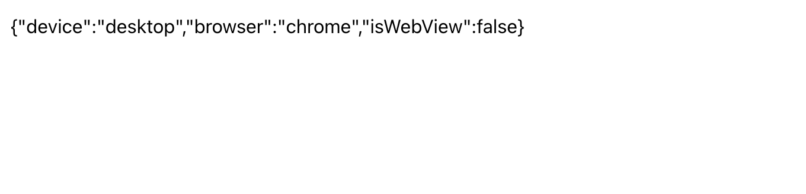
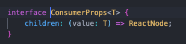
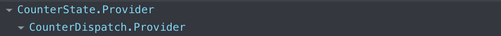
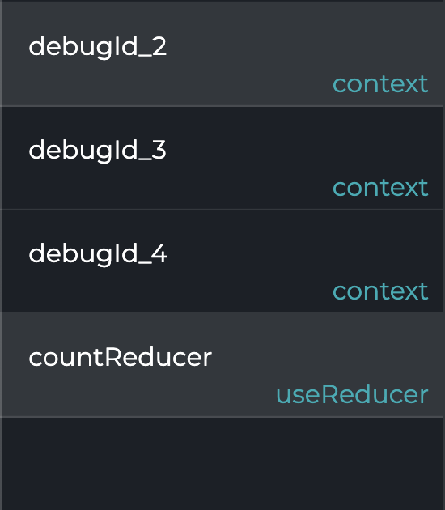
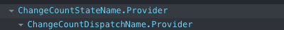
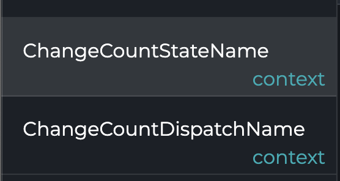
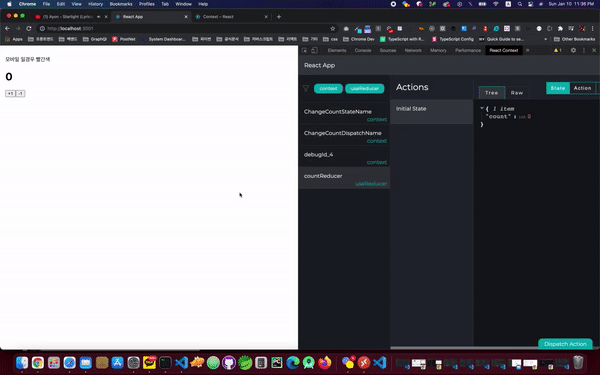

# Context

- Context를 사용하면 단계마다 일일이 props를 넘겨주지 않고도 컴포넌트 트리 전체에 데이터를 제공할 수 있다.
- Context를 이용하면, 트리 단계마다 명시적으로 props를 넘겨주지 않아도 많은 컴포넌트가 이러한 값을 공유할 수 있다.

## 언제 context를 써야 할까?

- context는 React 컴포넌트 트리 안에서 전역적이라고 볼 수 있는 데이터를 공유할 수 있도록 고안된 방법이다. 그러한 데이터로 현재 로그인한 유저, 테마, 선호하는 언어 등이 있다.
- 필자는 주로 기획쪽에서 요청하는 것이 PC에서는 일정 너비를 주어주고, 해당 너비보다 줄면 스크롤이 생기게하고, 모바일로 접속시에는 모바일 UI에 맞게 해달라고 요청 받을 때가 많았다. 그리고 API를 보낼때에도 PC인지, 모바일인지에 따라 다른 API 요청을 받아야할때 등등 그럴떄 UserAgent값을 이용해서 분기를 치는데 매번 UserAgent를 만들어주지 않고 Context를 하나 생성해서 사용하고 있다.

```md
조은님께서 주신 의견 : User-Agent는 근데 조만간 deprecated 되고 client hints를 메인 스펙으로 가져갈 예정. https://wicg.github.io/ua-client-hints/

아래 예제는 전역에 변경이 필요없는 자원을 공유하는 방법 정도로 생각해주세요 client hints를 메인 스펙으로 가져갈 예정이라고 하니, 혹시라도 이전에 userAgent를 사용하고 있는 프로젝트들이 있다면 대비도 필요할듯 합니다. IE 브라우저 대응하시는 분들은 제가 조만간 대응 방안에 대해서는 knowledge-warehouse에 정리해서 올리겠습니다.
```

`context를 사용하지 않고, 다른 기타 상태 관리 라이브러리를 사용하지 않는 경우에는 트리 구조 상 App - TodoPage - TodoList - ListItem`에서 만약 ListItem만 item object를 받으면 되는 것을 결국 App에서 TodoPage로 넘겨주고 TodoList로 넘겨줘야 하는 경우가 생긴다. 하지만 Context를 사용하면 ListItem에서 Context를 사용하면 중간 엘리먼트들에게 props를 넘겨주지 않아도 된다.

## Context를 사용하기 전에 고려할 것.

- context의 주된 용도는 다양한 레벨에 중첩된 많은 컴포넌트들에게 데이터를 전달하는 것이다.
- 여러 레벨에 걸쳐 props를 넘기는 걸 대체하는 데에 context보다 <a href="https://ko.reactjs.org/docs/composition-vs-inheritance.html">컴포넌트 함성</a>이 더 간단한 해결책일 수 있다.

`간단하게 보는 컴포넌트 함성`

```jsx

<Page user={user} avatarSize={avatarSize} />
// ... 그 아래에 ...
<PageLayout user={user} avatarSize={avatarSize} />
// ... 그 아래에 ...
<NavigationBar user={user} avatarSize={avatarSize} />
// ... 그 아래에 ...
<Link href={user.permalink}>
  <Avatar user={user} size={avatarSize} />
</Link>
```

> 지금 만약 Link와 Avatar 컴포넌트에게 user와 avatarSize라는 props를 전달행 하는 `Page`컴포넌트를 생각해보자.

- 실제 사용되는 곳은 Avatar 컴포넌트 뿐인데 user와 avatarSize props를 여러 단계에 걸쳐 보내줘야 한다는게 번거러울 수 있다.

`Avatar 컴포넌트 자체를 넘겨주면` context를 사용하지 않고, 이를 해결할 수 있다.

```jsx
function Page(props) {
  const user = props.user;
  const userLink = (
    <Link href={user.permalink}>
      <Avatar user={user} size={props.avatarSize} />
    </Link>
  );
  return <PageLayout userLink={userLink} />;
}

// 이제 이렇게 쓸 수 있습니다.
<Page user={user} avatarSize={avatarSize} />
// ... 그 아래에 ...
<PageLayout userLink={...} />
// ... 그 아래에 ...
<NavigationBar userLink={...} />
// ... 그 아래에 ...
{props.userLink}
```

> 그 아래에 표시는 트리구조 상 page -> pageLayout -> NavationBar -> Link -> Avatar이런식으로 있다고 보면된다.
>
> - `하지만 이방식 또한 복잡한 로직을 상위로 옮기면, 이 상위 컴포넌트들은 더 난해해지기 마련이고 하위 컴포넌트들은 필요 이상으로 유연해져야 한다.`

- 같은 데이터를 트리 안 여러 레벨이 있는 많은 컴포넌트에게 주어야 할 경우도 있을 수 있다. 이 때 데이터 값이 변할 때마다 모든 하위 컴포넌트에게 널리 `broadcast`하는 것이 context이다. 흔한 예시로 선호 로케일, 테마, 데이터 캐시 등을 관리하는 데에 있어서는 일반적으로 context를 사용하는 것이 가장 편리하다.

## API

### React.createContext

```js
const MyContext = React.createContext(defaultValue);
```

> Context 객체를 만든다. Context 객체를 구독하고 있는 컴포넌트를 렌더링할 때 React는 트리 상위에서 가장 가까이 있는 짝이 맞는 `Provider`로부터 현재 값을 읽습니다.

`defaultValue` 매개변수는 트리 안에서 적절한 Provider를 찾지 못했을 때만 쓰이는 값이다. 컴포넌트를 독립적으로 테스트할 때 유용한 값이다. Provider를 통해 undefined값을 내보낸다고 해도 구독 컴포넌트들이 `defaultValue`를 읽지는 않는다는 점에 유의하자.

### Context.Provider

```jsx
<MyContext.Provider value={/* 어떤 값 */>}>
```

- Context 오브젝트에 포함된 React 컴포넌트인 Provider는 context를 구독하는 컴포넌트들에게 context의 변화를 알리는 역할을 한다.
- Provider 컴포넌트는 `value` prop을 받아서 이 값을 하위에 있는 컴포넌트에게 전달한다. 값을 전달받을 수 있는 컴포넌트의 수에 제한은 없습니다. Provider 하위에 또 다른 Provider를 배치하는 것도 가능하며, 이 경우 하위 Provider의 값이 우선시 된다.
- Provider 하위에서 Context를 구독하는 모든 컴포넌트는 Provider의 value prop이 바뀔 때마다 다시 렌더링 된다. Provider로부터 하위 consumer (.contextType와 useContext를 포함한)로의 전파는 shouldComponentUpdate 메서드가 적용되지 않으므로, 상위 컴포넌트가 업데이트를 건너 뛰더라도 consumer가 업데이트된다.
- context 값이 바뀌었는지 여부는 `Object.is`와 동일한 알고리즘을 사용해 이전 값과 새로운 값을 비교해서 측정된다.

> 가장 최하단에서 CreateContext와 더불어 전체 예시를 들어드리겠습니다.

### Class.contextType

- `React.createContext()` 로 생성한 Context 객체를 원하는 클래스의 `contextType` 프로퍼티로 지정할 수 있습니다. 그러면 그 클래스 안에서 this.context를 이용해 해당 Context의 가장 가까운 Provider를 찾아 그 값을 읽을 수 있게 된다. 이 값은 render를 포함한 모든 컴포넌트 생명주기 메서드에서 사용할 수 있다.

<span style="color:red;">경고 : 위 API는 하나의 context만 구독할 수 있다. 여러 context를 구독하기 위해서는 여러 context 구독하기를 참조하자.</span>

```tsx
import React from "react";
import { UserEnvStateContext } from "../../Contexts/UserEnv";
type Props = {};

class ClassCounter extends React.Component<Props> {
  static contextType = UserEnvStateContext;
  constructor(props: Props) {
    super(props);

    this.state = {};
  }

  componentDidMount() {
    let value = this.context;
    console.log(value);
  }

  render() {
    return <div>{JSON.stringify(this.context)}</div>;
  }
}

export default ClassCounter;
```

> 필자는 해당 클래스 컴포넌트의 정적 프로퍼티로 `contextType`을 지정해서 사용했고 결과는 아래와 같다.



### Context.Consumer

- context 변화를 구독하는 React 컴포넌트입니다. `함수 컴포넌트`안에서 context를 읽기 위해서 쓸 수 있습니다.
- 하지만, 클래스 컴포넌트에서도 사용가능합니다..
- Context.Consumer의 자식은 함수여야한다. 이 함수는 context의 현재값을 받고 React 노드를 반환한다. 해당 함수가 받는 value 매개변수 값은 해당 context의 Provider 중 상위 트리에서 가장 가까운 Provider의 value prop과 동일하다. 상위에 Provider가 없다면 value 매개변수 값은 `createContext()`에 보냈던 `defaultValue`와 동일할 것이다.
  

```tsx
import React from "react";
import { UserEnvStateContext } from "../../Contexts/UserEnv";
type Props = {};

class ClassCounter extends React.Component<Props> {
  static contextType = UserEnvStateContext;
  constructor(props: Props) {
    super(props);

    this.state = {};
  }

  componentDidMount() {
    let value = this.context;
    console.log(value);
  }

  render() {
    return (
      <div>
        <UserEnvStateContext.Consumer>
          {(value) => JSON.stringify(value)}
        </UserEnvStateContext.Consumer>
      </div>
    );
  }
}

export default ClassCounter;
```

### Context.displayName

- Context 객체는 displayName 문자열 속성을 설정할 수 있다. React 개발자 도구는 이 문자열을 사용해서 context를 어떻게 보여줄지 결정한다.

`변경 전 React 개발자 도구`


`변경 전 React Context 개발자 도구`


`변경 후 React 개발자 도구`


`변경 후 React Context 개발자 도구`


- 이제 Redux 없이 만들어본 카운터 예제를 한번 보도록 하자.

`UserEnv.tsx`

```tsx
import * as React from "react";

type UserEnvProviderProps = { children: React.ReactElement | React.ReactElement[] };

export const UserEnvStateContext = React.createContext<{ [key: string]: any } | undefined>(
  undefined
);

/**
 * @description 모바일인지 아닌지 확인 모바일의 경우 (Mobile: true, PC: false)
 * @returns boolean
 */
function isMobile(_ua: string): boolean {
  return _ua.indexOf("mobi") > -1;
}

/**
 *
 * @description 브라우저 체크 용도
 * @param {string} _ua
 * @returns {string}
 */
function checkBrowser(_ua: string): string {
  const browserList = ["chrome", "safari", "firefox", "edge", "rv:11", "msie", "opera"];

  const filter = browserList.filter((item) => _ua.indexOf(item) > -1)[0];

  return filter === "rv:11.0" || filter === "msie" ? "ie" : filter;
}

/**
 *
 * @description 웹뷰 인지 확인 하는 용도
 * @param {string} _ua
 * @returns {string}
 */
function checkWebView(_ua: string): string | boolean {
  if (isMobile(_ua)) {
    if (_ua.indexOf("android") > 0 && _ua.indexOf("wv") > 0) {
      return "android";
    } else if (_ua.indexOf("mac os") > 0 && _ua.indexOf("safari") <= 0) {
      return "ios";
    }
  }
  return false;
}

function UserEnvProvider({ children }: UserEnvProviderProps) {
  const _ua = navigator.userAgent.toLowerCase();
  const env = {
    device: isMobile(_ua) ? "mobile" : "desktop",
    browser: checkBrowser(_ua),
    isWebView: !checkWebView(_ua) ? checkWebView(_ua) : "browser",
  };

  return <UserEnvStateContext.Provider value={env}>{children}</UserEnvStateContext.Provider>;
}

function useUserEnvState() {
  const context = React.useContext(UserEnvStateContext);

  if (context === undefined) {
    throw new Error("useContextEnv must be used wiithin a UserEnvProvider");
  }

  return context;
}

export { UserEnvProvider, useUserEnvState };
```

`Counter-context.tsx`

```tsx
import * as React from "react";

export const INCREMENT = "counter/INCREMET";
export const DECREMENT = "counter/DECREMENT";

type Action = { type: typeof INCREMENT } | { type: typeof DECREMENT };
type Dispatch = (action: Action) => void;
type State = { count: number };
type CountProviderProps = { children: React.ReactElement | React.ReactElement[] };

export const CountStateContext = React.createContext<State | undefined>(undefined);
CountStateContext.displayName = "ChangeCountStateName";
export const CountDispatchContext = React.createContext<Dispatch | undefined>(undefined);
CountDispatchContext.displayName = "ChangeCountDispatchName";

function countReducer(state: State, action: Action) {
  switch (action.type) {
    case INCREMENT: {
      return { ...state, count: state.count + 1 };
    }
    case DECREMENT: {
      return { ...state, count: state.count - 1 };
    }
    default:
      console.error(new Error(`Unhandled action type: ${(action as any).type}`));
      return state;
  }
}

function CountProvider({ children }: CountProviderProps) {
  const [state, dispatch] = React.useReducer(countReducer, { count: 0 });
  return (
    <CountStateContext.Provider value={state}>
      <CountDispatchContext.Provider value={dispatch}>{children}</CountDispatchContext.Provider>
    </CountStateContext.Provider>
  );
}

function useCountState() {
  const context = React.useContext(CountStateContext);

  if (context === undefined) {
    throw new Error(`useCountState must be used within a CountProvider`);
  }

  return context;
}

function useCountDispatch() {
  const context = React.useContext(CountDispatchContext);
  if (context === undefined) {
    throw new Error(`useCountDispatch must me used within a CountProvider`);
  }

  return context;
}

export { CountProvider, useCountState, useCountDispatch };
```

`index.tsx`

```tsx
import React from "react";
import ReactDOM from "react-dom";
import "./index.css";
import App from "./App";
import reportWebVitals from "./reportWebVitals";

import { debugContextDevtool } from "react-context-devtool";
import { CountProvider } from "./Contexts/Counter-context";
import { UserEnvProvider } from "./Contexts/UserEnv";

const container = document.getElementById("root");

ReactDOM.render(
  <React.StrictMode>
    <CountProvider>
      <UserEnvProvider>
        <App />
      </UserEnvProvider>
    </CountProvider>
  </React.StrictMode>,
  container
);

reportWebVitals();

debugContextDevtool(container, { disable: process.env.NODE_ENV === "production" });
```

`Counter.tsx`

```tsx
import React from "react";
import {
  DECREMENT,
  INCREMENT,
  useCountDispatch,
  useCountState,
} from "../../Contexts/Counter-context";
import { useUserEnvState } from "../../Contexts/UserEnv";

const Counter = () => {
  const counterState = useCountState();
  const dispatch = useCountDispatch();
  const { device } = useUserEnvState();

  // console.log(env);
  return (
    <div>
      <p style={{ color: device === "mobile" ? "red" : "black" }}>모바일 일경우 빨간색</p>
      <h1>{counterState.count}</h1>
      <button onClick={() => dispatch({ type: INCREMENT })}>+1</button>
      <button onClick={() => dispatch({ type: DECREMENT })}>-1</button>
    </div>
  );
};

export default Counter;
```

> 타입스크립트의 경우에는 react-app-env.d.ts 나 타입스 파일에

```ts
declare module "react-context-devtool";
```

> 이것을 넣어줘야 React Context devtools를 사용할 수 있다. 별도의 타입 파일이 없다. 그리고 클래스 컴포넌트에 Context사용시에는... 이상하게 개발자도구가 바보가된다. 그렇기에 클래스컴포넌트를 사용한다면 React-Context devtool은 사용하지말자...

- 이제 한번 결과 화면을 보도록하자:)
  

> 리덕스를 사용하지 않고도 잘 만들어진것을 볼 수 있다.

`주의 사항`

- 다시 렌더링할지 여부를 정할 떄 참조(reference)를 확인하기 때문에, Provider의 부모가 렌더링 될때마다 불필요하기 하위 컴포넌트가 다시 렌더링 되는 이슈가 생길 수 있으니. 가급적 원시타입으로 넣는 것을 권장한다.
- Object.is를 이용해서 비교하기에 위에서 보았듯이 `Object.is({}, {})는 false가 나오는 것을 보았기 때문에 원시타입을 사용할 수 있다면 원시타입을 사용해서 넣어주자..`
