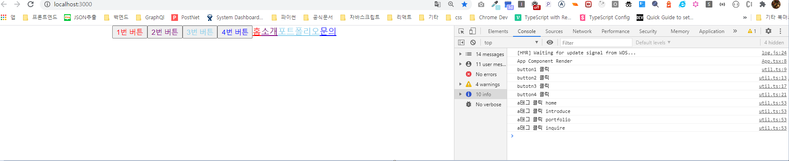

# 엘리먼트 변환 및 생성하기 (Element Conversion)

## Made By. Sangheon Kim(ksj8367@gmail.com)

- 배워볼 메서드
    - React.createElement()
    - React.Children
    - React.cloneElement()
    - React.isValidElement()

## React.createElement()
 - 인자로 주어지는 타입에 따라 새로운 React 엘리먼트를 생성하여 반환한다. JSX로 작성한 코드 역시도 React.createElement()로 변환된다.
 - 필자는 React docs의 React.createElement를 어떻게 활용할지 엄청 고민했다. React.createElement에 대해 언제 쓰면 좋을지 고민하던중 협업을 하면서, 공통적인 Interface를 명시하거나, 공통 스타일을 적용시 쓰면 좋지 않을까 생각했다.

 > 아래 두가지 함수를 만들어서 사용해보았다.(button 생성 함수와 anchor 태그 생성함수)

 ```javascript
 import * as React from "react"

// 버튼 리스트 관련 인터페이스 타입
export interface IBtnAttr {
  text: string;
  key: string;
}

// 메뉴 배열 관련 인터페이스 타입
export interface IMenuAttr {
  text: string;
  key: string;
  href: string;
}

// 버튼 생성 관련 배열
export const btnArray: IBtnAttr[] = [
  {
    text: '1번 버튼',
    key: 'button1'
  },
  {
    text: '2번 버튼',
    key: 'button2'
  },
  {
    text: '3번 버튼',
    key: 'button3'
  },
  {
    text: '4번 버튼',
    key: 'button4'
  }
];

// 메뉴 생성관련 배열
export const linkArray: IMenuAttr[] = [
  {
    text: '홈',
    key: 'home',
    href: '/'
  },
  {
    text: '소개',
    key: 'introduce',
    href: '/introduce'
  },
  {
    text: '포트폴리오',
    key: 'portfolio',
    href: '/port'
  },
  {
    text: '문의',
    key: 'inquire',
    href: '/inquire'
  }
]

 // 버튼 생성 함수
export function createButton(item: IBtnAttr, index: number | undefined, ref?: React.RefObject<HTMLElement>):React.ReactElement {
  const $button = React.createElement("button", {
    className:`button-sh ${item.key}`,
    type: 'button',
    key: `${item.key}_${index}`,
    id: item.key,
  }, item.text);

  return $button;
}

// a태그 생성함수
export function createLink(item: IMenuAttr, index: number | undefined, ref?:React.RefObject<HTMLElement>):React.ReactElement {
  const $atag = React.createElement("a", {
    className: `link-sh ${item.key}`,
    key: `${item.key}_${index}`,
    href: item.href,
    id: item.key,
  }, item.text)

  return $atag;
}
 ```

 - 예를들어 내가 만약 주기적으로 써오는 각 태그별 무조건적인 스타일이 있을 경우를 정의 해놓은 경우로 가정하여, 버튼 태그에는 생성시에 자동으로 버튼 생성함수에는 button-sh를 붙여준 것이고, 링크 태그 생성에는 link-sh를 붙여주었다. 각 태그별로 붙여줄 식별 키에는 index보다 고유한 키값을 지정해주는것을 권장하기에 더미 객체에는 key값을 싣어주었고, key를 가지고 id로도 사용하고 있다. 흔히 잊기 쉬운 type같은것들도 직접적으로 명시해주어 접근성 향상에도 도움을 줄 수도 있다. 
 - 놓치기 쉬운 그런 항목들 디테일한 부분을 챙기면서, 공통적인 부분들을 정의해줄 때 사용한다면, 위에서 정의한 함수를 가지고 만들어주는 것이다.

 **비슷한 것으로 React.createFactory가 있지만, 해당 함수는 레거시 기능으로 간주되고,  React엘리먼트를 만들어내는 함수를 반환하는 것이라는 차이가 있고, 공식문서에서도 createElement를 쓰라고 권장한다. 궁금하다면 https://ko.reactjs.org/docs/react-api.html#createfactory 를 들어가보자**


## React.Children
 - 불투명한 자료구조인 props.children을 다루는 유틸함수를 제공

### React.Children.map
- 첫번째 인수로는 props에 전달된 children을 전달하는데, 이 자식에 대해서는 각 배열의 자식들에 대한 함수가 호출된다. children이 null이거나 undefined인 경우 배열을 리턴하지 않고, null이나 undefined반환
> children이 Fragment인 경우 단일 자식으로 취급하여 순회하지 않는다.

```jsx
React.Children.map(children, function[(thisArg)])
```

### React.Children.forEach
 - 기본적으로 필자인 저는 이번에 forEach와 map을 설명하기에 앞서, 자바스크립트 공부를 하고오면 좋겠다. Array.prototype.map과 Array.prototype.forEach의 차이는 바로 리턴타입에 대한 차이가 있다. 

 ```js
 const arr = [1,2,3].map((item) => item + 1);
 console.log(arr) // ['2', '3', '4'];

 const forEachArr = [1,2,3].forEach((item) => item + 1);
 console.log(forEachArr) // undefined
 ```
 > 위 코드를 보면 알겠지만, map은 순회하면서 리턴해주는 것에 대한 새로운 배열을 생성해서 순회가 끝나면 새 배열을 리턴 해주게 된다. **하지만, forEach는 아무것도 리턴 해주지 않는다.**

 - 자 위의 결과를 보면 알겠지만, 리액트에서도 마찬가지로 map은 순회 후에 새로운 배열을 리턴해준다. 하지만, forEach는 undefined를 리턴한다 곧 아무것도 리턴해주지않는다. 그차이로 접근하자. 결국 Children.map과 Children.forEach는 반환값에 대한 차이가 있다. 단순히 순회만 할거라면 forEach를 처리 후에 배열이 필요하다면 map을 사용하자
```jsx
React.Children.forEach(children, function[(thisArg)])
```

### React.Children.count
 - map이나 forEach가 순회할 횟수와 동일하다. children에 포함된 컴포넌트 개수가 몇개인지 반환해주는 것.

```jsx
// (method) React.ReactChildren.count(children: any): number
React.Children.count(props.children) // 반환 값은  number타입이다.
```

### React.Children.only
 - 단 하나의 자식을 갖는지 확인하고 해당 자식 엘리먼트를 반환한다. -> 한개 이상이거나 없을 경우 에러 발생... 솔직히 이건 왜쓰는지 아직 모른다. 억지로 써보기위해서 children이 8개가 있는 컴포넌트에서 사용해보았다. 
 - 어떻게든 사용용도를 알려드리려했으나... 이건 잘모르겠다..
 ```jsx
 console.log(React.Children.only(props.children[0][0])) // React.ReactElement
 ```

### React.Children.toArray
 - 각 자식에 key가 할당된 배열을 children 자료구조로 반환. render()메서드에서 children 집합을 다루고싶을 때나 특히 하부 전달전에 일부를 잘라내거나 정렬할때 쓰면 좋다고 한다.
 - 필자가 확인한 가장 두드러진 차이는 평평해진 배열이었다..
 ```jsx
 // ButtonGroup.tsx 일부...
  <div className="ButtonGroup">
    <CloneWrapper>
      {btnArray.map((item:IBtnAttr, index) => createButton(item, index))}
      {linkArray.map((item: IMenuAttr, index) => createLink(item, index))}
    </CloneWrapper>
  </div>

// CLoneWrapper.tsx
const CloneWrapper:React.FC = (props: any) => {
  console.log('toArray', React.Children.toArray(props.children))
  
  console.log('withOut toArray', props.children)
}

export default CloneWrapper;
 ```


> 자 이제 마지막 두가지를 알아보자. (React.cloneElement, React.isValidElement)

## React.isValidElement() 
 - 여기에 인수로 object 타입을 아무거나 넣어보자.  React 엘리먼트인지 아닌지 확인해서 Boolean으로 반환해준다.

## React.cloneElement()
- element를 기준으로 새로운 React Element를 복사하고 반환한다고 한다. 첫번째 인자값으로 들어가는 React Element가 가지는 props와 새로운 props를 합쳐줄 수 있는 좋은 기능이다. 형식을 먼저 보자.
- clone 이름 그대로 복제다 하지만, 뭔가 추가적인 프롭스를 전달할 수 있는 이 함수 어떻게 쓰면 좋을까? 고민을 해보았다. 

```jsx
// 아시는 분들도 많겠지만, []가 붙은것은 생략이 가능하다는 것이다.
React.cloneElement(
  element,
  [props],
  [...children]
)
```

> 자 위에서 설명한 두가지와 각 엘리먼트 별로 onClick 이벤트를 따로주는 함수를 짜보자.

```jsx
// utils.ts
// 버튼 클릭에 대한 정의
export const buttonClick = (e: any, refArray: any, index: number) => {
  const { current } = refArray[index];
  let _this:HTMLButtonElement = current;

  if (!!refArray[index]) {
    switch(refArray[index].current.id) {
      case 'button1':
        console.log('button1 클릭');
        _this.style.color = 'red'
        break;
      case 'button2':
        console.log('button2 클릭');
        _this.style.color = 'purple'
        break;
      case 'button3':
        console.log('butotn3 클릭');
        _this.style.color = 'skyblue'
        break;
      case 'button4':
        console.log('button4 클릭');
        _this.style.color = 'blue'
        break;
      default:
        console.log('정의 안되어있음')
    }
  }
}

// a태그 링크 관련 함수
export const linkClick = (e: any, refArray: any, index: number) => {
  e.preventDefault();
  const { current }  = refArray[index] as {current: HTMLAnchorElement};
  let _this = current;
  if (!!current) {
    switch(current.id) {
      case 'home':
        _this.style.color = 'red'
        break;
      case 'introduce':
        _this.style.color = 'purple'
        break;
      case 'portfolio':
        _this.style.color = 'skyblue'
        break;
      case 'inquire':
        _this.style.color = 'blue'
        break;
      default:
        console.log('정의 안되어있다.')
    }
  }
  console.log('a태그 클릭', e.target.id);
}
```
- 함수를 선언도 해놓았겠다 이제 한번 cloneElement를 활용하여 전부 onClick을 정의해줘보자
```jsx
// CloneWrapper.tsx
import * as React from 'react';
import { buttonClick, linkClick } from "../../assets/util";

// 클론 Wrapper 이안에 들어오는 Children 요소들에 대해서 props를 재정의하거나, children을 재정의가 가능하다.
const CloneWrapper:React.FC = (props: any) => {
  let refArray: any = [];
  
  const cloneButtons = React.Children.map(props.children, (child:React.ReactElement, index: number) => {
    refArray.push(React.createRef());
    
    return React.isValidElement(child) ?  React.cloneElement(child as React.ReactElement, {
      onClick:  child.type === 'a' ? (e: any) => linkClick(e, refArray, index) : (e: any) => buttonClick(e, refArray, index),
      ref: refArray[index]
    }) : null
  })
  
  return <React.Fragment>{cloneButtons}</React.Fragment>
}

export default CloneWrapper;
```
> React.isValidElement를 활용해서 리액트 엘리먼트 인경우에만 cloneElement를 이용하여 엘리먼트 복제를 해준다. 왜냐하면 리액트 엘리먼트가 아니면 에러난다. onClick에는 child의 타입을 통해 태그를 확인하여 linkClick함수 또는 button클릭함수로 보내주었다. ref에는 미리 앞에서 순회하면서 refArray에 createRef를 넣고 인덱스 넘버가 동일하기에 넣어준다.

- 최종적으로 CloneWrapper를 감싸고 있는 ButtonGroup엘리먼트를 렌더링 시켜준다.
```jsx
// ButtonGroup.tsx
import * as React from 'react';
import { btnArray, createButton, createLink, IBtnAttr, IMenuAttr, linkArray } from "../../assets/dummy";
import CloneWrapper from "./CloneWrapper";


const ButtonGroup = () => {
  
  return (
    <div className="ButtonGroup">
      <CloneWrapper>
        {btnArray.map((item:IBtnAttr, index) => createButton(item, index))}
        {linkArray.map((item: IMenuAttr, index) => createLink(item, index))}
      </CloneWrapper>
    </div>
  )
}

export default ButtonGroup
```
버튼들 클릭전

버튼들 클릭 후


> 필자도 여러번 써보지 못한 함수를 어떻게든 설명하려고 애쓰다보니.. 예제가 그렇게 설득력 있지는 않을거라고 생각한다.. 하지만 이글을 읽고 있는 분은 저보다 잘할 것으로 생각되기에... 아마 이 함수를 어디에 쓰면 좋을지 잘 아실 듯합니다. 피드백은 언제든 환영합니다. 오늘은 이정도에서 글을 정리하겠습니다.