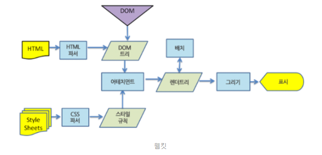
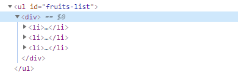
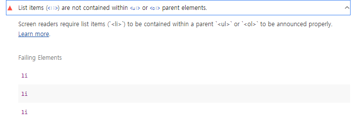
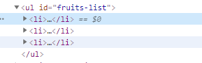

# React.Fragment 와 자바스크립트의 Fragment에 대해 알아보자

## Written by Sangheon Kim(ksj8367@gmail.com)

  - 이 이야기를 하기전에 Fragment는 과연 리액트에서만 볼 수 있는 개념일까? 고민해보자 리액트나 앵귤러 뷰 모두 자바스크립트 기반의 프론트엔드 프레임워크다. 먼저 왜 이 개념이 나오게 되었는지 이유를 알게되면 프레임워크를 개발한 개발자가 어떤걸 의도했는지 확인할 수 있다.
  - 단순히 프레임워크 사용법만 익히는데 그치지 않고, 오늘은 이런 것들이 왜 나오게 되었는지에 대해서도 알아보자


## 선수지식
 - 플로우와 페인트
 - Repaint와 Reflow
 - 렌더 트리

### 선수지식에 대해서 간단하게 한번 살펴보고 넘어가자

- 위에 이미지를 한번 보자. 위에 이미지에서 배치는 플로우를 나타내고 그리가 페인트를 나타낸다고 생각하자.

#### 플로우
  - 돔트리를 구성한 후에 스타일을 합쳐 렌더트리의 과정에서 크기, 위치 등을 담당한다.
#### 페인트
  - 렌더 트리 과정에서 플로우를 통해 계산한 것을 그리는 과정이 바로 페인트다.

#### 렌더 트리
  - HTML 코드를 통해 DOM트리가 만들어지고, CSS나 스타일 태그에 정의한 스타일에 의해 CSSOM Tree가 만들어진다. 그리고 이 DOM 트리와 CSSOM을 이용하여 Render Tree가 생성되게 됩니다.

#### 리플로우와 리페인트
  - Javascript를 통해 어떠한 이벤트가 발생하였을 경우, DOM을 조작하여, UI를 변경하거나 기타 스크립트를 통해, DOM을 추가하거나 조작하는 경우에는 DOM 트리가 바뀌게 되고, CSSOM이 변경되거나 하면서, 렌더트리가 다시 만들어지게되고, 렌더트리가 다시 만들어지면서, 위에서 설명한 플로우와 페인트가 다시 브라우저가 수행하는 것을 리플로우와 리페인트라고 한다.
  - 브라우저는 렌더트리를 활용하여 플로우하고 페인트하여 화면에 나타내주게 되는 것이다.

**CSSOM과 DOM트리 렌더 트리에 대해서는 Google에 검색을 해보면 이보다 더 자세한 설명도 많이 나올것이니 참고 해보시면 더 좋을 것같다. 웹개발자로서 정말 꼭 알아야 하는 주제라고 생각한다.**

**나중에 리플로우와 리페인트에 대해서는 따로 정리 하겠습니다. 일단은 여기서는 리플로우와 리페인트가 너무 자주일어나는건 브라우저 성능에 악영향을 끼친다 정도로 이해하고, 제 글을 읽으시면 이해가 되실겁니다.**

- 자 이제 React.Fragment를 설명하기에 앞서, 프론트엔드 프레임워크들은 왜? 대부분 상위노드를 div태그로라도 꼭 감싸주라고 하는 것일까? 생각해보자. vue에서도 div태그를 사용하기도 하고, vue-fragment라는 모듈을 이용해서 사용하기도 하는 것으로 알고있다. React는 div태그로 감싸거나, React.Fragment를 활용하여 꼭 자식 노드들을 감싸서 컴포넌트를 생성하라고 한다. 만약 그렇지 않으면 <>...</>? 등의 Fragment를 감싸라고 친히 에러를 뱉는다.
typescript React에서는 JSX expressions must have one parent element.

> 그렇다면 Why?
- HTML코드를 한번 보자

```html
<body>
  <ul id="fruits-list"></ul>
  <script>
      // 먼저 dom들에 대해서 선택자를 잡고 변수에 할당해준다.
      const $list = document.querySelector("ul#fruits-list");
          
      // // 과일 리스트를 담아준다.
      const fruits = ['apple', 'banana', 'orange'];
      
      for (let i = 0; i < fruits.length; i++) {
        // 반복문을 돌면서 li태그를 생성해주고
        const $listItem  = document.createElement("li");
        // 텍스트 노드를 생성한 후에 listItem안에 append해주고
        const textNode = document.createTextNode(fruits[i]);
        $listItem.appendChild(textNode);
        
        // 해당 노드를 현재 브라우저에 렌더 되어있는 ul태그에 append해준다.
        $list.appendChild($listItem)
      }
  </script>
</body>
```
> 자 반복문을 순회하면서 append를 해줌으로서, 브라우저에 렌더되어있는 반복문에 될때마다 fruits-list라는 id가 붙어있는 ul태그의 자식 노드로 li태그가 들어가게된다. 3개의 요소 노드를 생성하여 DOM에 3번 추가하므로 DOM이 3번 변경 된다. 이때 리플로우와 리페인트가 3번 실행된다. DOM을 변경하는 것은 높은 비용이드는 처리다. DOM을 변경하는 횟수는 가급적 줄이는 것이 효율적이다. 위에 예제처럼 기존 DOM에 요소 노드를 반복하여 추가하는 것은 비효율적이다.

- 위와 같은 문제를 개선하기 위한 방법으로 컨테이너 요소를 사용하여, 반복문을 순회하는동안 컨테이너요소의 자식 노드로 추가하고, 컨테이너 요소를 반복문이 끝났을 때 담아주자.

```html
<body>
  <ul id="fruits-list"></ul>
  <script>
      // // 먼저 dom들에 대해서 선택자를 잡고 변수에 할당해준다.
      const $list = document.querySelector("ul#fruits-list");
      
      const $container = document.createElement("div");
      // // 과일 리스트를 담아준다.
      const fruits = ['apple', 'banana', 'orange'];
      debugger;
      for (let i = 0; i < fruits.length; i++) {
        // 반복문을 돌면서 li태그를 생성해주고
        const $listItem  = document.createElement("li");
        // 텍스트 노드를 생성한 후에 listItem안에 append해주고
        const textNode = document.createTextNode(fruits[i]);
      
        $listItem.appendChild(textNode);
        
        // 해당 노드를 현재 브라우저에 렌더 되어있는 ul태그에 append해준다.
        $container.appendChild($listItem)
      }
      $list.appendChild($container);
  </script>
</body>
```
> 하지만, 위방법으로 하면 횟수적인 측면으로는 개선이 되었으나, 현재 코드상의 문제로는 한가지의 문제점과 불편사항이 있다.

 - 문제점1
    - ul태그안에 div태그가 나오는것 자체가 굉장히 좋지 않은 코딩 방법이다... ul태그나 ol태그 밑에는 li태그가 나오는것이 맞다. 실제 이렇게 코딩하고 lighthouse를 돌려보아라
    
   - 사진으로 보면 알겠지만, 당신의 페이지의 접근성 점수를 깎아 내리는 코딩방법이다...

  - 불편사항 1
    - 만약 ul태그가 아니라 div태그를 쓸 수 있는 환경에서 div태그를 서브노드로 넣어도 문제가 없는 코드에서라 한들 불필요하게.. div태그를 생성해서 넣어야하는 불편한 상황이 생긴다... 또는 혹시라도 div태그에 자체 스타일이 있어 만약 스타일 속성중에 inherit되어야하는 경우에 inherit이 제대로 이루어지지 않아... 내가 원치 않는 산출물이 나올 수도 있다..


> 그러면 위에서의 불편사항과 문제점도 해결할 수 있는 방법이 없을까? 리플로우 리페인트는 해결되었지만, 다른 문제점이 생겨버린 것이다. 이 모든것을 해결하기 위해 그가 나타났다 *Fragment* 도와줘요!!
- **Fragment**는 부모노드가 없어서 기존 DOM과는 별도로 존재한다는 특징이 있다. 별도의 서브 DOM을 구성하여 기존 DOM에 추가하기 위한 용도로 등장했다.

```html
<body>
  <ul id="fruits-list"></ul>
  <script>
      // // 먼저 dom들에 대해서 선택자를 잡고 변수에 할당해준다.
      const $list = document.querySelector("ul#fruits-list");   
      const $fragment = document.createDocumentFragment();
      // // 과일 리스트를 담아준다.
      const fruits = ['apple', 'banana', 'orange'];
      // debugger;
      for (let i = 0; i < fruits.length; i++) {
        // 반복문을 돌면서 li태그를 생성해주고
        const $listItem  = document.createElement("li");
        // 텍스트 노드를 생성한 후에 listItem안에 append해주고
        const textNode = document.createTextNode(fruits[i]);
      
        $listItem.appendChild(textNode);
        
        // 해당 노드를 현재 브라우저에 렌더 되어있는 ul태그에 append해준다.
        $fragment.appendChild($listItem)
      }
      $list.appendChild($fragment);
  </script>
</body>
```

 - container요소를 이용했을때에 문제점 및 불편사항도 해결하고 반복문을 돌떄마다 DOM을 건드리지 않고, 최종적으로 Fragment를 반복문이 끝난다음 list에 넣어줌으로서, 리플로우 리페인트를 가급적 줄이는 것도 해낸것이다. 이것이 바로 꿩먹고 알먹고!

- 위에서 설명한 것을 기반으로 아래 코드를 이해해보자.
```html
<body>
  <div class="virtualNode" style="display: none;" >
    <h1>헤드라인 태그</h1>
    <h2>헤드라인2 태그</h2>
    <span>123</span>
  </div>
  <button id="list-append">부모 없는 노드리스트 복사</button>
  <button id="parent-append">부모로 감싸져있는 돔 복시</button>
  <p>결과: <strong id="result-name"></strong></p>
  <div class="result"></div>
  
  <script>
    const $vc = document.querySelector(".virtualNode");
    const $body = document.querySelector("body");
    const $listAppend = document.querySelector("#list-append");
    const $parentAppend = document.querySelector("#parent-append");
    const $result = document.querySelector(".result");
    const $resultTitle = document.querySelector("#result-name");

    const cloneVC = $vc.cloneNode(true);
    cloneVC.style.display = 'block'
    
    $listAppend.addEventListener('click', function() {
      $resultTitle.textContent = '부모 없이 nodeList호출 효과';
      // debugger;
      [...cloneVC.children].forEach((item, index) => {
        console.log(item)
        $result.append(item)
      })
    });

    $parentAppend.addEventListener('click', function() {      
      $resultTitle.textContent = '부모가 있는 요소를 부모로 통째로 appned';
      $result.append(cloneVC)
    });
  </script>
</body>
```
> 위코드를 동작 시켜보면, 부모 요소를 통째로 넣는 것과 자식 노드를 반복해서 순회하는 것이다. 위의 예제로 비교해봐도 좋을 것 같다. 부모요소의 자식요소를 반복해서 뿌려주는 것이 바로 상위노드로 감싸지 않고 출력하는 거랑 비슷한 효과를 낼 것이라고 생각들고, 부모요소로 감싸져있는걸 한번 append하는것이 비슷하지 않을까하여 예제를 만들어보았다.

## React.Fragment
 - React.Fragment 컴포넌트를 사용하면 추가적인 DOM 엘리먼트를 생성하지 않아도 여러 엘리먼트를 반환할 수 있습니다. 상위 노드를 감싸지 않아도 된다는 이야기다. 리액트에서는 div태그 또는 Fragment같은 것으로 상위 노드를 꼭 감싸줘야 한다. 
 이유는 바로 위에서 언급했던 이유가 있다... 

 ```jsx
 // 자바스크립트 fragment 설명한 방식과 동일하지만 리액트에서 HTML element의 이름을 쓰지 않은것도 Fragment로 인식해준다.
 <>
  <li>1</li>
  <li>2</li>
  <li>3</li>
  <h1>헤드라인</h1>
 </>
// 자바스크립트 fragment 설명한 방식과 동일
<React.Fragment>
  <li>1</li>
  <li>2</li>
  <li>3</li>
  <h1>헤드라인</h1>
</React.Fragment>

// 위에서 설명한 2번예제와 비슷
<div>
  <li>1</li>
  <li>2</li>
  <li>3</li>
  <h1>헤드라인</h1>
</div>
 ```

> 자 오늘은 리액트의 기능과 더불어 왜 프레임워크에서는 같은 레벨의 서브노드들을 꼭 div태그로 감싸는지에 대해서 알아보았다. 자바스크립트와 DOM에 대해 공부하다보면, 프레임워크 내부에 특정 메소드들을 왜 제공해줄까에 대한 이유가 간혹 보인다. 프레임워크를 개발한 개발자의 관점에서 보는 시간을 가져보았다.

```jsx
// Fragments.ts
import React from 'react';

const Fragments = () => {
  return (
    <React.Fragment>
      <h1>123</h1>
      <h2>1234</h2>
      <h3>1234</h3>
    </React.Fragment>
  );
};

export default React.memo(Fragments);
```

### 제 글에 대해 틀린점 또는 부족한점이 있다면 피드백은 언제든 주시면 환영입니다.