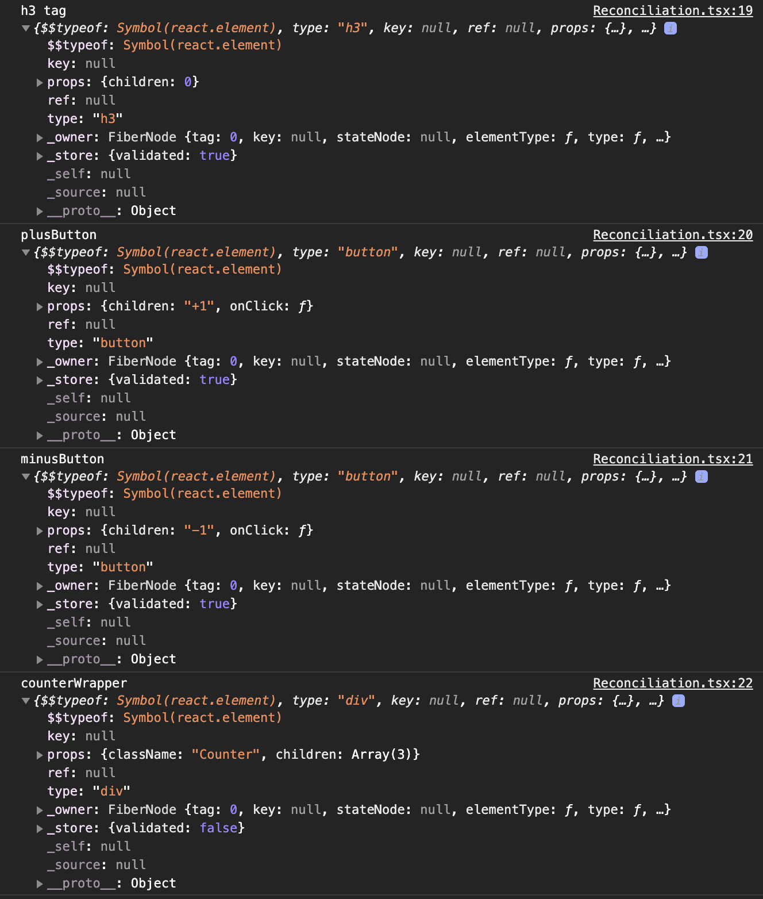
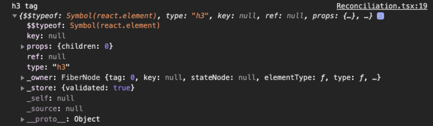
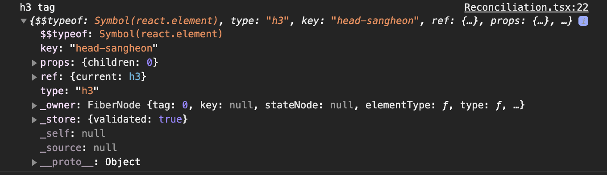
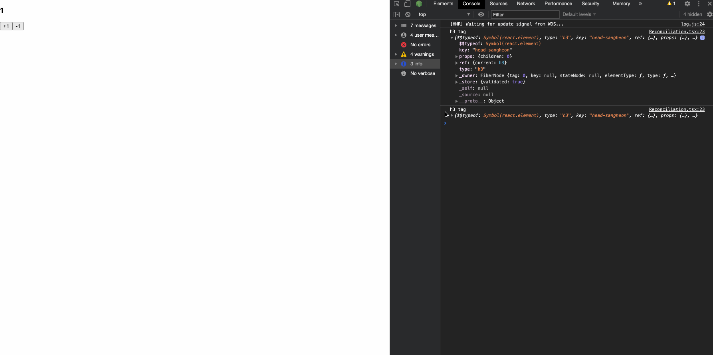
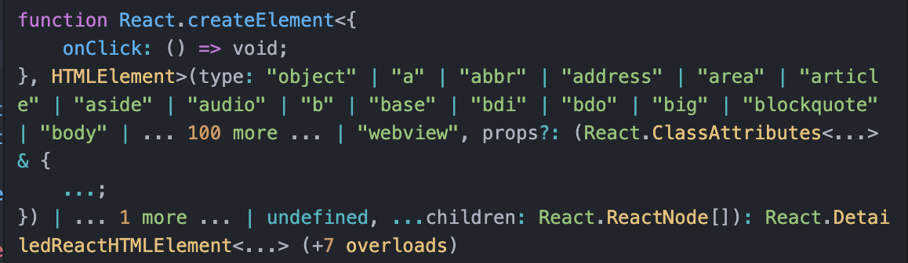
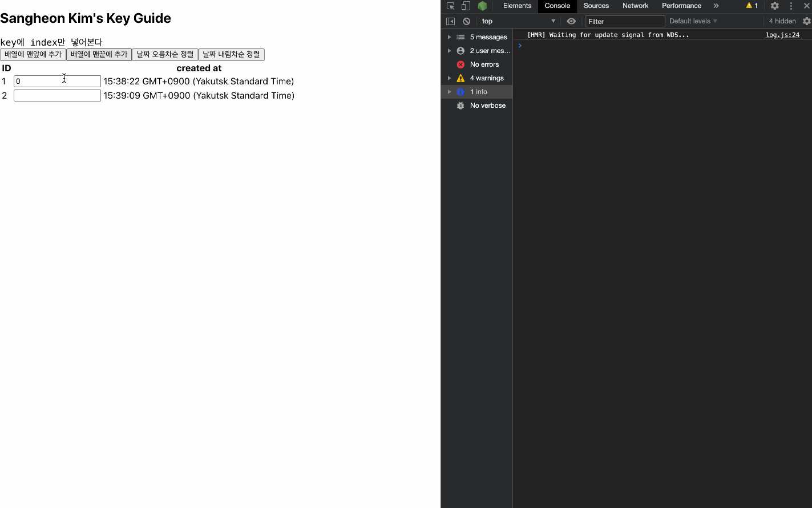
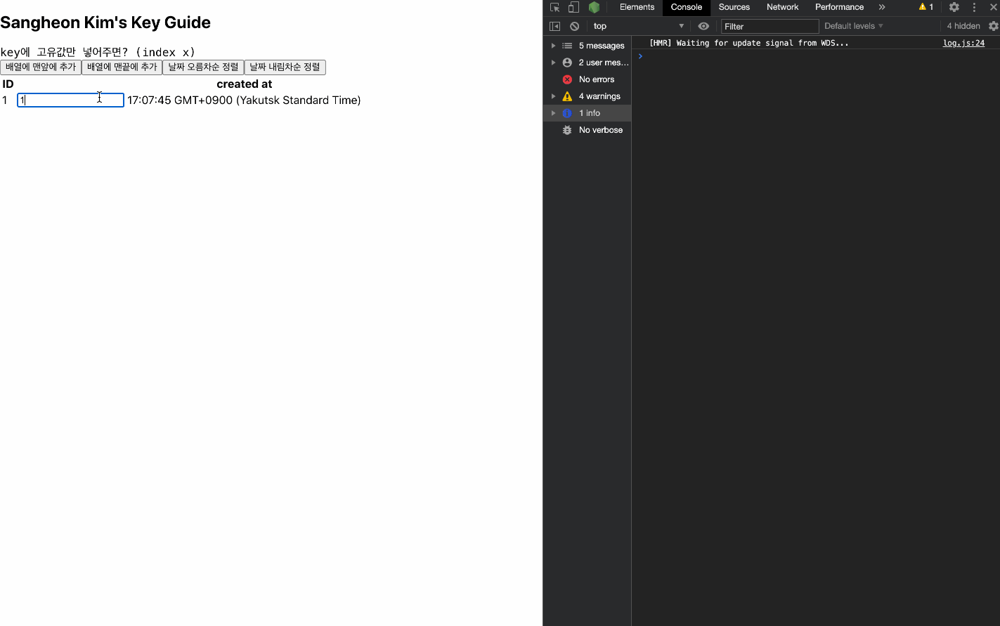

# 재조정 (Reconciliation)

## Written by Sangheon Kim(ksj8367@gmail.com)

- 선수 지식
  - 리액트에서 컴포넌트의 종류 (컴포넌트 정의하는 방법이 아닌 컴포넌트 종류)
  - React.Element의 들어가는 속성

## React 컴포넌트 종류

- Host 컴포넌트 : a태그 button 태그 div 태그등 일반적으로 React.createElement의 첫번째 인수값으로 넣을 수 있는 값들을 Host 컴포너트의 종류이자 HTML Element의 이름들이다.
- 사용자 정의 컴포넌트 : React.Component, React.pureComponent를 상속받아 클래스형으로 만드는 컴포넌트 또는, 함수 컴포넌트가 있다.
- Static 컴포넌트 : React.Fragment, React.context 등 특수한 기능을 위해 리액트 라이브러리가 제공해주는 컴포넌트가 되겠다.

## React.Element의 포함되어 있는 속성

- 이 글을 읽기전에 두번째 글 Element Conversion을 한번 보고 오면 좋을 것 같다.
- 간략 하게 이야기 해보면, JSX 형식으로 개발을 하게되면, 리액트 라이브러리는 그 JSX를 React.createElement를 가지고, 생성을 해줍니다.
- 이것을 모르고 타입이 뭔지도 key랑 prop이 개념으로만 이해하기에는 어려운 주제입니다. 이왕이면 실체를 확인 해보면서 이해하는 것이 아마 더욱 와닿을 것이라고 생각합니다. 저는 개인적으로 눈으로 확인을 할 수 있다면 꼭 확인을 해봅니다. 확인을 해보죠.

- 우선 같은 결과물을 내지만, 서로 다른 방법으로 사용자 정의 컴포넌트를 생성 해보겠습니다.
- 아래 코드에서 보면 위와 아래는 똑같은 동작을 합니다. children을 console로 찍으면 어짜피 볼 수 있는데 뭐하러 힘들게 React.createElement를 활용했냐라고 생각 드실분도 계실겁니다. 하지만 저는 그래도 요소 하나하나마다 모두 이런 attribute들이 있다고 알려드리고 싶었습니다.

```tsx
// 카운터 컴포넌트 생성 방법 1 (Using JSX)
const Counter = () => {
  const [number, setNumber] = React.useState(0);

  const increase = () => setNumber(number + 1);
  const decrease = () => setNumber(number - 1);

  return (
    <div className="Counter">
      <h3>{number}</h3>
      <button onClick={increase}>+1</button>
      <button onClick={decrease}>-1</button>
    </div>
  );
};

// 카운터 컴포넌트 생성 방법 2 (Using React.createElement)
const Counter = () => {
  const [number, setNumber] = React.useState(0);

  const increase = () => setNumber(number + 1);
  const decrease = () => setNumber(number - 1);

  const $headlineNumber = React.createElement("h3", {}, number);
  const $plusButton = React.createElement("button", { onClick: increase }, "+1");
  const $minusButton = React.createElement("button", { onClick: decrease }, "-1");
  const $counterWrapper = React.createElement("div", { className: "Counter" }, $headlineNumber, $plusButton, $minusButton);

  // ComponentDidMount()가 호출되는 시점에 콘솔
  React.useEffect(() => {
    console.log("h3 tag", $headlineNumber);
    console.log("plusButton", $plusButton);
    console.log("minusButton", $minusButton);
    console.log("counterWrapper", $counterWrapper);
  }, []);
  return $counterWrapper;
};
```

> 위 코드는 동일한 결과를 냅니다. 저희는 설명을 위해 Counter안에 있는 콘솔들을 확인 해보겠습니다.
> 

- 보면 각 Element마다 $$typeof, key, props, ref, type 등을 가지고 있다. $$typeof안에 값은 Symbol(react.element)라고 되어있는데, 잠깐 Symbol에 대해서 간단하게 설명 해보자

**Symbol 타입**

```js
let a = Symbol();
let b = Symbol();

console.log('a === b'a === b); // false
```

- Symbol타입으로 선언하면, 생성된 심벌 값은 외부로 노출되지 않아서 확인이 불가능하다. 하지만 이 생성된 심벌 값은 다른 값과 절대 중복되지 않는 유일한 값이다. Symbol타입은 primitive Type(원시 타입)인데 값에 대한 비교를 해보면 false가 나온다. 이유가 뭘까?? 바로 실제 자바스크립트 엔진이 Symbol타입에 실제 내부 값을 노출 시키지는 않지만, 메모리에 저장된 값은 서로 다른 값이 생성되기 때문이다. 객체의 프로퍼티 키로도 사용을 할 수 있는 Symbol 타입을 사용해 프로퍼티키를 지정하고 거기에 값을 할당하면 Object.keys, values, entries나 for...in문 등 객체를 순회하면서 열거해주는 객체 순회 메소드를 통해 확인해도 default Enumerable이 false이기 때문에 직접 프로퍼티에 해당 심벌 값으로 접근해서 확인하지 않는 이상 최소한의 은닉은 보장해준다. 만약 프로퍼티 키별로 구분하고 싶다면 Symbol.for(), Symbol.keyFor를 사용해보자. 전역 심벌 레지스트리에 기존에 같은 Symbol.for안에 지정해둔 키값이 있다면 갱신하고 없다면 생성하는 마법을...

> 심벌 타입에 대한 설명을 더하고 싶지만 글의 본질이 흐려질 것 같아서 이정도로만 넘어가자. $$typeof에 Symbol(react.element)라고 지정되어 있지만, 실제로는 각 element마다 $$typeof값 조차도 다르다는걸 알아두자.. \$\$typeof가 다똑같은거 아냐 할 수 있는 오해는 없애고 싶어 설명하게 되었다..

- 이글을 이해하는데 key, props, ref, type 정도가 뭔지 간단하게 설명 해보자.

```tsx
const $headlineNumber = React.createElement("h3", {}, number); 간단하게 헤드라인 태그를 보자
```



- 위에 콘솔중에 헤드라인 태그만 보면 key값에는 null을 가지고, props에는 children프로퍼티의 값으로 0이 들어가있고, ref는 null, type에는 Element의 tagName이 들어가있다.
- 그렇다면 각 React Element들은 ref, key를 직접적으로 넣어줄 수 있지 않을까? 한번 해보자.

```tsx
// ...
const headLine = React.createRef();
// ...
const $headlineNumber = React.createElement("h3", { key: "head-sangheon", ref: headLine }, number);
// ...

/** 위와 동일한 방법을 JSX 형식으로 하면 */
// ...
const headLine = React.createRef();
// ...
<h3 key="head-sangheon" ref={headLine}>
  {number}
</h3>;
```

> 이제 콘솔을 찍어보자
> 

- key와 ref를 각 요소마다 프로퍼티로 가지고 있기에 할당이 가능하다는 것을 알고 있으면 좋겠다. ref에 대한 설명을 하기전에 쓰는 선수 지식용 개념이기에 ref는 다음에 정말 깔끔하게 정리해주겠다.

**여기서는 아 React Element Object 에는 기본적으로 ref와 key라는 프로퍼티를 가진다 정도로 이해하자. 아래에서 설명하기 위해 간단하게 key와 타입에 대해 간단하게 정리해보자.**

- key와 type
  - Key: React가 어떤 항목을 변경, 추가 또는 삭제할지 식별하는 것을 돕습니다. key는 엘리먼트에 안정적인 고유성을 부여하기 위해 지정한다. 주로, map을 이용하여 배열의 요소를 화면에 나타내줄때에 같은 element를 사용하게 되는데 각 배열의 요소마다 엘리먼트 명이 동일할 수 있기에 지정하는 경우가 대부분이다.
  - type: 간단하게 말해서 해당 Element의 태그이름을 써놓은 것이다.
  - props: 전달받은 값 정도로 이해하자. - children : leaf 노드(자식 엘리먼트노드가 없는 노드의 경우에는 children에 보통 textNode를 가진다. 실제 leaf 노드는 textNode) - 위 에제에서는 number State를 h3Element name을 가지는 React Element의 children으로 넣어 놓았다. 한번 카운터를 증가시켜보자. - 나머지 콘솔은 지우겠다:)
    
    > props객체에 children 값이 바뀌는 것을 볼 수 있다.
- children을 DOM Tree개념에서 자식 노드의 개념으로 보는 것이 아니라 단지 React안에 children으로 보시는 분들이 간혹 계셔서 설명을 드립니다.. children은 React 개념에만 있는 것이 아닌 순수 DOM은 가지고 있습니다. 쉽게 말씀드리자면, Element 내부에 감싸져 있는 것을 자식 노드이자 children이라고 보면 됩니다. 위에서 설명드린 것처럼 JSX형식으로 작성한 코드들은 React,createElement로 변환이되고, 결국 createElement메서드는 React ELement로 변환이 됩니다. 그 안에 감싸져 있는 것을 children이라고 생각하시면 되겠습니다.
- 이부분이 이해가 안가시는분은 꼭 DOM 트리에 대해서 조금 더 알아보시고 공부하시고 접근하시면 이해가 되실 겁니다.

- 선수 지식은 이정도로 이해하고 이제 재조정(Reconciliation) 에 대해서 알아보자!

## 1. 재조정

- React는 선언적 API를 제공해주어, 갱신될 때 매번 무엇이 바뀌었는지 걱정할 필요가 없다. React의 비교 알고리즘을 통해 컴포넌트 갱신이 예측 가능한 것이다.

### 1) 재조정 동기(재조정의 이유??)

- React를 사용하다 보면, render 함수는 React 엘리먼트 트리를 만든다. state나 props가 갱신되면 render()함수는 새로운 React 엘리먼트 트리를 반환할 것인데. 이렇게 생성된 트리에 맞게 가장 효과적으로 UI를 갱신하는 방법을 알아낼 필요가 있다. React는 아래 두가지 가정을 기반한 O(n) 복잡도의 휴리스틱 알고리즘 구현
- 1. 서로 다른 타입의 두 엘리먼트는 서로 다른 트리를 만들어낸다.
- 2. 개발자가 key prop을 통해 여러 렌더링 사이에서 어떤 자식 엘리먼트가 변경되지 않아야 할지 표시 해줄 수 있다.

#### 1-1) 엘리먼트의 타입이 다른 경우

- 보통 render()함수가 호출되면 두개의 트리가 생성된다고 하는데, 최적의 UI 갱신 방법을 찾기 위해 루트 엘리먼트부터 비교합니다. 만약 두개의 루트 엘리먼트의 타입이 다르면, React는 이전의 트리를 버리고, 완전히 새로운 트리를 구축하게 된다. 기존에 있던 DOM 노드들이 모드 파괴된다. 이때 ComponentWillUnmount() 라이프 사이클 메서드가 실행됩니다. 새로운 트리가 만들어질 때, 새로운 DOM 노드들이 삽입이 된다. 이때 컴포넌트 인스턴스는 componentWillMount()가 실행되고, 이어서 componentDidMount()가 이어서 실행된다.

- 여기서 잠깐 짤막하게 생각해보자.
  - 나중에 라이프 사이클 메서드들을 따로 다루겠지만, 가볍게 생각해보면 componentDidMount()가 componentWillMount()보다 늦게 실행된다는 정도는 알아두자:)

```html
<div>
  <Counter>
</div>

<span>
  <Counter>
</span>
```

> 위 코드 처럼 루트 엘리먼트 타입이 div -> span 이런식으로 달라진 경우에는 루트 엘리먼트의 안에 있는 컴포넌트 인스턴스인 Counter가 바뀐것이 없어도.. 언마운트 되었다가 마운트 되는 것이다.

#### 1-2) DOM 엘리먼트의 타입이 같은 경우

- 같은 타입의 두 React DOM 엘리먼트 비교 시, 변경된 속성들에 대해서만 갱신해줍니다.

```html
<!-- 클래스 네임만 갱신해준다. -->
<div className="before" title="stuff" />

<div className="after" title="stuff" />

<!-- 스타일 attribute안에 color 값만 변경된것을 보고 color만 갱신한다. -->
<div style={{color: 'red', fontWeight: 'bold'}} /> <div style={{color: 'green', fontWeight: 'bold'}} />
```

> 위에서 코드에서 설명한 것처럼, 위에 대한 처리가 끝나면, 이어서 해당 노드의 자식들을 재귀적으로 호출하여 비교합니다.



> 위 사진은 React.createElement의 타입을 한번 확인해본 것이다.

- React.createElement는 function 키워드를 이용해 만들어낸 함수다. function 키워드를 이용했다는 것은 constructor를 내장하고 있다는 이야기다. 결국 인스턴스를 반환해주는 것이다. 여기서 말하는 instance란 React.createElement를 통해 생성된 React.element를 의미한다.

#### 1-3) 같은 타입의 컴포넌트 엘리먼트

- 컴포넌트가 갱신되면 인스턴스는 동일하게 유지되어 렌더링 간 state가 유지된다. 갱신이 되었다는 이야기는 안에 props에 전달되는 값이 children이 되었든, 또는 해당 컴포넌트의 state가 변경된 것을 의미하는 것으로 추정된다. 이때 React는 새로운 엘리먼트의 내용을 반영하기 위해 현재 컴포넌트의 인스턴스의 props를 갱신한다.

### 2) 자식에 대한 재귀적 처리

- DOM노드의 자식들 또한 위에서 말한 3가지를 이용하여, render()함수를 통해 생성된 DOM 트리와 기존에 DOM트리를 비교하여 재귀적으로 처리해주며 효율적으로 갱신해주게 된다.

```html
// 이전
<ul>
  <li>first</li>
  <li>second</li>
</ul>

// 현재
<ul>
  <li>first</li>
  <li>second</li>
  <li>third</li>
</ul>
```

> 자식의 끝에 Element를 추가하면 두 트리를 비교하여 갱신하는경우 문제가 없이 잘 갱신될 것 이다. 아래는 트리를 비교하여 갱신하는 과정이다.
>
> > - 1.  `<li>first</li>`가 서로 일치 하는 것을 확인한다.
> > - 2.  `<li>second</li>`도 서로 일치하는 것을 확인한다.
> > - 3.  `<li>third</li>`가 새로운 Tree에서 추가된 것을 보고 추가해줌으로 성공적으로 갱신된다.

<span style="color: red">!그렇다면, 맨 마지막에 추가하는 것이 아닌 자식노드의 앞에 추가하는 경우는...</span>

```html
<ul>
  <li>Duke</li>
  <li>Villanova</li>
</ul>

<ul>
  <li>Connecticut</li>
  <li>Duke</li>
  <li>Villanova</li>
</ul>
```

> 자식 노드를 비교하던중에 처음부터 달라진 것을 보고, `<li>Duke</li>`와 `<li>Villanova</li>`의 종속 트리를 그대로 유지하는 대신 모든 자식을 변경한다.
> 이렇게 되면 말그대로 비효율적이다..

**위에서 이야기한 문제를 해결하기 위해 React Element안에 key라는 속성이 있는 것이다.**

#### 2-1) keys

- key를 통해 기존 트리와 새로 생성된 트리의 자식들이 일치하는지 확인합니다. key는 형제들 사이에서만 유일하면 되고, 전역에서 까지 유일할 필요는 없다.

```html
<ul>
  <li key="2015">Duke</li>
  <li key="2016">Villanova</li>
</ul>

<ul>
  <li key="2014">Connecticut</li>
  <li key="2015">Duke</li>
  <li key="2016">Villanova</li>
</ul>
```

> 위 예제에서 React는 키 값을 가지고 비교하여, 2014가 추가된 것을 확인하고, 2015와 2016 key를 가진 엘리먼트는 이동하면 된다는 것을 알 수 있게됩니다.

- key값으로 고유한 값을 지정해야하는데 어떤 방법이 좋을까?? 고민해보게 된다.

먼저, 값들이 고유한 경우에 key를 지정하는 방법이다.

```tsx
const fruits = ["apple", "banana", "orange"];

fruits.map((item) => <li key={item}>{item}</li>);
```

> 만약 배열안에 들어갈 값이 중복이 없을 것이라면 위에 방법이 가장 단순할 수 있다.

- 하지만, 값에 중복이 있을 것이라면 배열을 순회할때 콜백함수의 두번째 매개변수인 index를 가지고 key값에 넣어서 해주게 되면 unique한 키를 할당 해줄 수 있다.

- 만약 배열 요소의 순서가 바뀔일이 없을 것이라면, index 값을 키값으로 사용해도 문제가 되지 않는다. 왜냐하면 밑으로 추가될때에는 index 역시 배열길이가 증가함에 따라 추가된 요소에는 증가된 index가 붙으면 문제가 없기 때문이다. <span style="color: red;">하지만, 만약 중간에 노드를 추가하거나 맨 앞에 추가를 한다거나 순서를 재정렬하는 경우를 상상해보자... 또는 중간에 노드를 삭제한다고 가정해보자 index값은 바뀐다... 그러면서 각 요소를 렌더링 해줄때 같이 넣어준 키값 또한 변경이 이루어지지 않겠는가... </span>
- 키가 존재하는 경우에는, 해당 키가 살아있다면, 재생성 하지 않고, 키가 존재하지 않는 경우 자식 노드들을 전부 재생성 하여 마운트 해준다... 다시 인스턴스를 생성하여, 넣어준다.. 결국 해당 컴포넌트 인스턴스는 재생성이 되고, 스테이트 역시 초기화가 될 것이다... 말로만 설명하기엔 어려우니 직접 에제를 보자...

- 만약 배열의 요소의 인덱스가 바뀌어야 하는 상황이라면, 키값에 index만 쓰거나 고유값 + index를 사용하는 등 index를 사용하는 것을 자제하도록 하자...
- 인덱스를 넣는 순간 각 순회하면서 렌더링되는 컴포넌트의 유일성은 보장해주지만... 만약 순서를 건드리게 되면 어떤 문제가 생기는지 보자...
-

## 인덱스를 키값으로 사용하면 안되는 이유

- 예제마다 하단에 Table Body내부에서 배열을 순회하여 ToDo 컴포넌트에 key값을 넣어주는 부분을 보자.
- 특별히 input안에는 key값으로 예상되는것을 넣어서 정렬해보겠다. 그래야 예측이 쉬울테니

### 1) index만 사용한 경우(대표적으로 리액트 코드를 보다보면, 이렇게 코딩한 사람들이 많이 보인다...)

```tsx
/* eslint-disable react-hooks/exhaustive-deps */
import * as React from "react";

interface ITodo {
  id: number;
  createdAt: Date;
}

const ToDo: React.FC<ITodo> = (props: ITodo) => {
  return (
    <tr>
      <td>
        <label>{props.id}</label>
      </td>
      <td>
        <input />
      </td>
      <td>
        <label>{props.createdAt.toTimeString()}</label>
      </td>
    </tr>
  );
};

const TableBody: React.FC = (props: any) => {
  const ListItems = React.Children.map(props.children, (child: React.ReactElement, index: number) => {
    return child;
  });

  return <tbody>{ListItems}</tbody>;
};

const ToDoList: React.FC = () => {
  const [todoCounter, setTodoCounter]: [number, React.Dispatch<React.SetStateAction<number>>] = React.useState(1);
  const [list, setList] = React.useState([
    {
      id: todoCounter,
      createdAt: new Date(),
    },
  ]);

  const sortByEarliest = () => setList([...list.sort((a: ITodo, b: ITodo) => (a.createdAt as any) - (b.createdAt as any))]);
  const sortByLatest = () => setList([...list.sort((a: ITodo, b: ITodo) => (b.createdAt as any) - (a.createdAt as any))]);
  const addToEnd = () => {
    setList([...list, { id: todoCounter + 1, createdAt: new Date() }]);
    setTodoCounter(todoCounter + 1);
  };
  const addToStart = () => {
    setList([{ id: todoCounter + 1, createdAt: new Date() }, ...list]);
    setTodoCounter(todoCounter + 1);
  };

  return (
    <div>
      <h2>Sangheon Kim's Key Guide</h2>
      <code>key에 index만 넣어본다</code>
      <br />
      <button onClick={addToStart}>배열에 맨앞에 추가</button>
      <button onClick={addToEnd}>배열에 맨끝에 추가</button>
      <button onClick={sortByEarliest}>날짜 오름차순 정렬</button>
      <button onClick={sortByLatest}>날짜 내림차순 정렬</button>
      <table>
        <thead>
          <tr>
            <th>ID</th>
            <th />
            <th>created at</th>
          </tr>
        </thead>
        <TableBody>
          {list.map((todo: ITodo, index: number) => (
            <ToDo key={index} {...todo} />
          ))}
        </TableBody>
      </table>
    </div>
  );
};

export default ToDoList;
```



- 보면 알겠지만 배열에 index를 추가할때 뒤로 추가할때는 문제 없이 잘 추가 되는 것을 볼 수 있다. 하지만, 앞으로 하나를 추가하는 순간 기존의 요소들이 하나씩 index가 밀릴것이다.
- `Array<item.id(value)>['1','2','3','4','5'] -> ['6','1','2','3','4','5']`
- `Array<item.index(key)>`[0, 1, 2, 3, 4] -> [0, 1, 2, 3, 4, 5]
- id값이 1은 index가 0에서 1로 id값이 3이었던 것은 index가 2에서 3으로 밀려났다 하지만... key값이 사라진건 아니다.
- input은 키값이 살아 있기 때문에 굳이 갱신될 필요가 없다. 안에 children 요소가 바뀐것도 아니다. 하지만 ID와 날짜는 직접 `<td>` 호스트 컴포넌트 내부에 `<label>` 호스트 컴포넌트의 children 값이 바뀐 것이기에 기존 React.Element안에 props안에 children 값을 갱신해주게되는 것이다. 그리고 5라는 index가 추가되면서 5라는 키를 가진 ToDo 사용자 정의 컴포넌트는 기존에 없었기에 input과 label을 새로 만들고, append해준다. 그래서 맨밑에 빈 input이 생성되는것을 볼 수 있는 것이다. 이것이 당신이 원하는 개발 산출물은 아닐 것이다. 분명 멋지게 위에 추가를 했다면 맨위에 새로운 input이 추가되길 원할 것이다.

- index를 넣으면 배열 요소들의 순서가 바뀌게 되면 할당받은 key들이 전부 바뀌게 되는 그런 불상사가 일어난다. 이전 트리와 비교 했을 때 당연히... 분명 모든게 바뀐것처럼 보일 것이다...

### 2) 인덱스와 고유값을 같이 넣어보자...(이 방식은 정말 많이 보았다. 변경부분만 보여주도록 하겠다)

```tsx
// ...
return (
    <div>
        {/* ... */}
        <TableBody>
          {list.map((todo: ITodo, index: number) => (
            <ToDo key={`${todo.id}-${index}`} {...todo} />
          ))}
        </TableBody>
      </table>
    </div>
);
```


- `Array<item.id(value)>['1','2','3','4','5'] -> ['6','1','2','3','4','5']`
- `Array<item.index(key)>`['1-0', '2-1', '3-2', '4-3', '5-4'] -> ['6-0', '1-1', '2-2', '3-3', '4-4', '5-5']

키 값의 변화이다 5개를 마지막 배열에 넣어주다가 맨앞 배열에 넣어주자마자 요소의 키값에 변화를 위에서 써주었다... 보자 맨앞에 넣자마자 고유 값까지 같이 넣어주다보니 아예 존재하는 키값 조차 아예 없어지면서 리액트는 전체가 다 바뀐것으로 생각하여 ToDo 컴포넌트의 서브노드들을 전부 재생성 해준다... 그래서 값이 모두 날라가는 것을 눈으로 확인할 수 있다... 키값을 기존의 트리와 새로 생성된 트리와 비교해서 갱신을 하는데 index만 했을때는 단순히 밀리는 현상이었지만, 이건 아예 기존 트리에 키값과 새로생성된 키값이 서로 같은게 아예 없어져버린다... 그래서 전부 서브노드들을 새로 생성해주게 된다.. 굉장히 비효율 적으로 동작하게 되는 것이다.

## 해결책

- index값을 넣지 않고 정말 고유의 값을 할당해서 넣은 todo.id만 키값으로 넣어보자

```tsx
// ...
return (
    <div>
        {/* ... */}
        <TableBody>
          {list.map((todo: ITodo, index: number) => (
            <ToDo key={todo.id} {...todo} />
          ))}
        </TableBody>
      </table>
    </div>
);
```



- 크 완벽하다... index값이 아니라 정말 해당 배열의 id값 곧 고유값을 직접 넣어주었기에 아무리 배열의 순서가 바뀌어도 key값이 바뀌거나하는 영향이 없다. 따라서 위에 Index를 넣어줄때는 단지 맨위에만 삽입해도 깨지는것이 확인되어 정렬은 눌러볼 필요 조차 없었으나... 이건 맨앞에 추가하고 뒤에 추가하고 정렬을 막해도 서브노드들이 재생성되지않고, key값을 비교하여 이동하고 추가되어 원하는 결과가 나오게 되었다...

**재조정 알고리즘은 구현상의 세부사항이다. 리렌더링은 모든 컴포넌트의 render를 호출하는 것이다. 그러면서 렌더링 전후에 변경된 부분만을 적용을 하는 것이다.**

- 1. 비교 알고리즘은 다른 컴포넌트 타입을 갖는 종속 트리들의 일치 여부를 확인하지 않는다. 왜냐면 종속 트리의 타입을 비교하기 전에 미리 최상단의 타입이 바뀌어버리면 전체를 다시 생성하기 때문이다. 그래서 만약에 컴포넌트를 교체하고 싶다면... Element의 타입은 꼭 동일시하게 되는 것이 성능적인 부분에서 나을 것이다. 왜냐면 attribute에 대한거나 props만 바꾸면 되기 떄문이다.
- 2. key 부여시에는 반드시 변하지 않고, 예상 가능하며 유일해야 합니다. 위에서 충분히 예시로 보여드린 것 같습니다. Math.random()등을 사용하면, 불필요하게 많은 컴포넌트 인스턴스와 DOM 노드를 불필요하게 재생성하여 성능이 나빠지거나 state도 유실될 수 있습니다.

오늘은 이정도로 설명을 마치겠습니다. 긴글 읽어주셔서 감사합니다.
