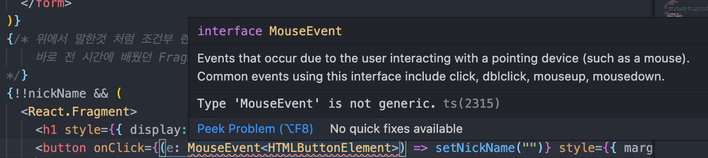

# Ref와 DOM

- Ref는 render 메서드에서 생성된 DOM 노드, React 엘리먼트에 접근하는 방법을 제공한다.
- Ref를 자주써오긴 했지만, Ref에 대해서 애매하게 알고 써왔다... 하지만, 그냥 외부 문헌자료들을 보다보면 ref를 써서 DOM을 건드려야 Virtual DOM을 조작할 수 있다고 하는데, 보통 event에서 event객체를 바인딩 받아서 그 안에 target을 제어하는건 이건 직접 DOM일까? 그러면 이벤트 바인딩 타겟으로 처리하는건 권장하지 않는걸까? 고민하던중 타입스크립트에서 EventBinding에 타겟을 지정하던중에 일반 타입스크립트에서 바인딩하는 것과 다르다는 것을 알았다.

```tsx
function container() {
  // ...
  return (
    {/* ... */}
    <button onClick={(e: React.MouseEvent<HTMLButtonElement>) => setNickName("")} style={{ marginLeft: 16 }}>
      로그아웃
    </button>
    {/* ... */}
  )
}
```

> 이벤트에 타입을 지정하는데 MouseEvent 일반 타입스크립트의 MouseEvent 아니라 React에 내장되어있는 이벤트를 쓴다는 것이다.
>
> - 그래서 뭘 말하고 싶은건지 궁금하실거다.. 바로 일반 타입스크립트에서 이벤트에 타입을 지정해주면 제네릭을 사용할 수가 없다. (뭔가 이벤트 바인딩 해준 이벤트 객체가 다른게 아닐까? 타입스크립트 라이브러리에 DOM에서 제공해주는 이벤트 객체와 다른게 아닐까? 제네릭으로 전달받은 HTMLElement 타입에 대해서 무엇인가에 대한 처리를 해줄 것 같다.)
> - 이벤트 객체를 바인딩해주는 타입마저 일반 타입스크립트에서 제공해주는 DOM 라이브러리와는 다른 것을 보고 이벤트 바인딩 객체를 이용해서 조작을 하는 것도 vDom을 조작하는게 아닐까 조심스럽게 추측해본다..
>   

- 선수지식

  - Reconciliation(https://github.com/sangheon-kim/React-docs-analyze/blob/master/src/Pages/4.Reconciliation/README.md)
  - Virtual DOM(https://github.com/sangheon-kim/React-docs-analyze/blob/master/src/Pages/5.VirtualDOM/README.md)

- 일반적으로 자식을 수정하려면 props를 전달하여 자식을 다시 렌더링 해야 합니다. (props, state가 변경시에 리렌더링이 되기 때문에)지만 때로는 데이터의 흐름과 관계 없이 직접 자식을 수정을 해야하는 경우가 생길 수 있습니다. 수정을 해야하는 자식은 ReactElement인데 그것이 사용자 정의 컴포넌트일 수도 있고, DOM 엘리먼트일 수도 있습니다.

## Ref를 사용해야 할 경우 (바람직한 사용 사례)

- 텍스트 선택영역의 포커싱을 하는 경우
- 미디어의 재생을 관리할 때
- 애니메이션을 직접적으로 실행시킬 때
- 서드 파티 DOM 라이브러리를 React와 같이 사용할 때

_위에 사례를 제외하면 거의 이벤트 바인딩 객체를 활용하여 target이나 currentTarget을 가지고 조작이 가능하거나 props값을 가지고 제어가 거의 가능할 것 같다. 바람직한 사용 사례에 적힌 사례의 내용이 아니라면 ref 사용을 권장하지는 않는 것 같다._

- 가급적이면 데이터 플로우를 가지고 props를 통해서 변경을 해주도록 노력해보자:)

## Ref를 남용하지 마세요!
