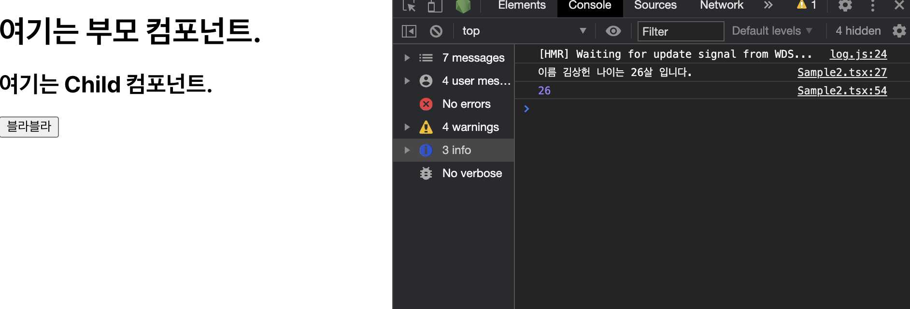
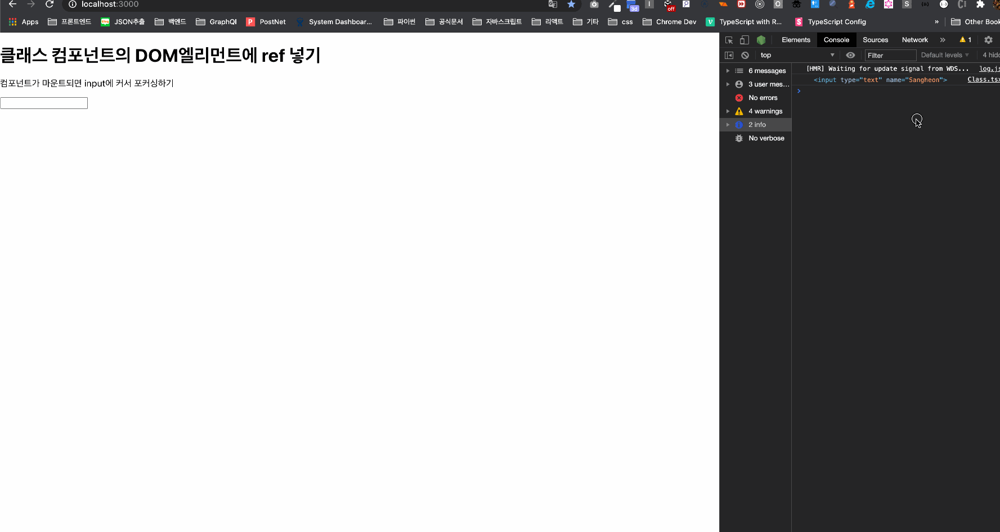
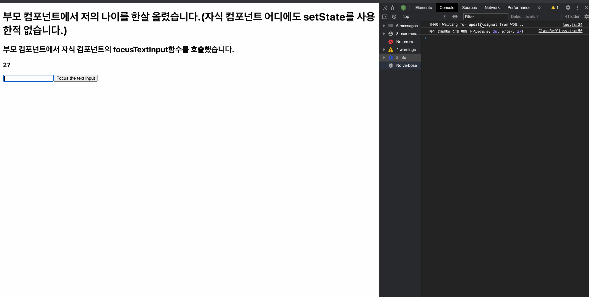
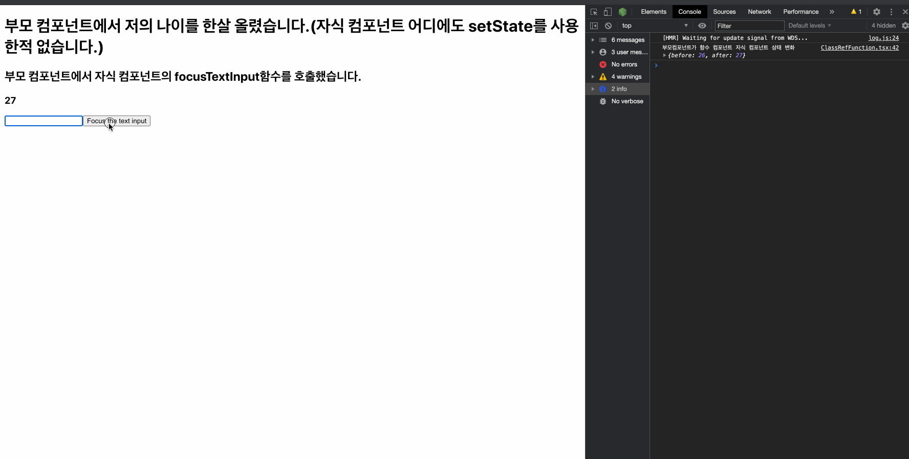

# Ref와 DOM을 이해해보자... ref는 언제 쓰는것이 좋으며, 어떠한 기능까지도 제공해주며, querySelector나 getElementBy~ 같은 DOM API를 쓰면 안되는지 등과 여러가지 기능을 제공해주는 ref에 대해서 알아봅시다.

> Let's understand Ref and DOM... Let's find out when to use the ref, what functions to provide, and whether to not use DOM APIs such as QuerySelector or getElementBy~.

## Written by. Sangheon Kim(ksj8367@gmail.com)

- Ref는 render 메서드에서 생성된 DOM 노드, React 엘리먼트에 접근하는 방법을 제공한다.
- Ref를 자주써오긴 했지만, Ref에 대해서 애매하게 알고 써왔다... 하지만, 그냥 외부 문헌자료들을 보다보면 ref를 써서 DOM을 건드려야 Virtual DOM을 조작할 수 있다고 하는데, 보통 event에서 event객체를 바인딩 받아서 그 안에 target을 제어하는건 이건 직접 DOM일까? 그러면 이벤트 바인딩 타겟으로 처리하는건 권장하지 않는걸까? 고민하던중 타입스크립트에서 EventBinding에 타겟을 지정하던중에 일반 타입스크립트에서 바인딩하는 것과 다르다는 것을 알았다.

```tsx
function container() {
  // ...
  return (
    {/* ... */}
    <button onClick={(e: React.MouseEvent<HTMLButtonElement>) => setNickName("")} style={{ marginLeft: 16 }}>
      로그아웃
    </button>
    {/* ... */}
  )
}
```

> 이벤트에 타입을 지정하는데 MouseEvent 일반 타입스크립트의 MouseEvent 아니라 React에 내장되어있는 이벤트를 쓴다는 것이다.
>
> - 그래서 뭘 말하고 싶은건지 궁금하실거다.. 바로 일반 타입스크립트에서 이벤트에 타입을 지정해주면 제네릭을 사용할 수가 없다. (뭔가 이벤트 바인딩 해준 이벤트 객체가 다른게 아닐까? 타입스크립트 라이브러리에 DOM에서 제공해주는 이벤트 객체와 다른게 아닐까? 제네릭으로 전달받은 HTMLElement 타입에 대해서 무엇인가에 대한 처리를 해줄 것 같다.)
> - 이벤트 객체를 바인딩해주는 타입마저 일반 타입스크립트에서 제공해주는 DOM 라이브러리와는 다른 것을 보고 이벤트 바인딩 객체를 이용해서 조작을 하는 것도 vDom을 조작하는게 아닐까 조심스럽게 추측해본다..
>   

- 선수지식

  - Reconciliation(https://github.com/sangheon-kim/React-docs-analyze/blob/master/src/Pages/4.Reconciliation/README.md)
  - Virtual DOM(https://github.com/sangheon-kim/React-docs-analyze/blob/master/src/Pages/5.VirtualDOM/README.md)

- 일반적으로 자식을 수정하려면 props를 전달하여 자식을 다시 렌더링 해야 합니다. (props, state가 변경시에 리렌더링이 되기 때문에)지만 때로는 데이터의 흐름과 관계 없이 직접 자식을 수정을 해야하는 경우가 생길 수 있습니다. 수정을 해야하는 자식은 ReactElement인데 그것이 사용자 정의 컴포넌트일 수도 있고, DOM 엘리먼트일 수도 있습니다.

## Ref를 사용해야 할 경우 (바람직한 사용 사례)

- 텍스트 선택영역의 포커싱을 하는 경우
- 미디어의 재생을 관리할 때
- 애니메이션을 직접적으로 실행시킬 때
- 서드 파티 DOM 라이브러리를 React와 같이 사용할 때

  > 이것에 대한 설명 역시 아래에 예제에서 많이 다룰 예정이니 기대해도 좋다!

  > _위에 사례를 제외하면 거의 이벤트 바인딩 객체를 활용하여 target이나 currentTarget을 가지고 조작이 가능하거나 props값을 가지고 제어가 거의 가능할 것 같다. 바람직한 사용 사례에 적힌 사례의 내용이 아니라면 ref 사용을 권장하지는 않는다.._

**예를 들어 Dialog 컴포넌트에서 open()과 close() 메서드를 두는 대신, isOpen이라는 prop을 넘겨주어. isOpen의 boolean타입을 가지고 처리하는 것이 효율적이라는 것이다. 해당 prop을 가지고 컴포넌트의 변화를 주기에도 충분하기 때문이다.**

- 가급적이면 데이터 플로우를 가지고 props를 통해서 변경을 해주도록 노력해보자:)

## Ref를 남용하지 마세요!

- ref는 애플리케이션에 '어떤 일이 일어나게'할 때 사용될 수도 있다. (자식 컴포넌트에 ref를 전달하여, ref를 바인딩하여 부모 컴포넌트에서 자식 컴포넌트의 상태를 제어하는 경우 같은 상황)필자도 개발할 때 ref를 이용해서 어떤일이 일어나게 해본적은 없다... 하지만... 가능하다는 것은 알았다... 하지만 정말 좋지 않은 선택이라고 생각한다. 보통 그런 경우에는 하위 컴포넌트의 경우 상위 컴포넌트에서 상태를 prop으로 전달받아서 처리해줘도 충분히 좋은 컴포넌트가 될 수 있고, 대체적으로 필자는 UI 컴포넌트인 presentational Component에서나 atomic 디자인 패턴에서는 template 이전 단계에서는 최대한 상태나 특정 메서드를 주지않고 최대한 props로 전달받아 처리하려고 노력한다. 상태를 상위로 끌어올리는 것에 대한 예제는 공식문서 링크를 참조해드리겠습니다. <a href="https://ko.reactjs.org/docs/lifting-state-up.html">링크</a>

자 Ref에 대해서 직접 자식 컴포넌트의 스테이트를 참조하거나 내부에 정의한 메서드를 호출하는 아주 Baaad한 예제를 하나 보여드리겠습니다.
_주의_ **사용은 자제해주세요**

```tsx
import React, { Component } from "react";

type Props = {
  onParentRef: (ref: React.RefObject<Child>) => React.RefObject<Child>;
};

interface ParentType {}

class Child extends Component<Partial<Props>> {
  state: { age: number };

  constructor(props: Partial<Props>) {
    super(props);
    if (props.onParentRef) {
      props.onParentRef(this as any);
    }

    this.state = {
      age: 26,
    };

    this.sangheonZZang = this.sangheonZZang.bind(this);
  }

  sangheonZZang(): void {
    console.log(`이름 김상헌 나이는 ${this.state.age}살 입니다.`);
  }

  render() {
    return (
      <div>
        <h2>여기는 Child 컴포넌트. </h2>
      </div>
    );
  }
}

class Parent extends Component {
  childComponent: any;
  constructor(props: ParentType) {
    super(props);
    this.childComponent = React.createRef();
    this.callChildMethod = this.callChildMethod.bind(this);
  }

  /**
   *
   * @description 자식 컴포넌트의 메서드와 스테이트에 접근해서 호출
   * @memberof Parent
   */
  callChildMethod(): void {
    this.childComponent.sangheonZZang();
    console.log(this.childComponent.state.age);
  }

  render() {
    return (
      <div>
        <h1>여기는 부모 컴포넌트.</h1>
        <Child onParentRef={(ref: React.RefObject<Child>) => (this.childComponent = ref)} />
        <button onClick={this.callChildMethod}>블라블라</button>
      </div>
    );
  }
}

export default Parent;
```

> 부모 컴포넌트 인스턴스의 버튼을 클릭하게 되면 callChildMethod 함수가 호출되면서 자식 컴포넌트의 sangheonZZang과 스테이트중 나이가 age에 찍힌다..
> 
> 너어어어어무 Baaad하다... 지금 부모 컴포넌트에서 자식 컴포넌트의 상태를 건드리고, 자식 컴포넌트의 메서드를 호출 하고 있다.. 근데 과연 여러분들이 보시기에도 굳이... 이렇게 할 필요가 있을까? 생각이 들지 않는가... 크흠... 괜히 위에서 상태 끌어올리기를 사용하여 더 높은 계층에서 메서드를 정의하고 상태를 정의하는 것이 더 좋을 것 같다는 판단이 되지 않나요??

<span style="color:red">주의 - 저는 React 16.3부터 추가된 React.createRef()를 사용할 것 입니다. 그 이하 버전은 callback Ref를 대신 사용해주세요. 콜백 ref에 대한 간단한 예제도 마지막에 다룰 예정입니다.</span>

## Ref 생성하기

- Ref는 React.createRef()를 통해 생성됩니다. ref 어트리뷰트를 통해서 React 엘리먼트에 부착됩니다.
  )
- 자 이전 시간에 재조정을 배울떄 보여드렸던 React.ReactElement를 콘솔을 찍어본 것입니다. ReactElement는 객체 형태로 이루어져 있고 다양한 property를 가집니다. 그중에 ref가 있는 것도 보실 수 있습니다. 이 프로퍼티에 생성한 React.createRef()를 통해서 생성한 ref를 넣어주면 컴포넌트 인스턴스의 어느곳에서든 Ref에 접근을 할 수 있게됩니다!

## Ref에 접근하기

- render 메서드 안에서 ref가 엘리먼트에 전달되었을 때, 그 노드를 향한 참조는 **ref의 current 어트리뷰트에 담깁니다!**

```tsx
const node = this.myRef.current;
```

- ref의 값은 노드의 유형에 따라 다르지만, current에 담기는 사실은 변치 않는다. React.createRef()로 생성된 ref는 자신을 전달받은 DOM엘리먼트를 current 프로퍼티의 값으로서 할당을 받습니다.
- ref 어트리뷰트가 커스텀 클래스 컴포넌트에 쓰였었다, ref 객체는 마운트된 컴포넌트의 인스턴스를 current 프로퍼티의 값으로서 받습니다.
- 함수 컴포넌트는 인스턴스가 없기 때문에 함수 컴포넌트에 ref 어트리뷰트를 사용할 수 없습니다.

> 필자인 저도 위에 설명을 보고 이해해보려고 했으나, 쉽게 이해되지는 않았습니다. 일단은 그냥 간단하게 클래스 컴포넌트에서와 함수 컴포넌트는 다르게 동작하는 구나 정도로 가볍게 이해하시고 아래 예제를 보시지요 ㅎㅎ

**예제 순서**

- 1. DOM 엘리먼트에 Ref 사용해보자. (함수, 클래스 컴포넌트 둘다 가능)
- 2. 자식 컴포넌트인 클래스 컴포넌트에 ref를 사용해보자. (자식 컴포넌트가 클래스 컴포넌트라면 ref어트리뷰트르르 전달받을 수 있습니다.)
- 3. 함수 컴포넌트는 인스턴스를 갖고 있지 않기 때문에 ref를 사용해서 에러를 한번 확인 한 후 이에 대한 대응 방안으로 제시된 `forwardRef`와 `useImperativeHandle`을 사용해서 해결해보자.

> 위에서 이해가 되지 않았던 설명을 이해 시켜드리겠습니다.

## DOM 엘리먼트에 Ref 사용하기

**위에서 이야기했던 사용사례중에 Input Focusing을 해보겠다.. 주로 채팅방에 입장했을 때 채팅 입력창에 Focusing이 되어있거나, 또는 접근성 있는 페이지의 경우에도 특정 버튼에 Focusing을 해두어 부가적인 작업을 통해서 마우스 없이 키보드를 가지고 제어할 수 있게 하는 좋다.**

`클레스 컴포넌트`

```tsx
import * as React from "react";

type Props = {};
export default class ClassComponent extends React.Component<Props> {
  _inputRef: React.RefObject<HTMLInputElement>;
  constructor(props: Props) {
    super(props);

    this.state = {};
    this._inputRef = React.createRef();
  }

  componentDidMount() {
    // 컴포넌트가 마운트되는 시점에 해당 라이프 사이클 호출
    console.log(this._inputRef.current);
    // 옵셔널 체이닝 연산자(존재할경우 메서드 실행, 없으면 실행하지 않고 반환값으로는 undefined)
    this._inputRef.current?.focus();
  }

  render() {
    return (
      <div>
        <h1>클래스 컴포넌트의 DOM엘리먼트에 ref 넣기</h1>
        <p>컴포넌트가 마운트되면 input에 커서 포커싱하기</p>
        <input type="text" ref={this._inputRef} name="Sangheon" />
      </div>
    );
  }
}
```



> 마운트 되는 시점에 input에 커서가 포커싱되어 깜박거리는 것을 확인하였다. 너무 멋지다 채팅창이나 검색창에서도 사용할 수 있다.

`함수 컴포넌트`

```tsx
import React from "react";

interface IFunctionRef {}

const FunctionRef: React.FC<IFunctionRef> = () => {
  const _button: React.RefObject<HTMLButtonElement> = React.useMemo(() => React.createRef(), []);

  React.useEffect(() => {
    console.log(_button.current);
    // 옵셔널 체이닝 연산자
    _button.current?.focus();
  }, [_button]);

  return (
    <div style={{ paddingLeft: 16 }} role="tabpanel">
      <h1>함수형 컴포넌트의 DOM엘리먼트에 ref 넣기</h1>
      <p>컴포넌트가 마운트되면 button에 포커싱하기(outline)</p>
      <button ref={_button} name="Function-sangheon-button" tabIndex={1}>
        저는 버튼이에요 저를 눌러주세요
      </button>
      <button name="Function-sangheon-button" tabIndex={1}>
        {"탭으로 저를 포커싱해보세요 :)"}
      </button>
      <button name="Function-sangheon-button" tabIndex={-1}>
        {"탭해도 오지않게 해주세요"}
      </button>
    </div>
  );
};

export default FunctionRef;
```

> 내가 만든 사이트에 사용자가 혹시라도 마우스는 없고 키보드만 있는 사용자 일수도 있지 않은가.. 그런 사용자들에게도 자유롭게 탐색을 할 수 있게 하기위해 모던 브라우저들은 탭키사용으로 이동할 수 있게 제공해준다. 버튼에 미리 포커싱을 해두면 사용자 입장에서는 바로 눌러보거나 탭을 눌러서 이동해볼 수 있나 하고 생각하게 될 것이다. tabIndex를 지정해주어 탭키를 가지고 자유롭게 이동할 수 있게 해준 것이다. -1을 지정해주면 탭이 안오게된다. 그럴때는 별도의 화살표 컨트롤이 필요하다 한번 보너스 예제겸 글을 읽어주시는 분들에게 감사한마음을 표현할 겸 예제코드를 보여드리겠습니다.

```tsx
/* eslint-disable react-hooks/exhaustive-deps */
import React from "react";

interface IFunctionRef {}

const FunctionRef: React.FC<IFunctionRef> = () => {
  const [index, setIndex]: any = React.useState(null);
  const _tabSection: React.RefObject<HTMLDivElement> = React.useMemo(() => React.createRef(), []);
  const _button1: React.RefObject<HTMLButtonElement> = React.useMemo(() => React.createRef(), []);
  const _button2: React.RefObject<HTMLButtonElement> = React.useMemo(() => React.createRef(), []);
  const _button3: React.RefObject<HTMLButtonElement> = React.useMemo(() => React.createRef(), []);
  const buttonArray = [_button1, _button2, _button3];
  React.useEffect(() => {
    // 옵셔널 체이닝 연산자
    _tabSection.current?.focus();
  }, [_tabSection]);

  const tabArrow = React.useCallback(
    (e: React.KeyboardEvent<HTMLDivElement>) => {
      let buttonCount = buttonArray.length - 1;

      if (e.keyCode === 37 || e.keyCode === 39) {
        if (index !== null) {
          if (e.keyCode === 37) {
            console.log("왼쪽 방향키 클릭");
            if (index === 0) {
              setIndex(2);
            } else {
              setIndex(index - 1);
            }
          } else {
            console.log("오른쪽 방향키 클릭");
            if (index === buttonCount) {
              setIndex(0);
            } else {
              setIndex(index + 1);
            }
          }
        } else {
          setIndex(0);
          if (e.keyCode === 37) {
            console.log("왼쪽 방향키 클릭");
          } else {
            console.log("오른쪽 방향키 클릭");
          }
        }
      }
    },
    [buttonArray.length, index]
  );

  React.useEffect(() => {
    if (index !== null) {
      buttonArray[index].current?.focus();
    }
  }, [index]);
  return (
    <div style={{ paddingLeft: 16 }}>
      <h1>함수형 컴포넌트의 DOM엘리먼트에 ref 넣기</h1>
      <p> 컴포넌트가 마운트되면 tab에 index하기 화살표 좌우로 움직여서 탭을 잡아보세요</p>
      <div className="buttonGroup" tabIndex={1} ref={_tabSection} onKeyDown={(e) => tabArrow(e)}>
        <button id="button1" name="Function-sangheon-button" tabIndex={-1} ref={_button1}>
          1번 버튼
        </button>
        <button id="button2" name="Function-sangheon-button" tabIndex={-1} ref={_button2}>
          2번 버튼
        </button>
        <button id="button3" name="Function-sangheon-button" tabIndex={-1} ref={_button3}>
          3번 버튼
        </button>
      </div>
    </div>
  );
};

export default FunctionRef;
```

> 화살표가 버튼 그룹에 focusing 되고 화살표로 자유롭게 움직이는 것을 볼 수 있다. 이걸 왜하냐고 묻고싶은 분들에게 답을 알려드리자면 대부분의 브라우저에서 tab을 가지고 제어는 다되지만 탭이 모두 되버리면 사용자나 스크린 리더에서도 굉장히 비효율적이다 화살표로 움직일 수 있는 영역을 잡아주기 위해서 tabIndex를 -1로 주고 그 안에서는 방향키를 가지고 제어하는 것이다.

## 자식 컴포넌트인 클래스 컴포넌트에 ref를 사용해보자. (자식 컴포넌트가 클래스 컴포넌트라면 ref어트리뷰트르르 전달받을 수 있습니다.) (CreateRef 사용)

`부모 컴포넌트(클래스 컴포넌트) -> 자식 컴포넌트(클래스 컴포넌트)`

```tsx
import * as React from "react";

interface IAutoFocusTextInput {}
class AutoFocusTextInput extends React.Component<IAutoFocusTextInput> {
  _customTextInput: React.RefObject<CustomTextInput>;
  constructor(props: IAutoFocusTextInput) {
    super(props);
    this._customTextInput = React.createRef();
    this.state = {};
  }

  componentDidMount() {
    if (!!this._customTextInput.current) {
      this._customTextInput.current.setState({ age: 27 });
      this._customTextInput.current.focusTextInput();
    }
  }

  render() {
    return <CustomTextInput ref={this._customTextInput} />;
  }
}

export default AutoFocusTextInput;

interface ICustomTextInput {
  age?: number;
  name?: string;
}
class CustomTextInput extends React.Component<ICustomTextInput> {
  textInput: React.RefObject<HTMLInputElement>;
  state: ICustomTextInput;
  constructor(props: ICustomTextInput) {
    super(props);

    this.state = { age: 26, name: "Sangheon" };

    this.textInput = React.createRef();
    this.focusTextInput = this.focusTextInput.bind(this);
  }

  focusTextInput() {
    this.textInput.current?.focus();
  }

  shouldComponentUpdate(nextProps: ICustomTextInput, nextState: ICustomTextInput) {
    const { props, state } = this;

    if (state.age !== nextState.age) {
      console.log({
        before: state.age,
        after: nextState.age,
      });

      return true;
    }

    return false;
  }

  render() {
    return (
      <div>
        <h1>부모 컴포넌트에서 저의 나이를 한살 올렸습니다.(자식 컴포넌트 어디에도 setState를 사용한적 없습니다.)</h1>
        <h2>부모 컴포넌트에서 자식 컴포넌트의 focusTextInput함수를 호출했습니다.</h2>
        <h3>{this.state.age}</h3>
        <input type="text" ref={this.textInput} />
        <input type="button" value="Focus the text input" onClick={this.focusTextInput} />
      </div>
    );
  }
}
```



> - 그다음은 자식 컴포넌트가 클래스 컴포넌트라면 부모 컴포넌트가 함수 컴포넌트에서도 클래스 컴포넌트로 만들어진 자식 컴포넌트를 제어하기위해 ref를 attribute로 넣을 수 있다는 걸 보여드리기 위한 예제입니다.

`부모 컴포넌트(함수 컴포넌트) -> 자식 컴포넌트(클래스 컴포넌트)`

```tsx
import React from "react";

const ClassRefFunction: React.FC = () => {
  const _customTextInput: React.RefObject<CustomTextInput> = React.createRef();

  React.useEffect(() => {
    if (_customTextInput.current) {
      _customTextInput.current?.setState({ age: 27 });
      _customTextInput.current?.focusTextInput();
    }
  }, []);

  return <CustomTextInput ref={_customTextInput} />;
};

export default ClassRefFunction;

interface ICustomTextInput {
  age?: number;
  name?: string;
}
class CustomTextInput extends React.Component<ICustomTextInput> {
  textInput: React.RefObject<HTMLInputElement>;
  state: ICustomTextInput;
  constructor(props: ICustomTextInput) {
    super(props);

    this.state = { age: 26, name: "Sangheon" };

    this.textInput = React.createRef();
    this.focusTextInput = this.focusTextInput.bind(this);
  }

  focusTextInput() {
    this.textInput.current?.focus();
  }

  shouldComponentUpdate(nextProps: ICustomTextInput, nextState: ICustomTextInput) {
    const { props, state } = this;

    if (state.age !== nextState.age) {
      console.log("부모컴포넌트가 함수 컴포넌트 자식 컴포넌트 상태 변화", {
        before: state.age,
        after: nextState.age,
      });

      return true;
    }

    return false;
  }

  render() {
    return (
      <div style={{ paddingLeft: 16 }}>
        <h1>부모 컴포넌트에서 저의 나이를 한살 올렸습니다.(자식 컴포넌트 어디에도 setState를 사용한적 없습니다.)</h1>
        <h2>부모 컴포넌트에서 자식 컴포넌트의 focusTextInput함수를 호출했습니다.</h2>
        <h3>{this.state.age}</h3>
        <input type="text" ref={this.textInput} />
        <input type="button" value="Focus the text input" onClick={this.focusTextInput} />
      </div>
    );
  }
}
```



> 부모 컴포넌트에서 자식 컴포넌트 인스턴스의 ref프로퍼티에 ref어트리뷰트를 전달하였습니다. 그래서 부모 컴포넌트에서 자식 컴포넌트의 상태를 변경하고, 메서드를 호출하는 예제 입니다. 과연 이걸 부모 컴포넌트에서 상태 제어가 필요할지는 의문이 들지만 이런 방법도 있구나하고 참고 해주세요:)

- 위쪽에서 가이드 드린대로... 가급적 ref를 통해서 자식 컴포넌트의 메서드나 상태를 제어하거나 그러지 마시고, 부모 컴포넌트에서 props를 전달해서 자식 컴포넌트의 인스턴스의 변화를 주는것을 권장합니다.
  > 3번째 방법인 함수 컴포넌트는 인스턴스를 갖고 있지 않기 때문에 ref를 사용해서 에러를 한번 확인 한 후 이에 대한 대응 방안으로 제시된 `forwardRef`와 `useImperativeHandle`을 사용해서 해결해보자. 이부분은 forwardRef 와 useImperativeHandle 설명과 함께 하겠습니다.

## 부모 컴포넌트에게 DOM ref를 공개하기

- 자식 컴포넌트의 DOM 노드를 포커스하는 일이나, 크기 또는 위치를 계산하는 일 등을 할때는 효과적인 방법이 될 수 있지만, 자식 컴포넌트의 인스턴스의 DOM 노드가 아닌 자식 컴포넌트의 인스턴스를 가져온다는 점에서 좋지 않다. 그래서 16.3 버전 이후부터는 함수 컴포넌트에 전달하는 경우에는 ForwardRef를 사용하고, 16.2 버전에서의 사용예를 보여드리겠습니다.

- forwardRef를 사용해서 함수 컴포넌트 형태의 자식 컴포넌트 인스턴스안에 ref전달하는건 마지막에 설명 드리겠습니다.

```jsx
function CustomTextInput(props) {
  // props에서 전달받은 inputRef를 넣어줍니다.
  return (
    <div>
      <input ref={props.inputRef} />
    </div>
  );
}

class Parent extends React.Component {
  constructor(props) {
    super(props);
    this.inputElement = React.createRef();
  }
  render() {
    // 부모 컴포넌트에서 inputRef라는 props 이름으로 넘겨준 것이다.
    return <CustomTextInput inputRef={this.inputElement} />;
  }
}
```

## 콜백 ref

- React.createRef()를 통해 생성된 ref를 전달하는 대신, 함수를 전달하는 것입니다.

`이전에 createRef로 전달하는 것과는 다르게 current어트리뷰트에 담기는 것이 아니라는 차이가 있다.`

```jsx
class CustomTextInput extends React.Component {
  constructor(props) {
    super(props);

    this.textInput = null;

    this.setTextInputRef = (element) => {
      this.textInput = element;
    };

    this.focusTextInput = () => {
      // DOM API를 사용하여 text 타입의 input 엘리먼트를 포커스합니다.
      if (this.textInput) this.textInput.focus();
    };
  }

  componentDidMount() {
    // 마운트 되었을 때 자동으로 text 타입의 input 엘리먼트를 포커스합니다.
    this.focusTextInput();
  }

  render() {
    // text 타입의 input 엘리먼트의 참조를 인스턴스의 프로퍼티
    // (예를 들어`this.textInput`)에 저장하기 위해 `ref` 콜백을 사용합니다.
    return (
      <div>
        <input type="text" ref={this.setTextInputRef} />
        <input type="button" value="Focus the text input" onClick={this.focusTextInput} />
      </div>
    );
  }
}
```

### 레거시 API: 문자열 ref

- ref 어트리뷰트의 값이 "textInput"처럼 문자열이고 DOM 노드를 this.refs.textInput과 같이 예전의 API를 안다면 얼른 콜백 ref나 createRef API를 사용하는 것을 권장한다 추후 배포에 삭제 예정이라고 합니다.

### 콜백 ref에 관한 주의 사항

- ref 콜백함수가 만약 인라인 함수로 정의 되어있을 경우 콜백 ref는 무조건 처음에는 null로 그리고 다음 과정에서 DOM엘리먼트로 두번 호출이 일어나는데... 매 렌더링 될때 마다 ref 콜백의 새 인스턴스가 생성된다. React가 이전에 사용된 ref를 제거하고, 새 ref를 설정해야하기 때문에 ref 콜백을 아예 바인딩된 메서드로 선언함으로 해결할 수 있지만 만약 콜백 ref로 선언한게 너무 많은 경우 이런 현상이 문제가 되지 않기에 굳이 모든걸 다바꿔서 사이드이펙트가 일어나는 것에 대한 고려도 하고 진행하도록 하자.

## 3.함수 컴포넌트는 인스턴스를 갖고 있지 않기 때문에 ref를 사용해서 에러를 한번 확인 한 후 이에 대한 대응 방안으로 제시된 `forwardRef`와 `useImperativeHandle`을 사용해서 해결해보자.

> 다음장에서 알아보자.

`보너스 예제...`
`1인 다역 메신저 만들기...`
`Container.tsx`

```tsx
/* eslint-disable react-hooks/exhaustive-deps */
import React from "react";
import ChatBoard from "./ChatBoard/ChatBoard";
import "./Container.scss";

/**
 *
 * @description 메시지 추상화 인터페이스 (Message 클래스의 Implements로 사용)
 * @interface IMessage
 */
interface IMessage {
  /** 메시지 인덱스 */
  index: number;
  /** 메시지 작성자 */
  author: string;
  /** 메시지 내용 */
  content: string;
  /** 메시지 시간 */
  time: string;
  /** 수정 */
  isEdit: boolean;
  /** 메시지 삭제*/
  isDelete: boolean;
}

/**
 *
 * @description 메시지 관련 인터페이스 생성자
 * @class Message
 * @implements {IMessage}
 */
export class Message implements IMessage {
  static number: number = 0; // index값을 다른 인스턴스들도 공유받아야 하기에 static으로 설정
  isDelete: boolean;
  isEdit: boolean;
  time: string;
  index: number;

  // 깨알팁으로 constructor에 매개변수에 미리 접근지정자와 타입을 같이 명시해두면, 자동으로 초기화도해준다.
  constructor(public author: string = "anonymous", public content: string = "") {
    this.isDelete = false;
    this.isEdit = false;
    this.time = `${new Date().getHours() >= 12 ? "오후" : "오전"} ${
      new Date().getHours() >= 12 ? new Date().getHours() - 12 : new Date().getHours()
    }:${new Date().getMinutes() >= 10 ? new Date().getMinutes() : "0" + new Date().getMinutes()}`;
    this.index = ++Message.number;
  }
}

const Container: React.FC = () => {
  // 튜플 타입 방식으로 선언
  // TODO: SetStageAction 부분 타입 any 말고 적절한 타입 찾기
  const [messages, setMessages]: [IMessage[], React.Dispatch<React.SetStateAction<any>>] = React.useState([]); // 메시지 인스턴스 담아줄 배열
  const [nickName, setNickName]: [string, React.Dispatch<React.SetStateAction<string>>] = React.useState(""); // 닉네임을 담아줄 배열 선언
  const [message, setMessage]: [string, React.Dispatch<React.SetStateAction<string>>] = React.useState(""); // 메시지 내용

  const _chatBoard: React.RefObject<HTMLDivElement> = React.createRef(); // _chatBoard DOM에 접근하기 위한 Ref 생성
  const _message: React.RefObject<HTMLInputElement> = React.createRef(); // _message DOM에 접근하기 위해 Ref 생성
  const _nickname: React.RefObject<HTMLInputElement> = React.createRef(); // _nickname DOM을 건드리기 위해 Ref 생성

  React.useEffect(() => {
    // 옵셔널 체이닝 연산자 (undefined나 null이 아닌 경우에만 실행 (실행이 안되면 undefined 반환))
    _nickname.current?.focus(); // 초기 마운트시에는 닉네임으로 포커싱이 이동되게 합니다.
    // _message.current?.focus(); // 마운트가 되고 _message.current가 존재할때 focus 해줍니다.
  }, []);

  /**
   * @description 메시지 리스트를 subscribe하고 있다가,
   * 변경이 감지되면 chatBoard의 스크롤 맨위지점을 chatBoard의 높이 값으로 잡아주면 항상 맨밑에 위치시킬 수 있다.
   */
  React.useEffect(() => {
    // 옵셔널 체이닝 연산자 (undefined나 null이 아닌 경우에만 실행 (실행이 안되면 undefined 반환))
    _message.current?.focus();
    // 채팅보드를 chat변수에 할당해준다.
    let chat = _chatBoard.current;

    if (!!chat) {
      chat.scrollTop = chat.scrollHeight;
    }

    /**
     *
     *  메시지 배열에 정상적으로 들어갔다면 setMessage를 빈배열로 넣어주어 전송보냄과 동시에 message를 초기화해준다.
     * 이전에 배운 component타입에서 보았듯이 Function Component는 디테일한 제어가 힘들어
     * 클래스 컴포넌트로 한뒤에 디테일하게 배열의 길이를 기준으로 두고 초기화 시켜줄 수도 있지만, ref가 테마인지라
     * 만약 전송시에만 초기화를 시켜주고싶다면 custom hook을 사용하거나, 클래스 컴포넌트를 사용하길 바란다.
     */
    setMessage("");
  }, [messages]);

  /**
   * @description 메시지 저장을 위한 함수
   */
  const onSave = (e: React.MouseEvent<HTMLButtonElement>) => {
    // 이벤트 전파 차단
    e.preventDefault();
    // 메시지 배열에 추가해주는데, Message 클래스를 활용하여 담아준 인스턴스를 기준으로 생성해준다.
    setMessages([...messages, new Message(nickName, message)]);
  };

  /**
   * @description 메시지 삭제를 위한 함수
   */
  const onRemove = (e: React.MouseEvent<HTMLButtonElement>, itemIndex: number) => {
    // 이벤트 전파 차단
    e.stopPropagation();
    // 메시지 배열을 덮어씌우는데 index와 메시지배열에서 일치하는 것에 대해서는, isDelete를 true로 만들어준다. isEdit은 false로 두어 수정도중 삭제시 삭제처리하고 수정을 비활성화
    setMessages(messages.map((item: Message) => (item.index !== itemIndex ? item : { ...item, isDelete: true, isEdit: false })));
  };

  /**
   * @description 메시지 수정 요청
   */
  const onEdit = (e: React.MouseEvent<HTMLButtonElement>, itemIndex: number) => {
    // 이벤트 전파 차단
    e.stopPropagation();

    // 메시지 수정요청이 들어오면 메시지 리스트에서 isEdit을 true로 바꿔주어 활성화 시켜준다.
    setMessages(messages.map((item: Message) => (item.index !== itemIndex ? item : { ...item, isEdit: true })));
  };

  const onEditComplete = (e: React.MouseEvent<HTMLButtonElement>, itemIndex: number, value?: string) => {
    // 이벤트 전파 차단
    e.stopPropagation();

    // 수정이 완료되었다면 해당 인덱스에 맞는 아이템을 찾아서 내용은 들어온 value로 바꾸어주고, isEdit은 false로 두어 수정 가능상태를 꺼주자
    setMessages(messages.map((item: Message) => (item.index !== itemIndex ? item : { ...item, content: value, isEdit: false })));
  };

  return (
    <div className="Container">
      <h1>Ref 설명을 위한 CRUD 게시판(Without DB)</h1>
      <h3>Made By Sangheon.Kim</h3>
      {/* 조건부 렌더링의 경우에는 독립된 컴포넌트로 보기에 서브노드로 감싸주어야 한다. 
          가급적이면 form양식인 경우에는 form태그를 감싸주자.. 접근성 측면에서도 그게 좋다..
      */}
      {!nickName && (
        <form>
          <label htmlFor="message">닉네임</label>
          <input type="text" name="nickname" id="nickname" placeholder="20글자 미만 닉네임을 입력해주세요" ref={_nickname} />
          <button
            type="submit"
            onClick={() => {
              if (!!_nickname.current && _nickname.current.value.length < 20) {
                setNickName(!!_nickname.current ? _nickname.current.value : "");
              } else {
                alert("20자 미만으로 설정해주세요");
                if (!!_nickname.current) {
                  _nickname.current.value = "";
                }
              }
            }}
          >
            접속
          </button>
        </form>
      )}
      {/* 위에서 말한것 처럼 조건부 렌더링의 경우에는 독립된 컴포넌트로 인식한다.
          바로 전 시간에 배웠던 Fragment를 사용해보았다. 
      */}
      {!!nickName && (
        <React.Fragment>
          <h1 style={{ display: "inline-block" }}>{nickName}님 안녕하세요.</h1>
          <button onClick={(e: React.MouseEvent<HTMLButtonElement>) => setNickName("")} style={{ marginLeft: 16 }}>
            로그아웃
          </button>
          <form>
            <label htmlFor="message">메시지</label>
            <input
              type="text"
              ref={_message}
              name="message"
              id="message"
              placeholder="150자 미만 메시지를 입력해주세요"
              onChange={(e: React.ChangeEvent<HTMLInputElement>) => e.target.value.length < 150 && setMessage(e.target.value)}
              value={message}
            />
            <button onClick={(e: React.MouseEvent<HTMLButtonElement>) => onSave(e)}>입력</button>
          </form>
        </React.Fragment>
      )}
      <ChatBoard
        messages={messages}
        nickname={nickName}
        onRemove={onRemove}
        refDom={_chatBoard}
        onEdit={onEdit}
        onEditComplete={onEditComplete}
      />
    </div>
  );
};

/* 부모 컴포넌트의 렌더링에 관계없이 해당 컴포넌트의 props와 state 변경시에만 
리렌더링이 발생하도록 React.memo를 활용하여 감싸주었다. */
export default React.memo(Container);
```

`ChatBoard.tsx`

```tsx
import React from "react";
import "./ChatBoard.scss";
import { Message } from "../Container";

interface IChatBoard {
  messages: Message[];
  nickname: string;
  onEditComplete: any;
  onRemove: (e: React.MouseEvent<HTMLButtonElement>, itemIndex: number) => void;
  onEdit: (e: React.MouseEvent<HTMLButtonElement>, itemIndex: number, value?: string) => void;
  refDom: React.RefObject<HTMLDivElement>;
}

/**
 *
 * @description 채팅을 보여줄 보드
 * @class ChatBoard
 * @extends {React.PureComponent<IChatBoard>}
 */
class ChatBoard extends React.PureComponent<IChatBoard> {
  messageRef: React.RefObject<HTMLDivElement>;
  constructor(props: IChatBoard) {
    super(props);

    this.state = {};
    this.messageRef = React.createRef();
  }

  render() {
    const { messages, nickname, onRemove, refDom, onEdit, onEditComplete } = this.props;
    return (
      <React.Fragment>
        <p>대화 목록</p>
        <div className="ChatBoard" ref={refDom}>
          {messages.map((item) => {
            return (
              <div className={`ChatBoard__message ${item.author === nickname ? "to" : "from"}`} key={item.index}>
                {item.author !== nickname && <p className="sender">{`${item.author}`}</p>}
                <div className={`messageControl ${item.author === nickname ? "to" : "from"}`}>
                  {!item.isDelete && item.author === nickname && (
                    <React.Fragment>
                      <button
                        id="edit"
                        onClick={(e: React.MouseEvent<HTMLButtonElement>) => {
                          !item.isEdit ? onEdit(e, item.index) : onEditComplete(e, item.index, this.messageRef.current?.textContent);
                        }}
                      >
                        {item.isEdit ? "완료" : "수정"}
                      </button>
                      <button id="remove" onClick={(e: React.MouseEvent<HTMLButtonElement>) => onRemove(e, item.index)}>
                        삭제
                      </button>
                    </React.Fragment>
                  )}
                  {item.author === nickname && <span className="time">{item.time}</span>}
                  <div
                    className={`message ${item.author === nickname ? "to" : "from"}`}
                    contentEditable={item.isEdit ? "true" : "false"}
                    onKeyDown={(e: any) =>
                      item.content.length + e.target.textContent.length > 150 ? alert("150자 이상 불가능합니다.") : console.log(e.target)
                    }
                    ref={this.messageRef}
                  >
                    {!item.isDelete ? item.content : "삭제된 메시지입니다."}
                  </div>
                  {item.author !== nickname && <span className="time">{item.time}</span>}
                </div>
              </div>
            );
          })}
        </div>
      </React.Fragment>
    );
  }
}

export default ChatBoard;
```

> 1인 다역 채팅을... 한번 해보시길 scss파일은 해당 폴더로 이동하면 있습니다.
