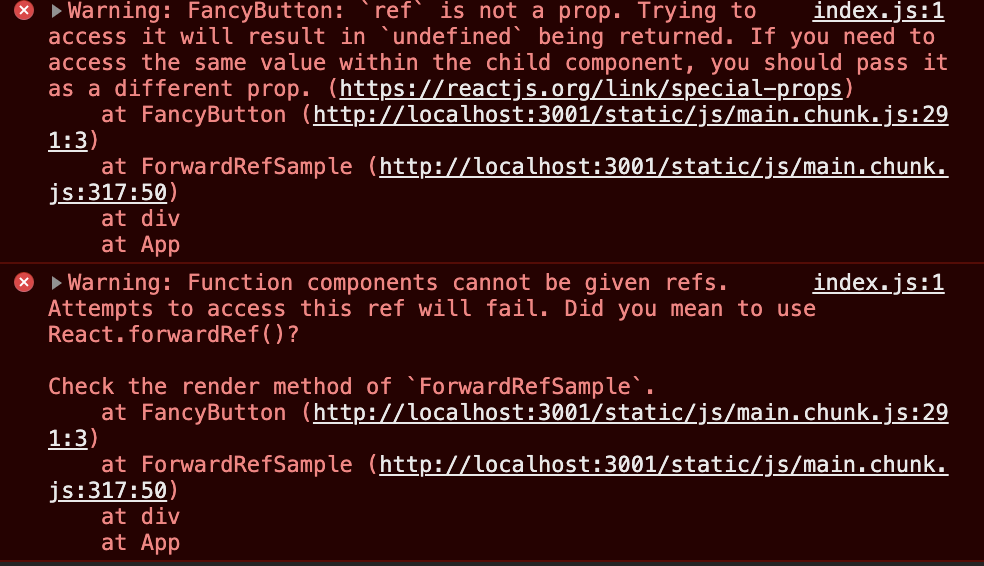
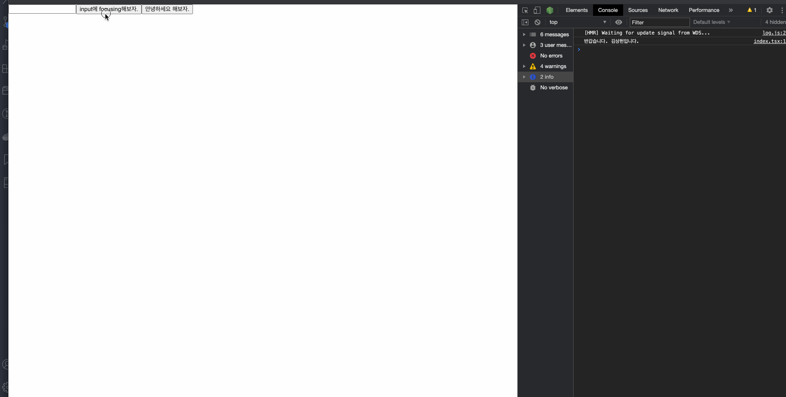

# ref 전달하기(함수 컴포넌트인 하위 컴포넌트에게 ref를 전달해보자) - (useImperativeHandle, forwardRef)

> Ref forwarding (let's deliver the ref to the subcomponent that is the function component) - (useImproactiveHandle, forwardRef)

- 선수 지식
  - Ref (https://github.com/sangheon-kim/React-docs-analyze/blob/master/src/Pages/6.Ref/README.md)

## Written by. Sangheon Kim(ksj8367@gmail.com)

- 이전 장에서 보았을 때 class 형 컴포넌트는 아무런 문제 없이 createRef로 생성한 ref를 전달할 수 있었지만, 자식 컴포넌트가 함수 컴포넌트인 경우 에러를 콘솔에서 확인할 수 있다.
- ref를 전달할 수 없다고, forwardRef를 사용하라고 에러를 뱉어준다.
- 이전장에서 나왔던 예제 순서중에 3번째에 대한 에제도 보자.
  `3. 함수 컴포넌트는 인스턴스를 갖고 있지 않기 때문에 ref를 사용해서 에러를 한번 확인 한 후 이에 대한 대응 방안으로 제시된 `forwardRef`와 `useImperativeHandle`을 사용해서 해결해보자.`

```tsx
import * as React from "react";

type ButtonProps = React.HTMLProps<HTMLButtonElement>;

const FancyButton: React.FC<ButtonProps> = ({ ref, children }) => {
  return (
    <button type="button" ref={ref} className="FancyButton">
      {children}
    </button>
  );
};

const ForwardRefSample: React.FC = () => {
  const ref = React.createRef<HTMLButtonElement>();

  React.useEffect(() => {
    console.log(ref);
    if (ref.current) {
      ref.current.style.color = "red";
    }
  }, [ref]);
  return <FancyButton ref={ref}>Click me!</FancyButton>;
};

export default ForwardRefSample;
```



## ForwardRef

- 함수 컴포넌트에게 Ref를 전달하기 위해 사용할 수 있는 React 내장 함수이다.
- 과정중에 일부를 설명하자면, forwardRef를 사용하면 ref를 전달받고 전달받은 ref를 ReactElement의 ref 프로퍼티에 넣으면 해당 ref에는 프로퍼티에 적용된 DOM에 대한 데이터가 자식 컴포넌트를 렌더링하고 있는 쪽으로 전달된다고 합니다. 그래서 사용할 수 있는 것이라고 합니다.

- forwardRef를 사용해보자...

예제 코드를 보자..

```tsx
import * as React from "react";

type ButtonProps = React.HTMLProps<HTMLButtonElement>;

const FancyButton = React.forwardRef<HTMLButtonElement, ButtonProps>((props, ref) => (
  // 두번째 인수 ref는 forwardRef를 사용할 때만 제공해준다. 일반 함수에서는 ref를 매개변수로 전달받을 수 없습니다.
  // props에서 ref를 사용할 수도 없습니다.
  <button type="button" ref={ref} className="FancyButton">
    {props.children} {/* ClickMe */}
  </button>
));

const ForwardRefSample: React.FC = () => {
  const _button = React.createRef<HTMLButtonElement>();

  React.useEffect(() => {
    console.log(_button); // 잘찍히는 것을 확인할 수 있다.
  }, [ref]);
  return <FancyButton ref={_button}>Click me!</FancyButton>;
};

export default ForwardRefSample;
```

> Forward Ref 동작 순서

- 1.  React.createRef를 호출하여 \_button을 생성 하고 ref변수에 할당합니다.
- 2.  우리는 `FacnyButton` 컴포넌트에 \_button을 ref 속성으로 지정하여 아래로 통과시킵니다.
- 3.  forwardRef의 두번째 매개변수인 ref를 통해서 위에서 생성해서 내려준 \_button을 통과 시켜줍니다.
- 4.  우리는 ref 매개변수를 통해 내려온 \_button을 button React Element의 ref프로퍼티의 값으로 지정해줍니다.
- 5.  \_button이 이제 붙었고. \_button은 이제 `<button>` DOM 노드를 가리키게 되었고, FowardRefSample에서 해당 \_button을 가지고 자식 컴포넌트의 `button` 노드를 제어할 수 있습니다

**컴포넌트 라이브러리 유지 보수 관리자 입장에서 주의사항**

- 만약 기존에 라이브러리에서 forwardRef를 사용하게된다면 꼭 배포할때 메이저버전 1(메이저버전).x(마이너버전).x(패치버전)중에서 메이저버전을 꼭 올려라. 왜냐하면 오래된 앱이나 다른 라이브러리에 영향을 가게할 수도 있다. 필히 본인이 외부에 배포하고 있는 라이브러리에 React.forwardRef를 갑자기 추가한다면 메이저버전을 올림으로써, 사용자에게 호환이 안될 수 있음에 대해서 알려야 한다.
- <span style="color:red">HOC(High Order Component)에 ref를 통과시키는 법인데 이부분은 나중에 High Order Components를 설명할때 해보는것이 적절할 것으로 판단되어, 제외하였습니다.</span>

## useImperativeHandle

```tsx
import * as React from "react";

React.useImperativeHandle(ref, createHandle, [deps]);
```

- forwardRef는 말그대로 ref를 전달해주는 기능을 하지만, 이 Ref는 DOM 엘리먼트이거나, ReactComponent인스턴스 일것이라고 이전부터 이야기해왔다. 하지만, 만약 부모 컴포넌트에서 ref를 넘겨주지 않았다면 어떨까?? null로 넘어오게되면 에러가 나게될 것이다. 그럴 경우도 대비할 수 있고... 무엇보다... 진짜 신박한건... 컴포넌트 인스턴스를 ref로 넘겨주지 않아도 자식 컴포넌트의 메서드를 전달할 수 있다. 코드를 한번보자..

```tsx
import * as React from "react";

type InputProps = React.HTMLProps<HTMLInputElement>;

const Child = React.forwardRef<HTMLInputElement, InputProps>((props, ref) => {
  // 두번째 인수 ref는 forwardRef를 사용할 때만 제공해준다. 일반 함수에서는 ref를 매개변수로 전달받을 수 없습니다.
  // props에서 ref를 사용할 수도 없습니다.

  const inputRef = React.createRef<HTMLInputElement & { sayHello: () => void }>();
  React.useImperativeHandle(
    ref,
    (): any => ({
      sayHello: () => {
        // inputRef.current?.sayHello();
        console.log("반갑습니다. 김상헌입니다.");
      },
      focus: () => {
        inputRef.current?.focus();
      },
    }),
    [inputRef]
  );
  return (
    <React.Fragment>
      <input type="text" ref={inputRef} className="FancyButton" />
    </React.Fragment>
  );
});

const Parent: React.FC = () => {
  const inputRef = React.createRef<HTMLInputElement & { sayHello: () => void }>();
  React.useEffect(() => {}, []);
  return (
    <React.Fragment>
      <Child ref={inputRef} />
      <button
        onClick={() => {
          inputRef.current?.focus();
        }}
      >
        input에 focusing해보자.
      </button>
      <button
        onClick={() => {
          inputRef.current?.sayHello();
        }}
      >
        안녕하세요 해보자.
      </button>
    </React.Fragment>
  );
};

export default Parent;
```



> 자식 컴포넌트의 메서드를 전달할 수 있다라는 것과 실제로 current를 콘솔 찍어보면 메서드들이 넘어온것들을 확인할 수 있다. 멋진 기능이다...
