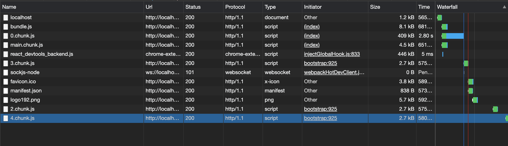
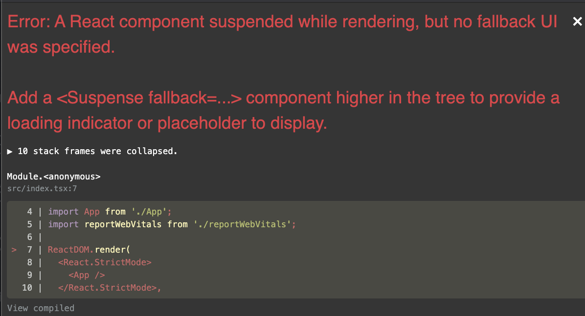

# 코드 분할 (Code Splitting)

> Bundleling(번들링)? Code Splitting(코드 분할)? Lazy load(지연 로드)? React.Suspense ?? 분명 프론트엔드 개발을 하시다보면 많이들 접해 보셨을 이야기라고 생각합니다. 과연 이것들은 이야기는 들었는데, 왜 쓰는지? 어떨때 사용하면 유용할지 한번 알아봐요:)

## Written By Sangheon Kim(ksj8367@gmail.com)

## 번들링

- 보통 우리는 슈퍼 같은 곳을 가면 번들 상품이라고 하여, 과자들이 묶여 있거나, 음료수들이 묶여있는 세트 상품들이라고 하여 번들 상품이라고 써있는 것을 볼 수 있습니다.
- 대표적으로 여러개의 파일을 하나의 파일로 병합한 것 입니다. 대표적으로 가장 널리 알려진 Create React App나 Next.JS 등은 Webpack을 사용하고 있고, Webpack 이외에 별도로 React 모듈을 설치하여, Rollup 이나 Browserify 등의 툴을 이용해도, 여러개의 파일을 하나의 파일로 병합을 합니다.

### `Example`

`Before Bundle`

```js
// app.js
import { add } from "./math.js;

console.log(add(16, 26)); // 42
```

```js
// math.js
export function add(a, b) {
  return a + b;
}
```

`After Bundle`

```js
function add(a, b) {
  return a + b;
}

console.log(add(16, 26)); // 42
```

> 실제 웹팩이나 롤업을 사용해서 번들링 한 결과는 각 모듈마다 붙혀주는 prefix나 subfix등 여러개가 붙고 기타 내부 동작에 의해 저렇게 두개 파일만 붙혀도 600줄이 넘는 결과물이 생성된다. 따라서 기타 번들 모듈을 이용해서 돌린다고 꼭 저렇게 import된 파일들만이 들어가는 것은 아니다.

**그렇다면 왜 우리는 번들링을 왜 사용하는 것일까? 그냥 남들은 마냥 웹팩이 좋아서? 남들이 쓰니까?? 흠... 좋지 않다.**

```html
<head>
  <link rel="stylesheet" href="style1.css" />
  <link rel="stylesheet" href="style2.css" />
  <link rel="stylesheet" href="style3.css" />
  <link rel="stylesheet" href="style4.css" />
  <link rel="stylesheet" href="style5.css" />
</head>
<body>
  <script src="a.js"></script>
  <script src="b.js"></script>
  <script src="c.js"></script>
  <script src="d.js"></script>
  <script src="e.js"></script>
</body>
```

- 만약 번들링이 되기 전 이고, 저 정적 파일들이 모두 필요하다면, 또는 image파일들이 여러개가 있다고 가정하고, 기타 정적 미디어 파일들이 많다고 가정하자... Request 수는 어마어마할거고 그에 따른 load시간 또한 증가하게 될 것이다.

- 웹팩이나 기타 번들링 모듈을 활용하여, 번들링을 해주는 이유

  - 1. 브라우저는 한번에 요청할 수 있는 자원의 개수가 한정되어 있다. (어느정도의 개선을 위해 HTTP 1.1 이상의 2.0이나 3.0을 사용해도 개선은 되지만 브라우저별로 정적 자원을 요청을 할 수 있는 개수에 제한은 있다.), 번들링을 해주게되면 request 수가 감소하게 된다.
  - 2. 지금 현재 글을 작성하고 있는 시점에서는 스크립트 파일을 .mjs으로 선언하고 script type을 module로 작성 후 다른 파일에서 import를 하고 export 하는 것이 가능해졌지만, IE 같은 구형 브라우저는 아직 까지 ES6 module 방식을 사용할 수가 없다. 결국 그래서 import, export, require를 사용하게되면 `requirejs is not defined`나 `import is not defined` 등의 에러를 볼 수 있다... 이런 문제를 파일 하나로 합쳐주는 webpack이나 기타 번들링 툴을 이용하면 파일이 하나로 합쳐지니... import export를 할 필요가 없어지는 것이다.

  > 위 두가지 방식이 아마 대표적으로 번들링 모듈을 사용하는 대표적인 예시일 것으로 추측해봅니다.


> webpack이 당당하게 메인에 걸어놓는 시그니쳐 이미지를 첨부해 보았습니다.

- 크... 얼마나 아름다운가... 그림 한장만으로도 웹팩이 어떤 역할을 하는지 알려주는 것 같다.

## 코드 분할

- 위에서 말한 번들링 기능은 정말 훌륭하다 request 수도 감소 시켜주고, import, export를 사용해도 번들링되어 한파일로 만들어주니 너무 훌륭하다...
- 하지만, 이 훌륭한 기능도 문제점은 가진다 그 문제점을 개선하기 위한 코드 분할을 설명하기 전에, 문제점을 보고가자

`번들링의 문제점`

- 말그대로 한파일로 합쳐주니 리퀘스트는 감소한다. 하지만, 파일 이 커지면 번들 또한 계속 커질 것이다. 만약 서드파티 라이브러리를 넣는다고 가정해보자.. npm 에서 받은 모듈들을 import하면 모듈들도 함께 번들링을 시켜주는데, 그런것들이 쌓이면 쌓일 수록 번들링 된 스크립트 파일은 어마어마하게 커질 것이다.
- 예를 들어 우리가 SPA를 만든다고 가정해보자... 리액트 라우터도 쓰지 않고, 순수 상태값을 가지고 매 상태를 표기해주어야하는 경우가 있을 수도 있다. 예를들어, 이전에 내가 만든 라이브 네이트온 빙고 프로모션의 경우에는 도메인조작을 하면 안되고, 서버와 소켓을 연결해서 서버에서 내려주는 STATE를 받아서 화면이 바뀌는 앱을 개발해야했다.
- 각 페이지마다 기능도 큰데 이걸, 처음에 어떤 상태이든 다불러와야하는 상황이 생기게된 것이다. 바로 이거다 이런 상황이 분명 찾아올 것이다. 각 앱마다 용도는 다르고 천차만별이기 떄문이다

`코드 스플리팅 및 코드 스프리팅 장점`

- 위의 문제에 대한 문제를 개선하려면, 코드를 나눠주면 되는 것이다.
- 앱의 코드 양을 줄일 필요가 없고, 사용자가 필요하지 않은 코드를 불러오지
  않게 되어 초기 로딩 시간 개선에도 큰 도움이 된다.

`저도 위에서 말한 빙고에서의 문제를 코드 스플리팅을 활용해서 해결 하였다..`

## import()

`before`

```tsx
import { add } from "./math";
console.log(add(16, 26));
```

`after`

```tsx
import("./math").then((math) => {
  console.log(math.add(16, 26));
});
```

- 앱의 코드를 분할하는데에 있어 가장 좋은 방법은 `import()` 문법이다.
- Webpack은 `import() 구문을 만나면 코드 스플리팅을 한다`
- <a href="https://create-react-app.dev/docs/code-splitting/" target="_blank">코드 분할 가이드(Create React App) </a>
- <a href="https://nextjs.org/docs/advanced-features/dynamic-import" target="_blank">Next.JS 코드 스플리팅 </a>
- <span style="color: red"> 혹여나, Babel을 사용하고 계신다면,
  <a href="https://classic.yarnpkg.com/en/package/babel-plugin-syntax-dynamic-import">`Babel-plugin-syntax-dynamic-import`</a>를 사용하여, 바벨이 트랜스파일링 하지 않도록 해주는 것이 좋다.</span>
- 보통 Create React App, Next의 경우 Webpack이 구성되어 있어 그냥 바로 저렇게 작성해주면 된다.

## React.lazy

- `React.lazy` 함수를 사용하면 동적 import를 사용해서 컴포넌트를 렌더링 해줄 수 있습니다. 여기서 말하는 동적 import는 위에서 Webpack이 코드를 스캔하다가 만나면 코드를 분할해주는 그것이 아닐까?? 생각해본다...
- 예제와 결과 이미지를 보면서 어떤 차이를 보는지 알아봅시다:)
- 홈, 소개, 문의 페이지로 이동하는 버튼을 생성해서 스테이트를 바꿔주어 해당 스테이트에 맞춰서 각 페이지 컴포넌트를 렌더링 해주는 방식을 소개하고 있는 예제다.

  `스플리팅 전 코드`

```tsx
import React from "react";
import About from "./Codesplitting/About/About";
import Home from "./Codesplitting/Home/Home";
import Inquire from "./Codesplitting/Inquire/Inquire";

const Nosplitting: React.FC = () => {
  const [router, setRouter] = React.useState("Home");

  const makeContainer = React.useCallback(() => {
    switch (router) {
      case "Home":
        return <Home />;
      case "About":
        return <About />;
      case "Inquire":
        return <Inquire />;
      default:
        return;
    }
  }, [router]);

  return (
    <div className="Nosplitting">
      <p>코드 분할 전</p>
      <button onClick={() => setRouter("Home")}>홈</button>
      <button onClick={() => setRouter("About")}>소개</button>
      <button onClick={() => setRouter("Inquire")}>문의</button>
      {makeContainer()}
    </div>
  );
};

export default Nosplitting;
```


- 0.chunk.js는 409KB나 되길래 무슨 파일일까 오픈해보았다.
  
  
- 앞에서 설명한 React 모듈을 먼저 렌더링 해주는 것 같다. 기타 폴리필 들도 이때 렌더링 되는것으로 보인다.
- 우리가 짜놓은 리액트 코드를 브라우저가 이해할 수 있게 먼저 React 모듈을 먼저 로드 해준다.
  
- 그리고 위에 영상에서 보는것 처럼 5.3KB안에는 내가 정의한 Home 컨테이너 컴포넌트와 About, Inquire 컴포넌트가 모두 들어있다.
- main.chunk.js안에 다들어오는 것을 확인할 수 있다. 우리는 버튼을 눌러도 다른 파일을 로드해오지 않고, 초기에 한번만 로드하면 더이상 서버에 새로운 요청을 보내지 않아도 되는 원인을 눈으로 확인한 것이다.
- 이제는 그러면 코드 스플리팅을 이용해서 차이를 확인해보자.

`after`

```tsx
/* eslint-disable react-hooks/exhaustive-deps */
import React from "react";
const About = React.lazy(() => import("./About/About"));
const Home = React.lazy(() => import("./Home/Home"));
const Inquire = React.lazy(() => import("./Inquire/Inquire"));
const Splitting: React.FC = () => {
  const [router, setRouter] = React.useState("Home");

  const makeContainer = React.useCallback(() => {
    switch (router) {
      case "Home":
        return <Home />;
      case "About":
        return <About />;
      case "Inquire":
        return <Inquire />;
      default:
        return <Home />;
    }
  }, [router]);

  return (
    <div>
      <p>코드 분할 후</p>
      <button onClick={() => setRouter("Home")}>홈</button>
      <button onClick={() => setRouter("About")}>소개</button>
      <button onClick={() => setRouter("Inquire")}>문의</button>
      <React.Suspense fallback={<div>Loading... Sangheon ZZang</div>}>{makeContainer()}</React.Suspense>
    </div>
  );
};

export default Splitting;
```



- 우선 이번에는 Suspense의 역할을 설명하기 위해서... 아까와 다르게 네트워크 속도 설정을 Fast3G로 설정했다는 점을 양해해주셨으면 한다...
- 스플리팅을 하기전에는 main.chunk.js가 5.3kb의 용량을 차지하고 있었고, 현재는 4.5KB로 줄었다.
- 이번에는 이전과 다르게 갑자기 뜬금없이 0.chunk.js만 있는 것이 아닌 3.chunk.js, 2.chunk.js 4.chunk.js가 생겨난것을 볼 수 있다.
- 하지만 이것을 처음부터 요청한 것이 아니라 버튼을 누를때 해당 컴포넌트를 요청할때마다 브라우저가 서버에 요청을 해서 받아와서 렌더링 해주는 것이다.
- 영상을 보면 정말이네?? 할 것이다.
  
- 버튼을 눌러서 상태를 바꿔서 다른 컴포넌트를 렌더링 해야하는 그 시점에 브라우저가 요청을 하고 해당 컴포넌트를 렌더링해주는 js파일을 받아오고 있다. 근데 여기서 요청을 할때마다, `Loading Sangheon ZZang...`을 화면에 보여주고 있다. 리액트 개발자가 사용자를 배려했다는 것을 느꼈다. 동적 import를 활용하여 lazyLoad를 넣어서 처리할경우 Suspense를 넣어 주라고 에러를 뱉는다. 컴포넌트를 렌더링하기 위한 스크립트를 로드하는 시간까지 `fallback`에 넣어놓은 컴포넌트가 렌더링 되는 것이다.
- Suspense는 매번 다른 컴포넌트를 요청할때마다 만약 해당 컴포넌트가 렌더링 될자리가 하얗게 또는 까맣게 변한다면 사용자 입장에서 얼마나 불편할지 미리 고려한게 아닐까 생각이 든다.
  
- 그래서 나는 Suspense를 통해서 사용자가 현재 다른 컴포넌트를 렌더링할 스크립트 파일을 요청하고 있고, 기다려주세요 하고 알려줌으로서 사용자에게 양해를 구하는 배려심 깊은 개발자가 된 것이다.

- 근데 위에서 설명해놓은걸 보다 보면, 독자분들중에서 눈치가 빠르신 분들은 눈치를 채셨을 수도 있다.
- `스플리팅 전` (초기 화면 렌더에 필요한 스크립트 용량)
  - 0.chunk.js - 409KB, main.chunk.js - 5.3KB + etc...
- `스플리팅 후` (초기 화면 렌더에 필요한 스크립트 용량)

  - 0.chunk.js - 409KB, main.chunk.js - 4.5KB, 3,chunk.js(2.7KB) + etc...

- `스플리팅 전` (화면 세개 모두 보여주는데 필요한 스크립트 용량)
  - 0.chunk.js - 409KB, main.chunk.js - 5.3KB
- `스플리팅 후` (화면 세개 모두 보여주는데 필요한 스크립트 용량)
- 0.chunk.js - 409KB, main.chunk.js - 4.5KB, 3.chunk.js(2.7KB), 2.chunk.js(2.7KB), 4.chunk.js(2.7KB)다

**아니 좋다더니, 필자 양반 우리한테 사기친거 아니오!! 이러시는 독자분들도 계실 수 있다. 진정 하시길 바란다. 모든 성능 개선에 대해서는 다한다고 좋아지는 것이 아니다. 성능 개선을 위한 처리가 오히려 코드 줄수를 늘려서 용량을 증가시킬 수도 있는 것이다. 지금 현재 보여준 앱 예시는 정말 작은 양이다 단지 화면에서는 버튼이 눌려서 바뀔때마다 문장한줄 딱 써져있는 컴포넌트이다. 그렇기에 각 분리된 컴포넌트는 기본으로 가지고 있어야 하는 스크립트들이 들어가면서 용량이 2.7KB씩 고정으로 나온 것으로 보인다. 자 여기서 우리는 어떤걸 생각할 수 있을까?**

- 바로 일단 스플리팅을 먼저하고 들어가는 것 보다, 내가 Static Asset이 많지 않은지? 또는 앱이 너무 커졌고, 상태별로 보여줄 컨테이너 컴포넌트나 페이지 컴포넌트들이 많은 경우를 고려해보자. 그리고 서드파티 라이브러리들도 사용하고 그러다보면 번들링된 파일이 실제로 엄청난 용량을 가지게 될 수도 있다. 그때는 생각해보자 오늘 필자가 보여준대로 기본적으로 2.5KB는 분리하게되면 가져간다고 생각하고, 계산해보는 것이다. 이것을 나눴을 때 번들링된 용량과 비교하여, 스플리팅을 하는 것이 좋을지 안좋을지 계산하고 실행하는 것을 추천한다.

- 위와 같은 예시로 만약 WASM도 있다. 웹 어셈블리가 그렇게 빠르다빠르다하여 Rust를 도입을 한 사례를 예로 들어보자 1부터 1000까지 팩토리얼들의 합을 구한다고 가정할때까지는 순수 자바스크립트로 연산하는 것이 훨씬 빠르다. 왜냐하면 러스트가 웹에서 동작하기 위한 사전에 처리해줘야하는 동작이 돌아간 이후에 돌아가지 않을까? 생각해보자. 그러면 결국 기본적으로 지연되는 시간을 가져 가니, 1000까지는 느리다. 근데 만약 이 지연시간이상의 자바스크립트로 계산했을때 지연시간이 넘어가는 순간부터 WASM이 진가를 발휘한다. Rust로 계산하면 1000까지 합하든 100000까지 합하든 지연시간은 0.000002341ms 차이가 난다. 하지만 Javascript는 1000까지합했을때는 Rust보다 빨랐지만, 10000이 넘어가는 시점부터 비슷해지더니, 100000이 되니 10ms가 넘어가는것을 보였다. 러스트는 100000까지해도 0.00000002341ms차이났지만, Javascript는 끝이 늘어나면 늘어날수록 그만큼 정비례 하는 것을 보여주었다.

- 자 위에서 설명한대로 우리는 뭔가의 기술을 채택전에 정말 이게 필요할지 협업한다면 꼭 기술 협의를 거쳐서, 쓸지 말지 협업하는 사람들과 협의하고 사용하도록 하자는 이야기다:) (혼자 하더라도 꼭 미리 생각하고 도입하는 것을 추천한다)
- 이전에 네이트온 빙고 사례를 이야기했는데 그때는 정말 많이 줄였다 오디오나, 이미지, 스프라이트 애니메이션 이미지 등등 각 컴포넌트들마다 Static Asset들이 너무많았고, 페이지들도 많았기에, 필자는 그때는 사용해야겠다 생각했었고, 그때 사용을 하게 되었다..


- 잠깐 필자가 이전에 웹으로 라이브 네이트온 빙고 게임을 만들었던 것을 보여드리겠습니다. 지금 위 사진 외에도 기타 컴포넌트들이 굉장히 많았었다. 이때는 정말 스플리팅이랑 최적화를 하지 않고서는, 초기로딩이 너무 오래 걸렸습니다. 리퀘스트 수를 줄여보겠다고, 스프라이트 이미지도 전부 쓰고 최적화할수 있는 모든 최적화를 해도, 음원파일들도 효과음과 배경음을 나누어 레이지로드 분기를 쳤고, 결국 필자는 처음에 최적화 이전에는 초기 로딩 시간을 160초(Fast 3G기준)에서(최적화를 아예 안한 상황) 6초(Fast 3G기준)로 개선할 수 있었다. 결국 음질은 포기하였다.. Online에서는 300ms정도가 걸렸었다. 그만큼 할 수 있는 모든 최적화는 다했다. 웹폰트보다 이미지 폰트를 채택하였고, 이미지들도 스프라이트로 모두 썼고... 잠깐 독자분들께 하소연을 해보았다...

- 위에서 제가 말한 경우처럼 앱이 뭔가 커지는 느낌이 들면 그때는 꼭 코드 스플리팅을 고려해보시고 lazy load에 대한 부분도 꼭 고려해보시라 말씀드리고 싶다:)

> `코드 스플리팅은` 앱이 번들링될 때 것을 사용자가 나눠주는 것을 의미하며, `import()`를 웹팩이 보게되면 코드 스플리팅을 해줍니다. 그러면 여러개의 chunk.js로 나눌 수 있게 되고, 그것을 무언가에 특정 조건이 있을때 import 시키니 초기 로드보다 늦게 로드 시키기에 `React.lazy`를 이용하여 `LazyLoad` 처리하게 되는데 결국 해당 스크립트를 렌더링 하기 위해서는 내용을 요약해서 말씀드리면 `Suspense`에 Fallback UI를 지정해주어, 사용자에게 로딩중 임을 명시해줄 수 있게 됩니다. 그냥 빈화면만 보여주면 사용자는 당황할 수 있으니까요😎

- <span style="color:red">하지만 제가 보여드린 벤치마킹 결과를 보시고, 스플리팅해도 정말 해당 부분만 떼서 분할하는 것이 아닌 각 컴포넌트마다 뭔가 렌더링 시키기 위한 내부모듈들도 chunkJS마다 넣어주기에, 최소용량이 2KB 씩은 갖고가니 꼭 잘 생각해서 사용하시면 좋을 것 같다..!😍</span>

**오늘도 부족한 저의 긴 글을 읽어주셔서 너무 감사합니다.**
