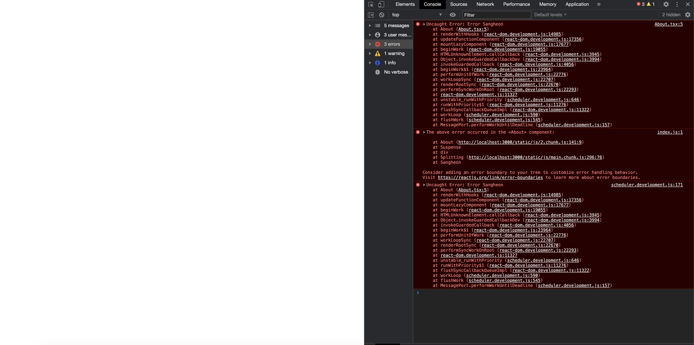
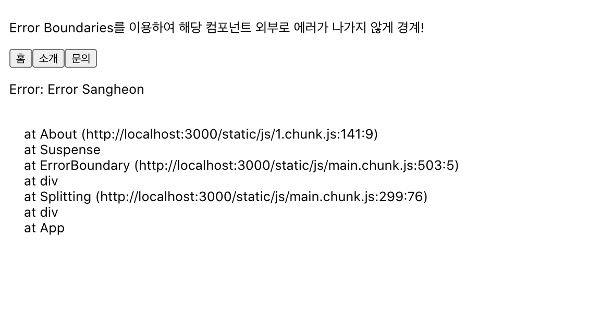
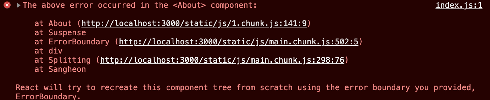
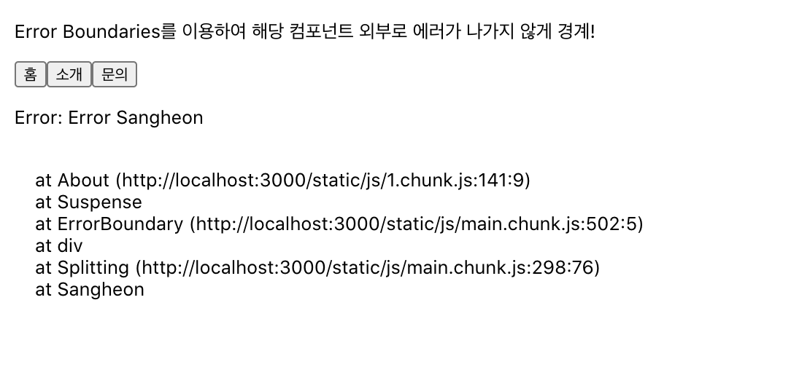
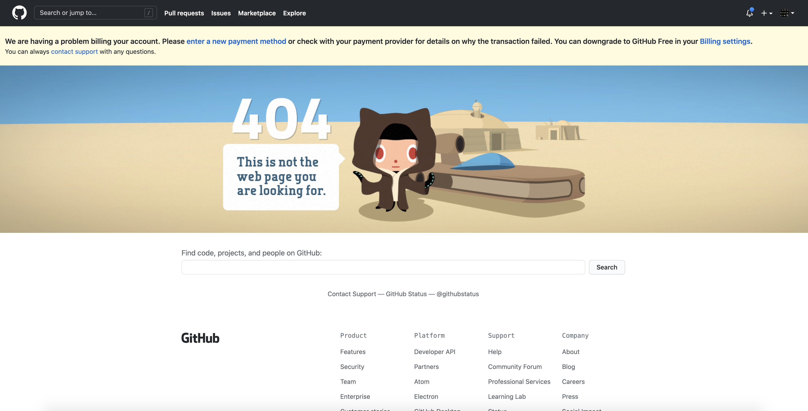

# Error Boundary

- 간혹 우리는 운영을 하다가 해당 컴포넌트가 갑자기 에러를 내는 바람에 화면에는 렌더링이 되지 않아, 빈 화면이 뜬다던가 하는 경우를 볼 수 있다. 저 또한 빙고를 개발할 때 Error Boundary를 설정하지 않아서, 실제 라이브를 하기 전에 QA를 하는데 갑자기 게임 상태로 넘어가는 부분에서 에러가 발생해서 아무것도 화면에 렌더링이 되지 않은 것이었다...
- 웃픈건... Error Boundary를 사용했는데 그 이후로는, 앱 전체를 멈추게 만드는 에러는 없었다고 한다... 그게 마지막 이슈 였다. 그래도 안전 장치를 해놓았다고 생각하면서 위안 삼았다 @\_@

## 이제 Error Boundary를 알아보자!

- 에러 경게는 바로 리액트 컴포넌트에서 에러를 정상적으로 처리할 수 있는 방법을 제공하지 않아서 이것을 복구할 방법이 없었습니다.
- 우리는 보통 UI 컴포넌트들을 여러개로 나누어서 개발을 한다. 여기서 정말 작은 컴포넌트 하나에서 에러가 나서 앱 전체가 빈화면이 뜨는 경우가 있을 수 있다...
- 위에서 말한 경우를 예방하기 위해서 나온 것이 Error Boundary입니다.
- Suspense에서는 해당 컴포넌트를 렌더링 하기 위한 스크립트를 응답 받을때까지 보여줄 UI를 넣어놓았지만, 에러 경계에서는 `하위 컴포넌트 트리의 어디에서든 자바스크립트 에러를 기록하며 깨진 컴포넌트 트리 대신 Fallback UI를 보여주는` 컴포넌트 입니다.
- 라이프 사이클 메서드 중에서 `static getDerivedStateFromError()` 와 `componentDidCatch()`를 사용해서 에러를 잡을 수 있다.
- try...catch 구문에서의 catch {} 구문의 역할과 비슷하지만, 그 역할을 컴포넌트에 적용될 수 있습니다.
- **에러 경계는 트리 내에서 에러 바운더리로 감싸놓은 하위 컴포넌트들의 안에서만 에러를 감지하게 된다.**
- 바로 이전에 8장에서 설명했던 예제에서 의도적으로 About 컨테이너에서 에러를 발생 시켜보자...

```tsx
const About = () => {
  throw new Error("Error Sangheon");
  return <div className="About">Let me Introduce</div>;
};

export default About;
```

`Before`

```tsx
/* eslint-disable react-hooks/exhaustive-deps */
import React from "react";
const About = React.lazy(() => import("./About/About"));
const Home = React.lazy(() => import("./Home/Home"));
const Inquire = React.lazy(() => import("./Inquire/Inquire"));
const Splitting: React.FC = () => {
  const [router, setRouter] = React.useState("Home");

  const makeContainer = React.useCallback(() => {
    switch (router) {
      case "Home":
        return <Home />;
      case "About":
        return <About />;
      case "Inquire":
        return <Inquire />;
      default:
        return <Home />;
    }
  }, [router]);

  return (
    <div>
      <p>코드 분할 후</p>
      <button onClick={() => setRouter("Home")}>홈</button>
      <button onClick={() => setRouter("About")}>소개</button>
      <button onClick={() => setRouter("Inquire")}>문의</button>
      <React.Suspense fallback={<div>Loading... Sangheon ZZang</div>}>{makeContainer()}</React.Suspense>
    </div>
  );
};

export default Splitting;
```



에러에 대한 캐치를 해서 무엇인가 처리를 하지 않은 경우다... 아마 지금 이 글을 읽고 계신분들중에... 개발모드에서는 에러에 대한 설명이 나오는 것을 보았을 수 있다... 하지만 NODE_ENV가 production인 경우에는 에러 화면을 보여주는 것이 아니라... 저렇게 흰화면 또는 body태그에 배경색이 보여진다..

- 에러 경게를 사용하면 어떤 변화가 있을지 한번 살펴보자

```tsx
return (
  <div>
    <p>Error Boundary를 이용하여 해당 컴포넌트 외부로 에러가 나가지 않게 경계!</p>
    <button onClick={() => setRouter("Home")}>홈</button>
    <button onClick={() => setRouter("About")}>소개</button>
    <button onClick={() => setRouter("Inquire")}>문의</button>
    <ErrorBoundary>
      <React.Suspense fallback={<div>Loading... Sangheon ZZang</div>}>{makeContainer()}</React.Suspense>
    </ErrorBoundary>
  </div>
);
```

**위에 설명한 예시와 다르게 LazyLoad 처리 해놓은 곳에 Wrapper로 ErrorBoundariy컴포넌트를 사용하였다.**

> 미리 이야기를 드리면, 잡을 수 없는 경우에 에러도 있다. 그 경우를 먼저 짚고 가보자.
>
> > - 1.  이벤트 핸들러
> > - 2.  비동기적 코드 (예: `setTimeout` 혹은 `requestAnimationFrame` 콜백)
> > - 3.  서버 사이드 렌더링
> > - 4.  자식에서가 아닌 에러 경계 자체에서 발생하는 에러 (Wrapper로 감싸져 있는 Child 컴포넌트가 아닌 Wrapper 자체에서 발생한 에러는 잡아낼 수 없다.)

<span style="color:red;">작은 부탁을 하나 드리겠다... 지금은 실행환경이 개발모드이다... 그래서 React에서는 친절하게... 에러 화면을 보여준다... 실제 실행환경이라고 가정하면... 저 화면 없이 원래는 비어있는 화면이 뜬다... 결과만 보여주려고 하였으나... 그래도 독자분들 대부분이 눈으로 봐야 더 와닿으실 것 같아서... 첨부드린다.. 중간에 뜨는 에러화면은 음.. 에러군 이러고 넘어가주고 그걸 닫은 화면에 집중해주시길 바란다...</span>

`After ErrorBoundary Case1(componentDidCatch를 이용해서 컴포넌트 스택과 에러메시지를 fallbackUI에 뿌려줘보자)`

```tsx
import * as React from "react";

interface IErrorBoundary {
  error: Error | null;
  errorInfo: React.ErrorInfo | null;
  children: React.ReactElement[] | React.ReactElement;
}

class ErrorBoundary extends React.Component<Partial<IErrorBoundary>> {
  state: Omit<IErrorBoundary, "children">;
  constructor(props: IErrorBoundary) {
    super(props);

    this.state = {
      error: null,
      errorInfo: null,
    };
  }

  componentDidCatch(error: Error, errorInfo: React.ErrorInfo) {
    // error는 에러 메시지 errorInfo의 componentStack에는 컴포넌트 스택이 들어있다.
    this.setState({
      error,
      errorInfo,
    });
  }

  render() {
    const { children } = this.props;
    console.log(this.state.errorInfo?.componentStack);

    if (this.state.error) {
      return (
        <div>
          <p>{this.state.error.toString()}</p>
          <p style={{ whiteSpace: "pre-wrap" }}>{this.state.errorInfo?.componentStack}</p>
        </div>
      );
    } else {
      return children;
    }
  }
}

export default ErrorBoundary;
```


> 첫번째 에러 경계 코드의 예시로는... 에러로 인해 다른 컴포넌트들도 렌더링 되는 것을 방해하지 않고 있다.. 해당 컴포넌트에 fallback UI로 에러 내용과 에러 메시지를 보여주게 만든 예시다... 얼마나 근데 기특한가... 사용자 입장에서는... 아예 빈화면이 떠버리면 이게 렉인지... 에러인지 분간이 안되지만... 친절하게도 사용자에게 에러라고 알려준다... 에러가 없는게 가장 베스트지만... 우리는 처리 해줌으로서..그래도 조금은 나은 사용성을 제공해줄 것이라고 생각이 든다..
> 

## 컴포넌트 스택 추적

- React 16버전에서 부터는 개발 과정에서 렌더링 하는동안 발생한 모든 에러를 콘솔에 출력을 하고 있습니다. `에러 메시지`와 `콜스택(실행 컨텍스트 스택)과 더불어 컴포넌트 스택을 제공해주고 있다.`
  

  > - 16버전부터 제공해주는 컴포넌트 스택을 가지고 우리는 컴포넌트 트리의 어느 부분에서 에러가 발생했는지 확인이 가능해진 것이다.
  > - <span style="color:red">CRA로 개발하고 있는 앱이 아니라면 `@babel/plugin-transform-react-jsx-source` 플러그인을 바벨 설정에 추가 해주어야 한다. 개발 모드에서만 사용하는 것을 권장드립니다.</span>

- React 16 이후 부터 제공해주는 컴포넌트 스택을 에러경게를 통해서 에러시에 보여주는 fallback UI안에 p태그의 텍스트 노드에 넣어서 출력해보았다.
- 스택구조는 LIFO(Last in First Out)구조를 갖고 있으며, 이말을 콜스택에 대입해보면, 스택처럼 쌓여있는 작업중 가장 최상단에 있는 작업이 수행될 것이다.
- 다시한번, 컴포넌트의 종류에 대해 이야기해보면, 일반적으로 a태그나 div태그등 HTML Element들도 React.createElement를 통해서 호스트 컴포넌트로 만들어진다. 그리고 우리가 위에서 정의한 것처럼 ErrorBoundary나 Splitting이라는 컴포넌트를 직접 만들었다. React.Component나 React.PureComponent나 함수 컴포넌트를 가지고 직접 정의하는 컴포넌트들이 있고, React.suspense나 React.Fragment나 React.context 등 특수한 목적을 가지고 정적으로 리액트 모듈에서 제공해주는 컴포넌트를 스태틱 컴포넌트라고 그런다.

- 위 이미지를 기준으로 정말 쉽게 설명해보면 말그대로 컴포넌트의 계층구조를 나타내준 것이라고 생각하면된다. 현재 `About(http://localhost:3000/static/js/1.chunk.js에 141번째 라인에 9번째 열에 있는)`사용자 정의 컴포넌트의 상위 컴포넌트가 `Suspense(스태틱 컴포넌트)`이고, Suspense의 부모 컴포넌트가 `ErrorBoundary(main.chunk.js 503번째줄에)`사용자 정의 컴포넌트 이고 ErrorBoundary 컴포넌트의 상위 컴포넌트는 `div`호스트 컴포넌트라는 것처럼 쭈욱 쭈욱 컴포넌트의 계층 구조를 보여주고 있는 것이다. 가장 위에는 App이라고 직접 우리가 정의한 사용자정의 컴포넌트가 있는 것이다. 못믿겠다면... App.tsx의 App을 Sangheon으로 바꿔보겠다.. 추가로 div class="App"으로 감싸놓은 것을 Fragment Static 컴포넌트를 이용하여 바꿔보았습니다.

```tsx
// App.tsx
function Sangheon() {
  return (
    <React.Fragment>
      <Splitting />
    </React.Fragment>
  );
}

export default Sangheon;

// index.tsx
ReactDOM.render(
  <React.StrictMode>
    <Sangheon />
  </React.StrictMode>,
  document.getElementById("root")
);
```



- 지금 보는 것처럼 실제 렌더 함수가 발생하면 컴포넌트 스택에 맞춰서 React.createElement가 호출되어진다. 그렇게 컴포넌트의 계층구조가 완성되는 것이다. 컴포넌트 스택구조가 무슨 필요가 있냐고? 물으실 수 있는데... 이 스택을 통해서 어떤 컴포넌트의 자식 컴포넌트로 있는 컴포넌트 부분에 있는지 추적할 수 있게 된 것이다.

`After ErrorBoundary Case2(static getDerivedStateFromError(error)를 사용해서 에러메시지와 동시에 fallback UI를 보여줘보자!)`

> 위와 다르게 getDerivedStateFromError에서는 에러메시지를 갖고있는 error를 매개변수를 통해서 전달받는다.

- 이번에는 이전 예제와 다르게 스플리팅 되지 않은 코드를 감싸 보겠습니다.

```tsx
// Nospliting2.tsx
import React from "react";
import About from "./CodeSplitting/About/About";
import Home from "./CodeSplitting/Home/Home";
import Inquire from "./CodeSplitting/Inquire/Inquire";
import ErrorBoundary2 from "./ErrorBoundary/ErrorBoundary2";

const NoSplitting: React.FC = () => {
  const [router, setRouter] = React.useState("Home");

  const makeContainer = React.useCallback(() => {
    switch (router) {
      case "Home":
        return <Home />;
      case "About":
        return <About />;
      case "Inquire":
        return <Inquire />;
      default:
        return;
    }
  }, [router]);

  return (
    <div className="NoSplitting" style={{ padding: 8 }}>
      <p>코드 분할 전</p>
      <button onClick={() => setRouter("Home")}>홈</button>
      <button onClick={() => setRouter("About")}>소개</button>
      <button onClick={() => setRouter("Inquire")}>문의</button>
      <ErrorBoundary2>{makeContainer()}</ErrorBoundary2>
    </div>
  );
};

export default NoSplitting;
```

```tsx
// ErrorBoundary2.tsx
import * as React from "react";

interface ErrorBoundary {
  error: Error | null;
}

class ErrorBoundary2 extends React.Component<Partial<ErrorBoundary>> {
  state: ErrorBoundary;
  constructor(props: ErrorBoundary) {
    super(props);

    this.state = {
      error: null,
    };
  }

  static getDerivedStateFromError(error: Error) {
    // state를 변경해줍니다.
    return { error };
  }

  render() {
    if (!!this.state.error) {
      return <h1>에러가 발생했습니다. 에러 내용: {this.state.error.toString()}</h1>;
    } else {
      return this.props.children;
    }
  }
}

export default ErrorBoundary2;
```


> 컴포넌트 스택에 대한 정보를 받아서 출력을 할 수는 없지만 역시나 콘솔에는 컴포넌트 스택이 잘찍힌다. 에러메시지를 꼭 출력해야하는 것은 아니다. 하지만 독자분들에게 직접 보여주고 싶은 저의 마음을 알아주셨으면 좋겠다..

## Error Boundary를 배치할 위치

- Next.JS같은 서버사이드 프레임워크가 충돌을 해결하는 것처럼 최상위 경로에 컴포넌트를 감싸서 유저에게 문제가 발생햇다고 메시지를 보낼수도 있습니다.
- 클라이언트 사이드 렌더링에서도 특정 에러가 발생했을때 이런식으로 전체 컴포넌트를 언마운트 해버리는 것이 아니라 특정 컴포넌트에 이런 귀여운 에러 이미지를 띄워줄 수 있는 것이다..
- 특정 컴포넌트마다 이렇게 에러에 대한 fallback UI를 지정해주는방법은 굉장히 다양하고 어떤 부분을 처리할지에 대한 부분은 제 글을 읽고 계시는 멋진 독자님들의 선택이 될것이라고 생각한다.

  

- 만약 손상된 UI를 그대로 보여준다고 가정한다면 너무 막대한 손해일 것이다.. 예를들어 수식 연산에서 에러가 나서 잘못된 금액 정보가 나와있는 경우가 생긴다거나 잘못된 정보를 사용자에게 전달하게 된다면 어떨까?? 사용자는 만약 손상된 정보가 보여지면... 그것은 아예 아무것도 안보여주는 것보다 더한 아주 안좋은 사용자 경험을 만들어내는 것이라고 생각한다.
- 실제 페이스북의 메신저에서도 사이드 바, 정보 패널, 대화 기록과 메시지 입력을 각각 별도의 에러 경계로 감싸두었다고 한다.. 이 UI 영역 중 하나의 컴포넌트에서 충돌이 발생하면 나머지 컴포넌트는 대화형으로 유지된다..
- fallback UI를 제공해줌과 동시에 만약 실제 프로덕션 환경에서 에러 로그를 쌓아놓는 별도의 데이터베이스를 유지해서 거기에 쌓아놓고 에러를 수정해나가는 것도 앱의 완성도를 더 높여주지 않을까 필자는 그렇게 생각해본다...

- 위에서 말한 케이스에서 에러 경계로 잡기 힘든 경우
  > - 1.  이벤트 핸들러
  > - 2.  비동기적 코드 (예: `setTimeout` 혹은 `requestAnimationFrame` 콜백)
  > - 3.  서버 사이드 렌더링
  > - 4.  자식에서가 아닌 에러 경계 자체에서 발생하는 에러 (Wrapper로 감싸져 있는 Child 컴포넌트가 아닌 Wrapper 자체에서 발생한 에러는 잡아낼 수 없다.)

위 4가지에서는 try...catch문을 이용해서 예외처리를 해주도록 하자...

### `try...catch` 문에서는 컴포넌트 내부에서 렌더링 과정중 발생한 에러에 대해서는 잡을 수 없다.. 그때는 `ComponentDidCatch`나 `static getDerivedStateFromError`를 사용해서 잡도록하자

> 오늘 내용을 요약해보자면... 컴포넌트 렌더링 도중 발생하는 에러에 대한 예외처리 이자... 대체 UI를 보여줌으로서 더 나은 사용성을 제공해주고, 잘못된 정보를 보여주지 않을 수도 있고, 에러 경게를 통해서 전체 컴포넌트가 언마운트 되어버리는 이슈들을 막을 수 있는 방식에 대한 설명이었다... 만약 이런 처리가 필요하다면 그때 저의 글을 다시 한번 보고 사용 해보자.. 필자도 자주 필자가 쓴 글을 다시보기도한다.

## **재미나게 읽으셨고, 유익하셨다면 Star도 Follow도 눌러주시면 감사드립니다.😘**
